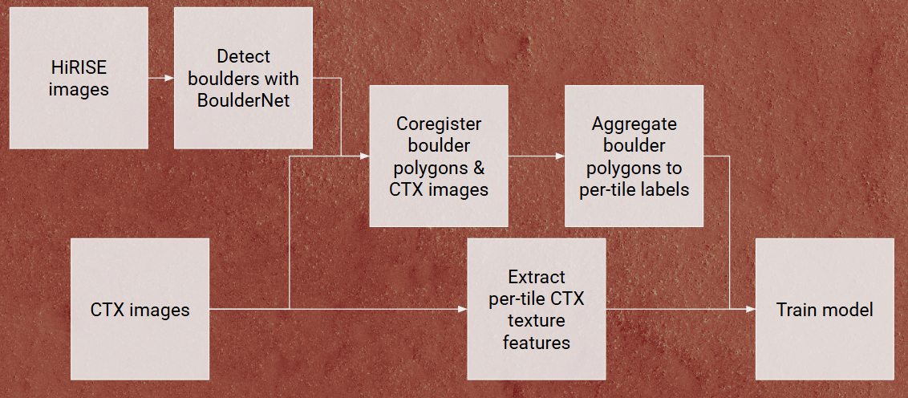
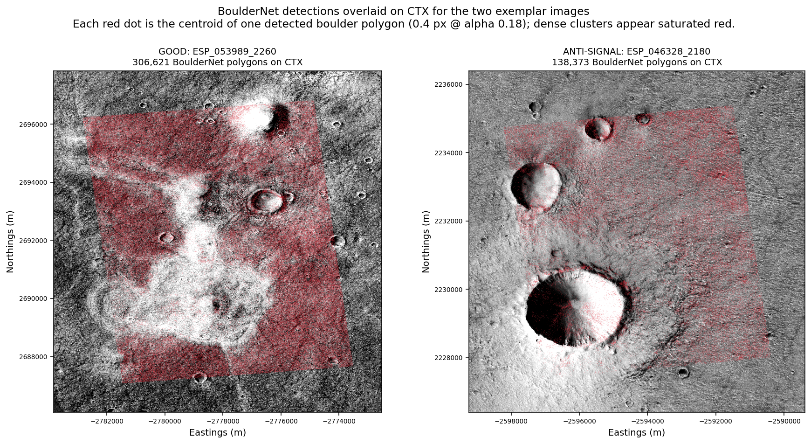
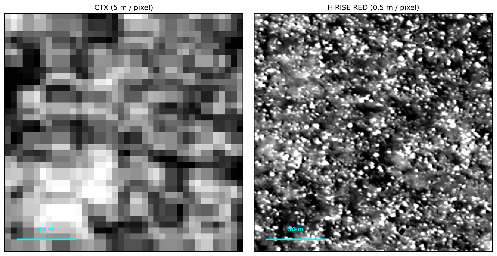
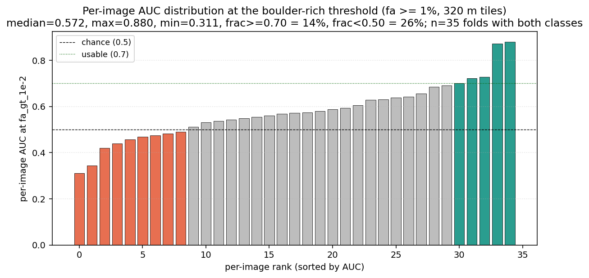
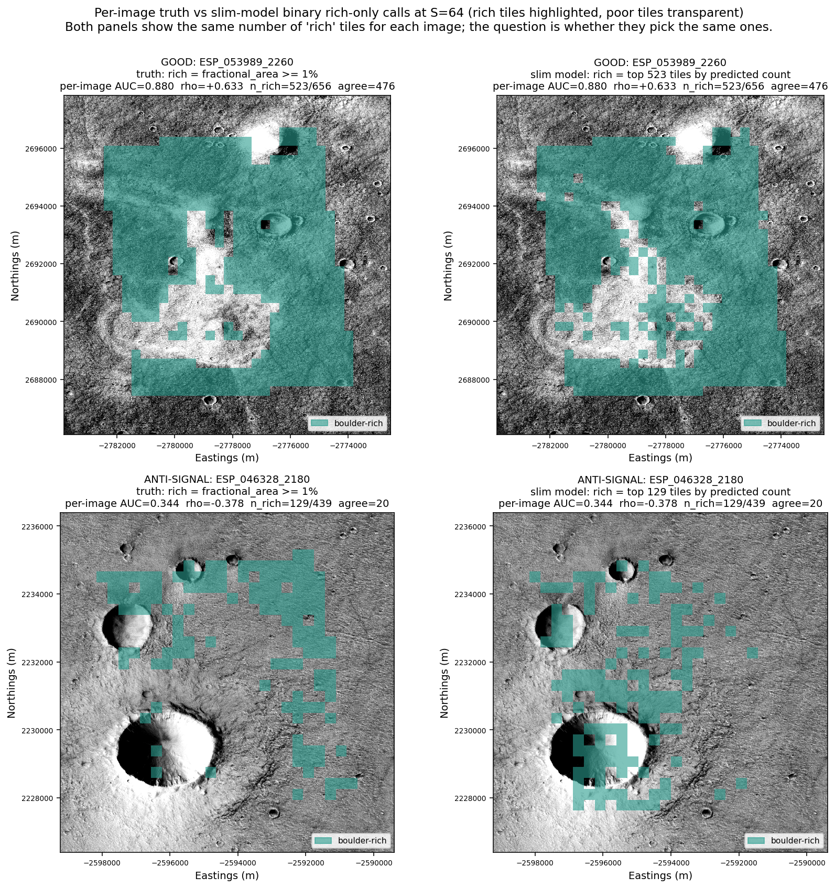

# Classification — CTX boulder-rich tile detector

Brian Amaro EPS 245 Project (Part 1)

## Motivation

Detecting meter-scale boulder deposits — concentrations of
boulders associated with depositional or transport landforms —
has two near-term applications. The first is landing-site
selection: meter-scale boulders are mission-ending hazards for
surface assets, and a CTX-resolution boulder-rich flag would
complement existing hazard catalogues. The second is mapping
boulder deposits across Mars for process science: boulder fields
encode their emplacement history, and a global boulder-deposit map
would help test, for example, the late-Hesperian megatsunami
hypothesis ([Rodriguez et al., 2016](https://doi.org/10.1038/srep25106);
[Costard et al., 2017](https://doi.org/10.1002/2016JE005230)) by
checking whether predicted boulder-rich regions track the proposed
deposit zones in the northern lowlands.

An overview of existing maps and how this project fits inL
- **THEMIS thermal-IR rock abundance**
  ([Nowicki & Christensen, 2007](https://doi.org/10.1029/2006JE002798))
  covers Mars near-globally but at ~100 m/pixel and indexes *any*
  exposed rock — bedrock and boulders lump together. The
  fraction of "rock abundance" that is specifically meter-scale
  loose boulders is not recoverable from thermal alone.
- **HiRISE-scale boulder mapping**
  ([Golombek et al., 2008](https://doi.org/10.1029/2007JE003065);
  [Prieur et al., 2023](https://doi.org/10.1029/2023JE008013))
  produces meter-resolution boulder catalogues but only within the
  < 4 % of Mars HiRISE has imaged.
- This study bridges the two. HiRISE-derived boulder polygons
  supply per-tile truth labels as HiRISE with its resolution of up to .25 m/pixel can resolve individual boulders; CTX texture features at ~ 5 m/pixel supply the
  inputs so the model can take advantage of CTX's near global coverage and 
  run on the rest of Mars.
  The deliverable is a boulder-specific (not bedrock-generic)
  per-tile classification at 320 m, near-globally.

Both downstream applications need a per-tile binary call ("rich"
or "poor") at the few-hundred-metre scale.

---

## 1. Question

Can a model trained on CTX texture features classify boulder-rich
tiles (fractional boulder area ≥ 1 %) accurately enough to be useful
on a per-image basis?

---

## 2. Data



*Figure 1. End-to-end pipeline. HiRISE imagery is run through
BoulderNet to produce boulder polygons; the polygons and CTX
imagery are co-registered into a common coordinate system and the
polygons are aggregated to per-tile boulder-rich / boulder-poor
labels. In parallel, per-tile CTX texture features are extracted
from the CTX imagery. The labels and features feed the model
training step.*

**Source data.** Three upstream pieces:

- **CTX imagery** — the
  [Murray Lab global CTX mosaic](https://doi.org/10.1029/2024EA003555)
  ([Dickson et al., 2024](https://doi.org/10.1029/2024EA003555)),
  ~5 m/px panchromatic, assembled from MRO Context Camera images
  ([Malin et al., 2007](https://doi.org/10.1029/2006JE002808)).
  Provides the **inputs** the model sees at training and inference.
- **Boulder polygons** — meter-scale boulder detections on HiRISE
  produced by a YOLO-based BoulderNet
  ([Amaro et al., 2026](https://doi.org/10.1029/2024JE008769);
  [Prieur et al., 2023](https://doi.org/10.1029/2023JE008013)).
  Provide the truth labels.
- **HiRISE imagery** ([McEwen et al., 2007](https://doi.org/10.1029/2005JE002605))
  — used only as the moving image for HiRISE → CTX co-registration;
  not a model feature.

**Co-registration + tiles.** Polygons are reprojected onto the CTX
mosaic's coordinate system, a per-image translation shift is solved
by block-median phase correlation between decimated HiRISE and CTX,
and the shift is applied uniformly to all polygons in that image.
Tiles are 64 × 64 CTX pixels (320 m × 320 m) anchored to the
mosaic's pixel origin so the grid is reproducible. Tiles with
incomplete HiRISE coverage are dropped.

**Binary truth.** For each tile, the fraction of tile area covered
by boulder polygons (`fractional_area`) is computed; the tile is
labelled **boulder-rich** if `fractional_area ≥ 1 %` and
**boulder-poor** otherwise.

**Boulder size limits.** BoulderNet polygons are filtered to
equivalent diameter ≥ ~1.4 m (`min_size_m = 1.4105` in the upstream
pipeline); sub-meter boulders are not in the truth labels and so
are invisible to the model. At CTX's 5 m/pixel input, individual
boulders are smaller than one pixel — the model never sees boulders
directly, only the aggregate texture (shadow fraction, roughness)
they produce at the tile scale.



*Figure 2. BoulderNet detections overlaid on CTX for two exemplar
held-out images, to make the input data concrete. Each red dot is
the centroid of one detected boulder polygon (over 300 000 on the
left, 138 000 on the right). The 5 m/px CTX surface context —
craters, terrain texture — is visible underneath.*



*Figure 3. Resolution gap between the model's input (CTX, 5 m/pixel)
and the source of the truth labels (HiRISE, ~0.5 m/pixel) on the
exact same 200 m × 200 m surface patch. **Left**: CTX, with the patch
fitting in a 40 × 40 pixel block; individual meter-scale boulders
are not resolved. **Right**: HiRISE RED panchromatic on the same
patch; boulders appear as discrete dark spots with bright shadows.*

**Cohort.** 36 HiRISE-labelled images clustered at ~40 – 46°N on
the eastern Chryse / western Arabia margins.

**Features (per CTX tile, 5 features).**

| Feature | What it measures |
|---|---|
| `shadow_fraction` | fraction of in-tile CTX pixels darker than the per-image shadow threshold — direct boulder-shadow proxy under oblique sun |
| `shadow_fraction_strict` | the same statistic at a tighter shadow threshold |
| `bright_cap_fraction` | fraction of pixels brighter than the per-image bright threshold — captures saturation / high-albedo |
| `grad_mag_std` | Sobel-gradient-magnitude standard deviation — sub-tile surface roughness |
| `intensity_std` | per-tile pixel-value standard deviation — sub-tile contrast |

Two physical mechanisms drive these: boulder shadows under oblique
sun (shadow features) and small-scale pixel-value variability from
boulder fields (roughness features). All five are derivable from
CTX alone.

---

## 3. Methods

**Model.** LightGBM with default hyperparameters (500 boosting
rounds, learning rate 0.05, 63 leaves, early stopping after 50
rounds). The model produces a per-tile continuous score; the binary
boulder-rich call is made by thresholding that score.

**Validation: leave-one-image-out (LOIO) cross-validation.** For
each of the 36 held-out images, the model is trained on the other
35 and scored on the held-out image's tiles. This protocol measures
generalisation to unseen images, matching the eventual scientific
use (predicting on geographic regions where no HiRISE coverage
exists). The **per-image AUC distribution** reported in §4.1 serves
as the uncertainty estimate — the spread across folds quantifies
how much performance depends on which image is held out, rather
than collapsing to a single cohort-aggregate number.

**Reported metric.** Per-image ROC-AUC at the boulder-rich threshold
(`fractional area ≥ 1 %`), computed on each fold whose held-out
image contains both rich and poor tiles. We report the per-image
distribution: median, min, max, and the fraction crossing the
"usable" AUC ≥ 0.70 line.

---

## 4. Results

### 4.1 Per-image AUC distribution

| | per-image AUC at fa ≥ 1 % |
|---|---:|
| median | 0.572 |
| max | 0.880 |
| min | 0.311 |
| fraction with AUC ≥ 0.70 ("usable") | 14 % |
| fraction with AUC < 0.50 ("anti-signal") | 26 % |



*Figure 4. Per-image AUC at the boulder-rich threshold
(`fractional area ≥ 1 %`), one bar per held-out image, sorted from
worst on the left to best on the right. Red = anti-signal
(AUC < 0.5); gray = chance (0.5 ≤ AUC < 0.7); green = usable on that
image (AUC ≥ 0.7).*

The detector works decisively on a minority of the cohort
(AUC up to 0.88) and fails on a comparable minority (AUC down to
0.31). 

### 4.2 Where the detector succeeds vs fails



*Figure 5. Boulder-rich tiles highlighted on CTX for two contrasting
held-out images; boulder-poor tiles are kept transparent so the CTX
surface context shows through. The left panel of each row is truth
(green = `fractional area ≥ 1 %`); the right panel is the detector's
call (green = top-K tiles by predicted score, K matched to the
truth count).*

***Top row** — `ESP_053989_2260`, a usable case (per-image AUC
0.88): the detector's green pattern matches the truth's green
pattern closely (476 of 523 rich-tile calls agree).*

***Bottom row** — `ESP_046328_2180`, an anti-signal case (AUC 0.34):
the detector places its green calls in the *opposite* region from
the truth's green — only 20 of 129 rich-tile calls agree, well
below the ~30 % a random ranking would produce at this base rate.*

---

## 5. Limitations

- **Geographic concentration.** The 36-image cohort clusters at
  ~40 – 46°N on the eastern Chryse / western Arabia margins.
  Performance on highland, polar, or fresh-ejecta terrain is
  untested.
- **Per-image performance varies widely.** The detector cannot
  currently be deployed without per-image confidence — on roughly a
  quarter of images it does worse than chance, and we do not yet
  have a reliable a-priori rule for predicting which images will
  fall in which regime.
- **CTX resolution.** At 5 m/px individual meter-scale boulders are
  unresolved; the detector is keying on tile-aggregate shadow +
  roughness statistics rather than direct boulder detection. This
  caps what is achievable with CTX-texture features alone.

---

## 6. Conclusions

The detector works as a boulder-rich tile classifier on a meaningful
subset of the cohort and fails on another meaningful subset, with
most images sitting in between. That spread is
both the limitation and the lead: there *is* a CTX-recoverable
signal — on the best images the model agrees with HiRISE truth on
over 90 % of its rich-tile calls — but recovering it consistently
across the cohort needs better tools than five hand-picked summary
statistics. Three future directions are listed below:

- **Diagnose the per-image variance.** The 14 %/60 %/26 % spread
  is unlikely to be noise; it tracks something about the images —
  illumination geometry, terrain type, dust regime, BoulderNet
  detection quality, or a combination. A targeted per-image probe
  that correlates AUC against image metadata would point at which
  factors matter and either inform potential model improvements or reveal a
  pre-deployment filter ("trust the detector on images with
  characteristics X, Y, Z").
- **Move beyond hand-engineered features with a CNN.** The
  current features are deliberately physically motivated summary
  statistics. A convolutional neural network (CNN) trained on raw
  CTX patches could learn texture patterns the hand-engineered
  statistics miss.
- **Use larger spatial context.** Boulder fields are often part of
  larger geological units (crater ejecta, depositional aprons,
  channel margins) that span many tiles; the current per-tile
  features see only the 320 m local window. Including features from
  neighbouring tiles or longer-range CNN receptive fields
  would let the detector utilize regional context.

The per-image AUC distribution shows the detector is feasible; the remaining work is closing the gap to consistent cross-image performance.

---

## 7. Reproducibility

**Repository**: [github.com/brianvamaro/hirise2ctx](https://github.com/brianvamaro/hirise2ctx)

The pipeline is run from importable modules under `src/` and a
single runner script. Code-side naming preserves the original "slim"
term (the doc is renamed to "classification" for science framing —
the artefacts on disk are not renamed).

| Artefact | Path |
|---|---|
| Runner | [`scripts/run_modeling_slim.py`](../scripts/run_modeling_slim.py) |
| Per-tile predictions | `dataset_v2/modeling_slim_predictions.parquet` (gitignored) |
| Per-fold summary | `dataset_v2/modeling_slim_summary.parquet` (gitignored) |
| Figure builders | [`scripts/probes/_modeling_slim_*.py`](../scripts/probes/) |

Re-run via:

```powershell
 run --no-capture-output -n geospatial `
    python -u scripts/run_modeling_slim.py
```

Runtime ~2 min on a CPU-only laptop.

---

## 8. References

- Amaro, B., et al. (2026). Effect of Boulder-Size Distributions on
  Thermally Derived Rock Abundances on the Moon. *Journal of
  Geophysical Research: Planets*.
  [doi.org/10.1029/2024JE008769](https://doi.org/10.1029/2024JE008769).
- Costard, F., et al. (2017). Modeling tsunami propagation and the
  emplacement of thumbprint terrain in an early Mars ocean.
  *Journal of Geophysical Research: Planets*, 122(3), 633 – 649.
  [doi.org/10.1002/2016JE005230](https://doi.org/10.1002/2016JE005230).
- Dickson, J. L., et al. (2024). The Global Context Camera (CTX)
  Mosaic of Mars: A Product of Information-Preserving Image Data
  Processing. *Earth and Space Science*.
  [doi.org/10.1029/2024EA003555](https://doi.org/10.1029/2024EA003555).
- Golombek, M. P., et al. (2008). Size-frequency distributions of
  rocks on the northern plains of Mars with special reference to
  Phoenix landing surfaces. *Journal of Geophysical Research:
  Planets*, 113, E00A09.
  [doi.org/10.1029/2007JE003065](https://doi.org/10.1029/2007JE003065).
- Malin, M. C., et al. (2007). Context Camera Investigation on board
  the Mars Reconnaissance Orbiter. *Journal of Geophysical Research:
  Planets*, 112, E05S04.
  [doi.org/10.1029/2006JE002808](https://doi.org/10.1029/2006JE002808).
- McEwen, A. S., et al. (2007). Mars Reconnaissance Orbiter's High
  Resolution Imaging Science Experiment (HiRISE). *Journal of
  Geophysical Research: Planets*, 112, E05S02.
  [doi.org/10.1029/2005JE002605](https://doi.org/10.1029/2005JE002605).
- Nowicki, S. A., & Christensen, P. R. (2007). Rock abundance on
  Mars from the Thermal Emission Spectrometer. *Journal of
  Geophysical Research: Planets*, 112, E05007.
  [doi.org/10.1029/2006JE002798](https://doi.org/10.1029/2006JE002798).
- Prieur, N. C., et al. (2023). Automatic Characterization of
  Boulders on Planetary Surfaces From High-Resolution Satellite
  Images. *Journal of Geophysical Research: Planets*, 128,
  e2023JE008013.
  [doi.org/10.1029/2023JE008013](https://doi.org/10.1029/2023JE008013).
- Rodriguez, J. A. P., et al. (2016). Tsunami waves extensively
  resurfaced the shorelines of an early Martian ocean. *Scientific
  Reports*, 6, 25106.
  [doi.org/10.1038/srep25106](https://doi.org/10.1038/srep25106).