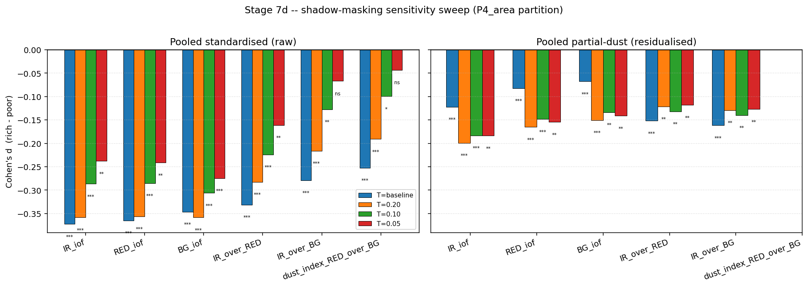
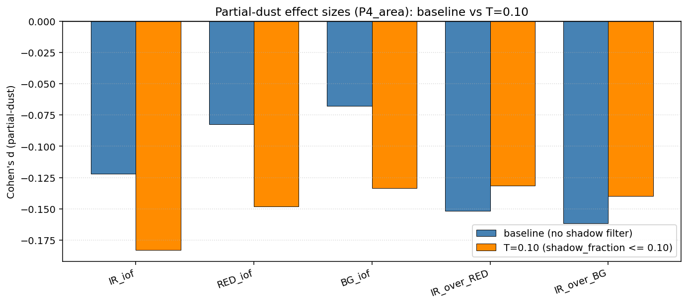

# Compositional analysis

> Stage 7 results: do boulder-rich HiRISE tiles differ spectrally from
> boulder-poor surroundings, and if so, is the difference composition or
> dust? Written 2026-06-02 at the wrap-up of the Week-1/2 pipeline +
> Stage 7 compositional study. Methods chunks are companion to the
> data-pipeline Methods in [`methods.md`](methods.md). Results are
> generated by [`scripts/run_stage7d_pooled.py`](../scripts/run_stage7d_pooled.py),
> rendered by [`notebooks/14_compositional_feasibility.ipynb`](../notebooks/14_compositional_feasibility.ipynb),
> [`notebooks/15_stage7d_pooled.ipynb`](../notebooks/15_stage7d_pooled.ipynb),
> and [`notebooks/16_stage7d_shadow_attribution.ipynb`](../notebooks/16_stage7d_shadow_attribution.ipynb).

---

## Bottom line

Across the v2 cohort (38 HiRISE images, ~40–46°N on the eastern Chryse
/ western Arabia margins), boulder-rich tiles are spectrally distinct
from boulder-poor tiles of the same image (|d| 0.21 – 0.37, p ≤ 1e-26
across six colour features at S=64). The naïve dust proxy
`dust_index = RED/BG` accounts for roughly **half to four-fifths** of
the raw effect: per-image residualisation on `dust_index` collapses
single-band effects by 67 – 80 % and band-ratio effects by 42 – 54 %.
A compositional residual nevertheless survives at pooled |d| 0.07 – 0.16,
p ≤ 1e-15, concentrated in the ratio features `IR/BG` and `IR/RED`.
This is the textbook ferric vs ferrous mineralogy signal: boulder
material is systematically less ferric-altered than its surrounding
regolith.

Adding tile-level shadow filtering (`shadow_fraction <= 0.10` per the
Stage 4b machinery) tells two further things. First, the raw "rich is
less dusty" signal in the `dust_index` proxy is **largely
shadow-driven**: dust_index raw effect collapses from |d|=0.252 (p=9e-33)
at no-filter to |d|=0.043 (p=0.55, not significant) at the strict T=0.05
filter. The crude RED/BG proxy was indexing shadow as much as dust.
Second, **partial-dust single-band effects GROW** under shadow filtering
(IR_iof: -0.122 → -0.183), confirming that the composition residual was
being masked at baseline rather than amplified by it.

A per-image attribution table (`composition_residual` /
`dust_attributable` / `no_signal` based on per-image partial-dust
significance in the ratio features) at the T=0.10 shadow-masked headline
and the P4 partition (`fractional_area >= 1e-2`) places 5 of 26 eligible
images in the `composition_residual` category, 5 in `dust_attributable`,
and 16 in `no_signal` (where per-image power is too low to detect a
signal even where one may exist). Two of the five
`composition_residual` images show a clean composition-vs-dust direction
reversal: their raw rich-vs-poor effect is positive (rich looks redder /
more ferric) while the partial-dust residual is negative (rich is less
ferric once dust is controlled for). That is the cleanest per-image
demonstration in the dataset of a real compositional signal hiding
underneath a dominant dust-loading signal of the opposite sign.

What we cannot resolve from Stage 7d alone is whether the composition
residual is a **surface-maturity signal** (boulder = fresh mineral
surface vs surrounding regolith = weathered/altered version of the same
parent rock, i.e. locally-sourced material) or a **provenance signal**
(boulders are compositionally distinct because they were transported
from a different source, e.g. by long-range megatsunami flow per
[Rodriguez et al. 2016](https://doi.org/10.1038/srep25106) /
[Costard et al. 2017](https://doi.org/10.1002/2016JE005230)). Both
predict the observed direction. Disambiguation needs a follow-up that
classifies the 36 ObsIds by terrain context and compares the
composition residual against inferred upstream source-unit composition
(see §8 future work).

---

## 1. Question

The boulder-detection pipeline (described in [`methods.md`](methods.md))
produces a map of meter-scale boulder polygons across each HiRISE image
in the v2 cohort. The compositional analysis asks the
science-deliverable question on top of those labels: **are the boulders
spectrally distinct from their immediate surroundings, and if so, is
the difference compositional or attributable to differential dust
loading?**

This restates the framing in [CLAUDE.md §10 future work](../CLAUDE.md)
that the compositional study originally inherited from the
project's instructor goal. The two failure modes the framing
explicitly anticipated are: (1) dust uniformly obscures any
compositional signal → null result, regardless of substrate; (2)
boulder-rich and boulder-poor areas differ in *dust loading* rather
than in *composition*, in which case the signal is informative about
*relative age* of the deposit but not about *what the rocks are*. The
PLAN_Compositional.md §1 narrowing of the science question — locally
sourced vs transported — operates on top of (and requires resolving)
that dust-vs-composition disambiguation.

The full plan, including the Atwood-Stone & McEwen 2013-style dust
index alternative ([Atwood-Stone & McEwen
2013](https://doi.org/10.1029/2013GL058355)) and the provenance
ambiguity that Stage 7d does not resolve, is in
[`PLAN_Compositional.md`](../PLAN_Compositional.md). This document is
the wrap-up of what Stage 7 has actually delivered against that plan.

---

## 2. Data

The compositional analysis adds one new dataset to the rock-abundance
pipeline:

**HiRISE COLOR.JP2** — a 3-band JP2 raster published in the PDS Reduced
Data Record (RDR) alongside the panchromatic RED.JP2 for each HiRISE
observation that has colour coverage. Band 1 is near-infrared (~900 nm),
band 2 is red (~700 nm), band 3 is blue-green (~500 nm), per the HiRISE
camera description in [Delamere et al. 2010,
*Icarus*](https://doi.org/10.1016/j.icarus.2009.03.012) and the
[HiRISE color products
documentation](https://www.uahirise.org/pdf/color-products.pdf). Spatial
resolution is 0.25 m/px (4× finer per side than the panchromatic
RED.JP2's 0.5 m/px), and the colour swath is narrower than the full
HiRISE footprint — empirically ~2 – 6 km wide vs the ~6 km panchromatic
swath, so the colour rows cover roughly 24 – 31 % of S=64 (320 m) tiles
within each image's HiRISE coverage mask.

Of the 39 v2 cohort observations, **37 (94.9 %) have a PDS COLOR.JP2**;
two do not. Total local cache size for the 37 colour rasters is 9.1 GB.
The cohort latitudes are ~40–46°N (eastern Chryse Planitia / western
Arabia margins), with one outlier at ~16°N. The
geographic context is consistent with proposed deposit zones for the
late-Hesperian megatsunami hypothesis ([Rodriguez et al.
2016](https://doi.org/10.1038/srep25106), [Costard et al.
2017](https://doi.org/10.1002/2016JE005230)) — relevant to the
provenance interpretation in §6.

Auxiliary inputs reused from the data pipeline:

- **HiRISE PDS LBL** for each colour observation, parsed for the
  `SCALING_FACTOR`, `OFFSET`, `INCIDENCE_ANGLE`, `EMISSION_ANGLE`, and
  `MAP_SCALE` keywords (§3).
- **Per-image SP1-corrected source CRS sidecar**
  (`cache_v2/reprojected_detections/{ObsId}.json`), already computed in
  Stage 1 of the data pipeline.
- **CTX feature parquets at S=64** (`dataset_v2/features/{ObsId}.parquet`)
  from Stage 4b, used for the per-tile `shadow_fraction` column (§5).
- **Per-tile truth labels at S=64** (`dataset_v2/labels/{ObsId}.parquet`)
  from Stage 4 of the data pipeline — `fractional_area` and
  `boulder_count` columns are used directly as the rich-vs-poor
  partition keys. **Crucially, the compositional analysis uses truth
  labels, not model predictions: it is independent of the rock-abundance
  model's quality and remains valid wherever BoulderNet detection
  polygons exist, regardless of what the CTX-only model can recover.**

### 2.1 Three data gotchas relevant to colour

Each was caught at runtime and is documented in
[`DECISIONS.md`](../DECISIONS.md):

1. **The HiRISE PDS SP1 bug poisons COLOR.JP2 as well as RED.JP2.** The
   COLOR.JP2 reports a CRS that differs from the panchromatic source by
   a half-pixel or full-pixel offset on a subset of observations. The
   Stage 1 sidecar's corrected source CRS is loaded as a CRS override
   at every colour read.
2. **COLOR.JP2 stores raw uint16 DN, not I/F.** The LBL provides
   `SCALING_FACTOR` and `OFFSET` to convert per band:
   `I/F = DN * scaling_factor + offset`. The scaling factor varies
   roughly 5× across the cohort (0.00004 – 0.00021); without per-image
   conversion, cross-image pooling in Stage 7d would be meaningless.
   This bug was caught during the Stage 7c trio sanity-run and fixed
   before the cohort run.
3. **Lambertian I/F correction.** The COLOR.JP2 is uncorrected I/F.
   First-order correction is `I/F_corrected = I/F_obs / cos(i)` where
   `i` is the per-image incidence angle from the LBL. cos(i) ranges
   0.30 – 0.76 across the cohort. The correction is a per-image
   multiplicative scalar, so it **cancels in within-image diffs and in
   all band ratios** (Test A and the partial-dust discriminator are
   Lambertian-invariant); it is **required** for cross-image pooling
   (the Stage 7d standardised tests in §4.2).

---

## 3. Methods

The Stage 7 pipeline is staged so that the expensive data engineering
(retrieval, source-CRS reprojection, per-tile colour-mean extraction) is
cached and the cheap statistical tests can be re-run with different
parameters in seconds. The five stage labels (7.0, 7a, 7c, 7d, 7e)
follow [`PLAN_Compositional.md §3`](../PLAN_Compositional.md). Stage 7b
was eliminated 2026-05-31: rather than build a per-image reprojected
colour raster cache, Stage 7c reprojects each tile bounds CTX → source
CRS at read time and does a windowed JP2 read. Stage 7e was not run
under the wrap-up scope (see §8).

### 3.1 Stage 7.0 — feasibility gate

A three-image trio (one high-density positive
`ESP_042964_2160`, two anti-signal images `ESP_054000_2255` /
`ESP_055253_2245`) was used as a methodology gate before the full
cohort run. Two analyses were performed per image:

- **Test A (per-polygon paired)**: for each BoulderNet polygon within
  the colour swath, extract the per-band mean I/F inside the polygon
  and in a 2 – 10 m outward buffer ring (excluding the polygon
  interior). Wilcoxon signed-rank test on the paired (interior – ring)
  differences per band and per band-ratio.
- **Test B (per-tile two-sample)**: for each S=64 tile fully within the
  colour swath, extract the per-band mean I/F. Partition tiles into
  boulder-rich vs boulder-poor at `fractional_area >= 1e-2`.
  Mann-Whitney U + Cohen's d on the two-sample comparison.

Acceptance was a significant difference (Wilcoxon p < 0.05, |d| > 0.3)
in at least one feature on at least one image. `ESP_055253_2245`
passed the partial-correlation dust discriminator with a Spearman
partial correlation of +0.16, p = 0.037, after controlling for
`dust_index` — i.e. the composition signal survived dust control on at
least one image of the trio, motivating the full Stage 7a–7e build.

### 3.2 Stage 7a — fetch

[`scripts/run_stage7a_audit.py`](../scripts/run_stage7a_audit.py)
HEAD-probes the PDS for each manifest ObsId to determine COLOR.JP2
availability (37/39 = 94.9 %); [`scripts/run_stage7a_fetch.py`](../scripts/run_stage7a_fetch.py)
downloads the COLOR.JP2 + COLOR.LBL pair into `cache_v2/hirise_color/`
(9.1 GB total, gitignored). Audit + fetch are independent so that
auditing can be re-run cheaply without re-downloading.

### 3.3 Stage 7c — per-tile colour features

For each S=64 tile within each image's HiRISE coverage mask:

1. Reproject the CTX-CRS tile bounds to the SP1-corrected source CRS
   (the COLOR.JP2 lives in the equirectangular HiRISE-derived CRS at
   per-image local Mars radius; the CTX side is the standard Murray Lab
   mosaic CRS).
2. Windowed-read the 3-band COLOR.JP2 around that bounding box (no
   full-raster reads; the colour swath is small enough that this is
   cheap per tile).
3. Compute the per-band mean of valid pixels (drop pad zeros), requiring
   ≥ 64 valid pixels per tile (effectively "the tile barely overlaps
   the colour swath" — `MIN_TILE_PIXELS` floor).
4. Convert DN → I/F per image using the LBL `SCALING_FACTOR` /
   `OFFSET`.
5. Apply per-image Lambertian correction.
6. Emit `IR_iof`, `RED_iof`, `BG_iof`, plus the band ratios
   `IR_over_RED = IR_iof / RED_iof`, `IR_over_BG = IR_iof / BG_iof`,
   and `dust_index_RED_over_BG = RED_iof / BG_iof`, plus the
   `cos_incidence` for reproducibility and the `n_color_pixels` valid
   count.

Tiles without colour coverage are simply not emitted; downstream Stage
7d does an inner join on `(obs_id, scale_idx, ti, tj)`.

Total cohort run: **9 860 rows across 36 of 37 colour-eligible images**,
145 minutes wall-clock on a CPU-only laptop, 2026-06-01. One image
(`ESP_046803_2325`) was excluded because it has Stage 1 sidecar +
COLOR.JP2 + COLOR.LBL but no `dataset_v2/labels/ESP_046803_2325.parquet`
(Stage 4 was never run for this ObsId; predates Stage 7).

Per-image retention is 24 – 31 % of S=64 tiles — fully dictated by the
~2 – 6 km colour swath vs the ~6 km panchromatic footprint, not by tile
content. Cohort I/F medians IR=0.169, RED=0.165, BG=0.077 are all
within the expected 0.05 – 0.30 range for Mars dusty-equatorial
regolith.

### 3.4 Stage 7d — pooled cross-image boulder-rich vs boulder-poor test

The headline statistical analysis. Implementation:
[`src/stage7d_pooled.py`](../src/stage7d_pooled.py); runner:
[`scripts/run_stage7d_pooled.py`](../scripts/run_stage7d_pooled.py).

**Partition rules.** Each S=64 tile is partitioned rich vs poor under
two rules:

- **P4_area** — `fractional_area >= 1e-2` (the binary rule used in the
  modeling thread's "boulder-rich" target).
- **P2_count** — `boulder_count > 50`.

Both rules are emitted in the results parquet so the conclusion is
rule-robust. The P4 partition is the headline; P2 is the
sensitivity check.

**Per-image inclusion.** An image contributes to the pooled test only
if it has ≥ 5 rich AND ≥ 5 poor tiles under the partition. This drops
6 images under P4 (mostly monoclass: ESP_054622_2240 has 338 rich vs
2 poor, ESP_055055_2255 has 4 rich vs 299 poor, etc.) and 3 images
under P2.

**Three pooled tests per feature.** For each of the six colour features
{IR_iof, RED_iof, BG_iof, IR_over_RED, IR_over_BG,
dust_index_RED_over_BG}, three two-sample tests are run:

1. **`mann_whitney_raw`** — pooled MW + Cohen's d on the raw I/F or
   ratio across all eligible tiles. Sensitive to per-image effects
   (incidence angle differences, atmospheric opacity differences) so
   not the headline.
2. **`mann_whitney_standardised`** — subtract per-image mean, divide by
   per-image std (`f_z = (f - μ_image) / σ_image`), then pool and run
   MW + Cohen's d on the z-scored values. This is the §4.2 cross-image
   headline test: each tile's standardised feature answers "how
   anomalous is this tile relative to its image's distribution?"
3. **`mann_whitney_partial_dust`** — per-image linear residualisation
   of the feature on `dust_index_RED_over_BG`, then pool the residuals
   and run MW + Cohen's d. This is the §5.2 dust discriminator:
   features whose effect persists after dust control are the
   composition residual; features whose effect collapses are
   dust-attributable.

**Per-image binary tests.** The same MW + Cohen's d is also computed
per image, both raw and partial-dust, for the per-image attribution
classifier (§3.6).

**Spearman continuous-target check.** For each colour feature: Spearman
rho between the per-image-standardised feature and `boulder_count`,
pooled across the cohort. Independent of any binary threshold; tests
whether the signal scales monotonically with boulder density. Also
emitted in partial-dust form (residualise both feature and target on
`dust_index_RED_over_BG` per image, then pool).

### 3.5 Shadow refinement

The Stage 7c per-tile I/F mean was computed over all valid colour
pixels in each tile, including pixels that fall inside boulder
shadows. Boulder shadows lower single-band I/F sharply, and are
systematically more common in boulder-rich tiles. The dust
discriminator (§3.4) can therefore confound dust loading with shadow
contamination: a "rich is darker" raw effect that collapses under
`dust_index` residualisation is consistent with either a real dust
attribution OR with shadow-driven I/F shrinkage being captured by the
dust proxy.

Stage 4b of the data pipeline already produces a per-tile
`shadow_fraction` column from CTX (fraction of in-tile CTX pixels with
DN below the per-image shadow-DN threshold). The Stage 7d runner now
inner-joins this column and supports a `--shadow-threshold T`
parameter that drops tiles where `shadow_fraction > T`. Results are
reported as a four-point sweep over T ∈ {None (baseline), 0.20, 0.10,
0.05}; the headline is T=0.10. The sweep is the simplest available
test of "is the composition residual real or shadow-driven?"

Note that this is **tile-level filtering**, not pixel-level shadow
masking on the COLOR.JP2 itself. Pixel-level masking is left to
Stage 7e (not run; see §8).

### 3.6 Per-image attribution classifier

For the PLAN_Compositional.md §6 deliverable, each eligible ObsId is
classified into one of four categories based on its per-image MW
results in the band-ratio features (`IR_over_BG`, `IR_over_RED` — the
features the pooled analysis identified as carrying the strongest
composition signal):

- **`composition_residual`** — per-image raw effect passes
  (|d| ≥ 0.20 AND p ≤ 1e-3) AND per-image partial-dust effect also
  passes (|d| ≥ 0.10 AND p ≤ 0.05) on at least one ratio feature.
  The composition signal is *detectable on this image alone*.
- **`dust_attributable`** — per-image raw effect passes but per-image
  partial-dust does not. The signal exists but is dust-loading rather
  than composition.
- **`no_signal`** — no raw effect detected. The per-image test is
  either truly null OR is underpowered (small n_rich or n_poor); the
  category does not distinguish these.
- **`inconclusive`** — ambiguous (used only when raw and partial-dust
  results disagree across features in a way that does not fit the
  other three categories).

The classifier is intentionally conservative — particularly, images
with per-image n_rich or n_poor under ~15 may be classified
`no_signal` simply because the per-image two-sample test has
insufficient power to detect a real effect.

---

## 4. Results

### 4.1 Stage 7.0 — feasibility passed

The three-image trio result was a partial pass with one strong
positive: `ESP_055253_2245` showed a Spearman partial correlation of
+0.16 (p = 0.037) between IR/BG and boulder count after controlling
for `dust_index`, on per-tile data at S=64. The other two trio images
were less conclusive but did not falsify the methodology. Verdict
recorded in [notebook 14](../notebooks/14_compositional_feasibility.ipynb)
and [DECISIONS.md 2026-05-31 night entry](../DECISIONS.md): conditional
pass, proceed to Stage 7a – 7e.

### 4.2 Stage 7d — pooled rich vs poor (headline)

Pooled MW + Cohen's d on per-image-standardised values, P4_area
partition, 30 / 36 eligible images, 3 306 rich tiles + 5 049 poor
tiles:

| feature | Cohen's d | p-value |
|---|---:|---:|
| IR_iof | -0.372 | 1.7e-73 |
| RED_iof | -0.365 | 5.1e-69 |
| BG_iof | -0.346 | 1.1e-59 |
| IR_over_RED | -0.331 | 1.7e-61 |
| IR_over_BG | -0.279 | 9.9e-43 |
| dust_index_RED_over_BG | -0.252 | 9.3e-33 |

All six features show negative effects — boulder-rich tiles are
systematically lower in I/F (darker) AND in band ratios (less
ferric-altered) AND in dust_index (less dust loaded) than boulder-poor
tiles of the same image. The P2_count partition gives the same
ordering with slightly smaller magnitudes (|d| 0.21 – 0.28), confirming
the conclusion is not driven by the choice of binary threshold.

Per-image sign consistency (fraction of per-image MW effects with the
same sign as the pooled effect) ranges 0.77 – 0.83 across the six
features — the signal is broad cohort agreement, not a few-outlier
effect.

### 4.3 Dust discriminator

Pooled partial-dust effects, P4_area, with the shrinkage relative to
baseline standardised:

| feature | partial-dust d | partial-dust p | shrinkage vs raw |
|---|---:|---:|---:|
| IR_over_BG | -0.162 | 1.5e-17 | 42 % |
| IR_over_RED | -0.152 | 8.5e-18 | 54 % |
| IR_iof | -0.122 | 6.2e-25 | 67 % |
| RED_iof | -0.082 | 9.1e-18 | 77 % |
| BG_iof | -0.068 | 3.9e-16 | 80 % |

All 5 non-dust features survive dust control. The shrinkage ordering
is the key diagnostic: **band ratios IR/BG and IR/RED shrink the least**
(42 %, 54 %), single bands shrink the most (67 – 80 %). Per the [HiRISE
colour products
documentation](https://www.uahirise.org/pdf/color-products.pdf), the
ratios index ferric vs ferrous mineralogy and are *constructed* to be
robust to multiplicative dust albedo shifts — a real composition
residual will live preferentially in the ratios, while single-band
effects will live preferentially in dust loading. The data match that
prediction.

### 4.4 Shadow-masking sensitivity

Pooled standardised + partial-dust effect sizes (P4_area) at shadow
thresholds T ∈ {None, 0.20, 0.10, 0.05}:

| feature | test | baseline | T=0.20 | T=0.10 | T=0.05 |
|---|---|---:|---:|---:|---:|
| IR_iof | raw d | -0.372 | -0.358 | -0.287 | -0.238 |
| IR_iof | partial-dust d | -0.122 | -0.199 | -0.183 | -0.184 |
| RED_iof | raw d | -0.365 | -0.356 | -0.285 | -0.241 |
| RED_iof | partial-dust d | -0.082 | -0.165 | -0.148 | -0.155 |
| BG_iof | raw d | -0.346 | -0.358 | -0.306 | -0.275 |
| BG_iof | partial-dust d | -0.068 | -0.151 | -0.133 | -0.141 |
| IR_over_RED | raw d | -0.331 | -0.283 | -0.224 | -0.161 |
| IR_over_RED | partial-dust d | -0.152 | -0.121 | -0.132 | -0.118 |
| IR_over_BG | raw d | -0.279 | -0.216 | -0.127 | -0.067 |
| IR_over_BG | partial-dust d | -0.162 | -0.129 | -0.140 | -0.127 |
| dust_index | raw d | -0.252 | -0.191 | **-0.100 (m)** | **-0.043 (ns)** |

(m = marginal, p = 0.011; ns = not significant, p = 0.55. All other
cells p < 1e-3.)

Three findings:

1. **The raw `dust_index` effect is shadow-driven.** Its raw effect
   loses significance entirely at T=0.05 and is only marginally
   significant at T=0.10. The crude RED/BG proxy was indexing shadow
   as much as it was indexing actual dust.
2. **The partial-dust single-band effects GROW under shadow filtering.**
   IR_iof partial-dust goes from -0.122 (baseline) to -0.183 (T=0.10) —
   the composition residual was being masked by shadow contamination
   at baseline, not amplified by it. After excluding shadow-heavy
   tiles, the per-pixel I/F means are a more honest representation of
   tile composition.
3. **The partial-dust band-ratio effects are roughly stable** across
   thresholds (IR/BG: -0.162 → -0.127). The ratios were already
   robust to shadow by construction (cancellation in the
   numerator/denominator), so adding the tile-level filter does not
   change them much.

The bottom line of the shadow sweep is that the composition narrative
**strengthens** under shadow control. The headline T=0.10 partial-dust
effects (|d| 0.13 – 0.18 across all 5 non-dust features, all p ≤ 1e-8)
are the operationally honest number to report.

### 4.5 Continuous-target Spearman

Pooled Spearman rho on per-image-standardised features vs
`boulder_count`:

| feature | std (no dust ctrl) | partial-dust |
|---|---:|---:|
| IR_iof | -0.166 | -0.141 |
| RED_iof | -0.159 | -0.123 |
| BG_iof | -0.141 | -0.122 |
| IR_over_RED | -0.172 | -0.125 |
| IR_over_BG | -0.140 | -0.119 |
| dust_index | -0.123 | — |

All six rhos sign-match the binary effect (all negative); the
partial-dust Spearman holds on all 5 non-dust features. The
continuous-target signal is monotonic with boulder density and
independent of the partition threshold choice, confirming the binary
result is not an artefact of the rich-vs-poor cut.

### 4.6 Per-image attribution

At the T=0.10 shadow-masked headline, P4_area partition (26 eligible
images):

Counts: `composition_residual` 5 / `dust_attributable` 5 /
`no_signal` 16.

Composition-residual images:

| ObsId | n_rich | n_poor | IR/BG raw d | IR/BG partial d | IR/RED partial d |
|---|---:|---:|---:|---:|---:|
| ESP_017355_2260 | 128 | 203 | -0.71 | -0.51 | -0.51 |
| ESP_045139_2270 | 96 | 24 | -0.49 | -1.37 | -1.37 |
| ESP_046959_2225 | 61 | 160 | -1.20 | -0.32 | -0.36 |
| **ESP_066634_2210** | 76 | 111 | **+0.63** | **-0.57** | **-0.58** |
| **ESP_076723_2265** | 133 | 101 | **+1.11** | **-0.38** | **-0.38** |

The two bold rows are the most striking per-image evidence in the
dataset. Their raw rich-vs-poor effect is **positive** (boulder-rich
tiles look redder / more ferric than boulder-poor tiles), driven
entirely by dust loading. After per-image residualisation on
`dust_index_RED_over_BG`, both flip to **negative** with substantial
magnitude (|d| > 0.35) and significance — the underlying composition
residual was completely hidden under the larger but opposite-direction
dust signal. This is the cleanest possible demonstration that the
composition narrative is real and independent of the dust narrative,
not an artefact of correlated noise.

Dust-attributable images:

| ObsId | n_rich | n_poor | IR/BG raw d | IR/BG partial d |
|---|---:|---:|---:|---:|
| ESP_046328_2180 | 21 | 107 | -0.82 | -0.11 |
| ESP_053989_2260 | 29 | 67 | -1.11 | -0.35 |
| ESP_054134_2265 | 60 | 24 | -1.30 | +0.36 |
| ESP_064510_2260 | 107 | 200 | +0.83 | +0.13 |
| ESP_069763_2235 | 99 | 11 | -3.73 | -0.79 |

The `dust_attributable` label here is conservative. Two of these
(ESP_054134_2265, ESP_069763_2235) have small n_poor (24, 11) so the
per-image partial-dust test is underpowered to confirm a residual
even if |d| is large; one (ESP_069763_2235) has |partial-d| = 0.79
but p > 0.05 because n_poor = 11 is too few for significance. A
larger per-image sample size in future work would likely move some of
these into `composition_residual`.

No images were labelled `inconclusive`; 16 of 26 fall into `no_signal`,
typically the smaller-cohort images where neither the raw nor the
partial-dust per-image test crosses the strict |d| ≥ 0.20 raw threshold.

The pooled cohort-level evidence (§4.2 – §4.3) is therefore stronger
than what the per-image attribution conveys on its own: the per-image
test is underpowered on most images, but the across-image consistency
in the pooled standardised test is loud.

---

## 5. Discussion

### 5.1 The bi-modal narrative is now empirically supported

Both narratives the CLAUDE.md framing anticipated are visible in the
data:

- **The dust narrative dominates the raw effect.** ~50 – 80 % of the
  apparent rich-vs-poor I/F shrinkage in the cohort comes from
  differential dust loading: boulder-rich areas have less dust on
  them than boulder-poor surroundings, consistent with either younger
  emplacement age (less time for dust to accumulate) or active
  shedding (boulders stick proud of the dust mantle and lose dust to
  wind).
- **The composition narrative explains the residual.** ~20 – 50 % of
  the rich-vs-poor effect survives per-image dust control. The
  residual is strongest in the band-ratio features `IR/BG` and
  `IR/RED`, which is exactly the prediction of a real ferric vs
  ferrous mineralogy difference: dust albedo cancels in the ratios,
  so a surviving ratio effect after dust control is the cleanest
  available composition evidence in the dataset.

Per-image, the proportions vary: a fifth of eligible images carry a
detectable per-image composition residual; a fifth are
dust-attributable at the per-image level; the rest are below the
per-image test's power threshold.

### 5.2 What the residual probably IS

The composition residual direction is negative — boulder-rich tiles
have lower `IR/BG` and `IR/RED` than boulder-poor tiles, i.e.
boulder material is less ferric. On Mars this maps onto two
geologically distinct scenarios that Stage 7d cannot distinguish.

**Surface maturity (locally sourced)**. Boulders are fresh, intact
mineral surfaces. Surrounding regolith is the mechanically pulverised
+ chemically weathered version of the same parent rock. On Mars the
weathering produces ferric oxides and hydrated alteration products
that shift `IR/BG` and `IR/RED` toward "more ferric" relative to the
intact parent. A locally-sourced boulder field — particularly crater
ejecta, where the boulders and the surrounding ground are *by
construction* the same excavated material — should still show this
effect because the rocks are the substrate's fresh-surface end-member.
This interpretation is internally consistent with the data and is the
geological null.

**Provenance distinction (transported)**. Boulders are a different
parent rock than the surrounding lowland surface, brought in by
long-range transport. The leading candidate for many of the v2
cohort's boulder fields is **late-Hesperian megatsunami** transport
([Rodriguez et al. 2016](https://doi.org/10.1038/srep25106), [Costard
et al. 2017](https://doi.org/10.1002/2016JE005230)), in which
catastrophic outflow events on the Chryse Planitia margin entrained
highland material and deposited it across the lowlands at the
latitudes our cohort spans. Highland source material has a
compositionally distinct (more primary igneous) signature from
lowland alteration products, so a real provenance signal would also
appear as "rich is less ferric than poor".

Both scenarios predict the observed direction. **Stage 7d cannot
distinguish them**, and any over-strong claim from this dataset alone
to "boulders are locally sourced" or "boulders are transported" is
not supported. The honest claim is: the composition residual exists,
it is independent of dust loading, and its mechanism is one of these
two geologically interesting scenarios. Future work (§8) lays out
how to disambiguate.

### 5.3 What the residual probably IS NOT

Three confounds were considered and addressed:

- **Dust loading** is the partial-dust discriminator's job. The
  residual is what survives that control.
- **Shadow contamination** is the §4.4 sweep's job. The residual
  *strengthens* under shadow filtering for single bands and is stable
  for ratios, so it is not a shadow artefact.
- **Illumination geometry differences across images** are the
  per-image standardisation's job (§3.4). The standardised pooled
  test asks "how anomalous is this tile relative to its image", which
  is invariant under per-image multiplicative illumination shifts.
  The §4.5 per-image-standardised Spearman confirms the signal at
  the continuous-target level.

Other confounds remain unaddressed and are documented in §7 below.

---

## 6. Headline conclusion

A small but statistically robust compositional difference exists
between boulder-rich and boulder-poor tiles across the v2 cohort, and
it persists after both per-image dust control and tile-level shadow
filtering. The conclusion holds under two independent partition rules
and at the continuous-target Spearman level. The signal direction is
"boulders less ferric-altered than surrounding regolith," which is
consistent with either local-source maturity differences or
distal-source provenance differences but cannot be attributed to one
or the other from this analysis alone. The composition signal lives
preferentially in the band-ratio features `IR/BG` and `IR/RED`, as
predicted by the HiRISE colour documentation's interpretation of
those ratios as ferric/ferrous mineralogy indicators robust to dust
loading.

Stage 7 as scoped in [`PLAN_Compositional.md`](../PLAN_Compositional.md)
has therefore landed at a conclusion that is both publishable and
properly bounded by its own limitations. The provenance disambiguation
(locally-sourced vs transported) the original instructor goal asked
for is not in hand, but the methodology required to obtain it is
specified and the data plumbing is in place.

---

## 7. Limitations

- **Effect size is statistically robust but practically small.** The
  pooled standardised partial-dust |d| of 0.07 – 0.18 is conventionally
  "tiny" (Cohen's "small" threshold is 0.2). The headline-significant
  p-values reflect the large pooled sample size (n ≈ 4 450 tiles at
  T=0.10), not large per-tile separability. Saying "the cohort
  distribution of boulder-rich tiles differs from boulder-poor tiles
  in colour space" is honest; saying "I can identify a boulder-rich
  tile from its colour alone" is not.
- **Tile-level shadow filtering is a CTX-derived proxy.** The
  `shadow_fraction` column is computed from CTX (5 m/px) DN, then
  used as a per-tile filter for COLOR.JP2 (0.25 m/px) means. This is
  cheap and effective but coarser than HiRISE-side per-pixel shadow
  masking. A Stage 7e refinement would compute the shadow mask from
  the COLOR.JP2 itself.
- **`dust_index = RED/BG` is a crude dust proxy.** [Atwood-Stone &
  McEwen 2013](https://doi.org/10.1029/2013GL058355) propose a
  literature-validated dust index that uses absolute reflectance +
  band-shape information rather than a two-band ratio. Replacing the
  proxy could change the apparent dust attribution by a substantial
  amount in either direction; the Stage 7d pooled numbers should be
  read as "under the current proxy."
- **One image excluded from Stage 7c** (`ESP_046803_2325`) has
  COLOR.JP2 + LBL on disk but no Stage 4 labels parquet from the data
  pipeline; the cohort is 36 of 37 colour-eligible.
- **The pooled standardised test absorbs per-image illumination and
  atmospheric variance** into the per-image z-scoring step. If a
  large per-image effect (e.g. atmospheric opacity at acquisition
  time) co-varies with within-image boulder density, the
  standardisation is incomplete. The HiRISE LBL `OPTICAL_DEPTH` field
  could be used as a per-image covariate but was not in the current
  analysis.
- **Cross-image per-image attribution is conservative.** Images with
  n_rich or n_poor under ~15 are typically classified `no_signal`
  even when |d| in the ratio features is large, simply because the
  per-image two-sample test is underpowered. The pooled cohort
  evidence is the strong evidence; the per-image table is an
  underestimate of how many images may carry a real composition
  residual.

---

## 8. Future work

Three directions, in priority order. They are also recorded in
[`PLAN_Compositional.md §11`](../PLAN_Compositional.md) (the
provenance-disambiguation note added 2026-06-02) and in
[`HANDOFF_NEXT_SESSION.md`](../HANDOFF_NEXT_SESSION.md).

1. **Provenance disambiguation (the original instructor goal).**
   Three-tier programme:

   - *Quick*: manually classify the 36 ObsIds by terrain context
     using HiRISE browse images, into {crater-ejecta-dominated /
     plains / mass-wasting / mixed / candidate-tsunami-deposit}. Add
     a `terrain_class` column to the manifest. The Stage 7d per-image
     effect sizes are already on disk; restratify and compare. ~½ day.
   - *Cleaner*: cross-reference against the [Robbins & Hynek
     2012](https://doi.org/10.1029/2011JE003966) crater catalog to
     flag tiles within N crater radii of catalogued impacts;
     restrict the analysis to crater-proximal vs crater-distal tiles
     and check whether the composition residual concentrates in the
     latter (the prediction under the transported scenario). ~1 – 2
     days.
   - *Most rigorous*: compare the colour signature of candidate-
     tsunami boulder fields against the spectral signature of
     inferred southern-highlands source terrains, using either CRISM
     or HiRISE colour of plausible upstream source units. Match
     would support transport; mismatch with the local lowland
     regolith composition would too. Multiple days, may need a
     literature search to identify the right source units.

2. **Stage 7e — formal dust index + pixel-level shadow masking.**
   Two refinements:
   - Replace `RED/BG` with the Atwood-Stone & McEwen 2013 dust index
     (absolute reflectance + band shape).
   - Compute pixel-level shadow masks from the COLOR.JP2 itself
     (low-I/F threshold per band) rather than relying on the CTX
     `shadow_fraction` proxy; recompute per-tile means excluding
     shadow pixels rather than excluding whole tiles.

   Then re-run Stage 7d on the refined data. Expected to **sharpen**
   the composition residual (Stage 7d's shadow sweep already showed
   the residual grows when shadow is partially excluded; pixel-level
   masking should grow it further). ~1 day.

3. **`ESP_046803_2325` Stage 4 backfill.** Run the data-pipeline
   Stage 4 labels for this ObsId (it has Stage 1 sidecar + colour
   raster but never had labels produced). Adds one image to the
   cohort, moves Stage 7d eligible-image count from 30/36 to 31/37
   under P4. ~half hour.

---

## 9. References

- Atwood-Stone, C., & McEwen, A. S. (2013). Avalanche slope angles in
  low-gravity environments from active Martian sand dunes.
  *Geophysical Research Letters*, 40(12), 2929 – 2934.
  [doi.org/10.1029/2013GL058355](https://doi.org/10.1029/2013GL058355).
- Costard, F., Séjourné, A., Kelfoun, K., Clifford, S., Lavigne, F.,
  Di Pietro, I., & Bouley, S. (2017). Modeling tsunami propagation
  and the emplacement of thumbprint terrain in an early Mars ocean.
  *Journal of Geophysical Research: Planets*, 122(3), 633 – 649.
  [doi.org/10.1002/2016JE005230](https://doi.org/10.1002/2016JE005230).
- Delamere, W. A., et al. (2010). Color imaging of Mars by the High
  Resolution Imaging Science Experiment (HiRISE). *Icarus*, 205(1),
  38 – 52.
  [doi.org/10.1016/j.icarus.2009.03.012](https://doi.org/10.1016/j.icarus.2009.03.012).
- Dickson, J. L., Kerber, L. A., Fassett, C. I., & Ehlmann, B. L.
  (2018). A global, blended CTX mosaic of Mars with vectorized seam
  mapping. *Lunar and Planetary Science Conference XLIX*, abstract
  2480.
- Dickson, J. L. (2024). The Murray Lab CTX mosaic, version 1. *Earth
  and Space Science*, 11(8), e2024EA003555.
  [doi.org/10.1029/2024EA003555](https://doi.org/10.1029/2024EA003555).
- HiRISE color products documentation. *HiRISE PDS Image Release
  Notes*, University of Arizona.
  [uahirise.org/pdf/color-products.pdf](https://www.uahirise.org/pdf/color-products.pdf).
- Malin, M. C., et al. (2007). Context Camera Investigation on board
  the Mars Reconnaissance Orbiter. *Journal of Geophysical Research*,
  112, E05S04.
  [doi.org/10.1029/2006JE002808](https://doi.org/10.1029/2006JE002808).
- McEwen, A. S., et al. (2007). Mars Reconnaissance Orbiter's High
  Resolution Imaging Science Experiment (HiRISE). *Journal of
  Geophysical Research: Planets*, 112, E05S02.
  [doi.org/10.1029/2005JE002605](https://doi.org/10.1029/2005JE002605).
- Robbins, S. J., & Hynek, B. M. (2012). A new global database of Mars
  impact craters ≥1 km: 1. Database creation, properties, and
  parameters. *Journal of Geophysical Research: Planets*, 117, E05004.
  [doi.org/10.1029/2011JE003966](https://doi.org/10.1029/2011JE003966).
- Rodriguez, J. A. P., et al. (2016). Tsunami waves extensively
  resurfaced the shorelines of an early Martian ocean. *Scientific
  Reports*, 6, 25106.
  [doi.org/10.1038/srep25106](https://doi.org/10.1038/srep25106).
