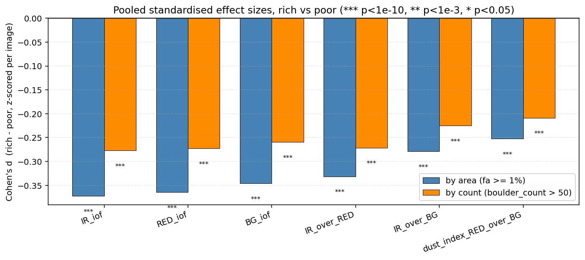
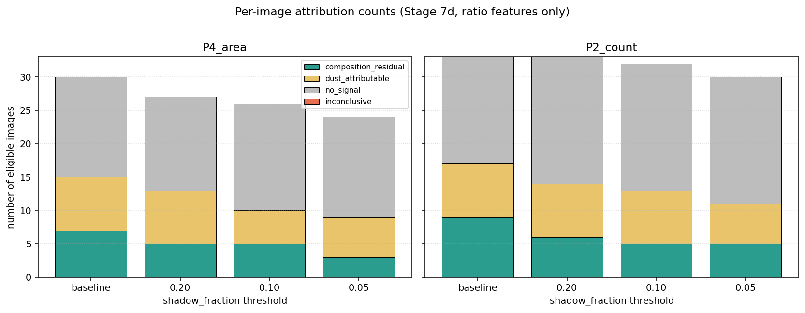
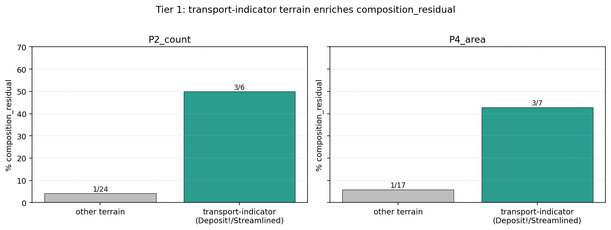

# Compositional analysis (slim)

> A higher-level reportable writeup of the compositional study. Same
> data and same numbers as the full implementation in
> [`compositional.md`](compositional.md); written at a level pitched
> at a general scientific reader rather than someone working in the
> pipeline. The full doc is the reference for the per-image partition
> rules, the shadow-threshold sweep, the data-engineering gotchas,
> and the additional crater-catalog cross-reference; everything here
> stands on its own.

---

## Bottom line

Boulder-rich tiles look spectrally different from boulder-poor tiles
of the same image, across a cohort of 36 HiRISE observations with
usable colour coverage. About half to four-fifths of the
rich-vs-poor effect comes from differential dust loading; the
remaining ~20–50 % survives per-image dust control and lives
preferentially in the band-ratio features that index ferric vs
ferrous mineralogy. Boulder material is systematically *less
ferric-altered* than the surrounding regolith. That direction is
consistent with both a "locally-sourced, surface-maturity"
interpretation (boulders = fresh same-parent-rock; surroundings =
weathered version) and a "transported, distinct parent"
interpretation; a separate terrain cross-reference against
independent geological annotations on the same images modestly
favours the transported interpretation (Fisher's exact p = 0.018),
but the surface-maturity alternative remains in play and needs a
follow-up comparison against inferred upstream source-unit
composition to disambiguate decisively.

---

## 1. Question

The boulder-detection pipeline ([modeling_slim.md](modeling_slim.md))
produces a map of meter-scale boulder polygons on each HiRISE image
in the v2 cohort. The compositional study asks the science-deliverable
question on top of those labels: **are the boulders spectrally
distinct from their immediate surroundings, and if so, is the
difference compositional or attributable to differential dust
loading?**

The framing anticipates two failure modes. The first is that dust
uniformly hides any compositional signal — boulder-rich and
boulder-poor tiles look the same regardless of what's underneath, so
there is no detectable difference at all. The second is that
boulder-rich and boulder-poor areas differ in *dust loading* rather
than in *composition* — the signal is real but informative about
relative age of the deposit, not about what the rocks are made of. A
follow-on question, beyond pure dust-vs-composition disambiguation,
is whether the boulders are **locally sourced** (eroded in place
from underlying bedrock, exposed by impacts, or otherwise derived
from the immediate substrate) or **transported** by long-range
processes (notably megatsunami transport from the late-Hesperian
outflow events into the northern lowlands per
[Rodriguez et al. 2016](https://doi.org/10.1038/srep25106) /
[Costard et al. 2017](https://doi.org/10.1002/2016JE005230); the
cohort's geographic location at ~40 – 46°N on the eastern Chryse /
western Arabia margins sits in their proposed deposit zones).

---

## 2. Data

**Source data.** The compositional analysis works on two pieces of
upstream data:

- **HiRISE COLOR.JP2** — a three-band JP2 published by the PDS
  alongside each HiRISE panchromatic observation. The three bands
  are near-infrared (~900 nm), red (~700 nm), and blue-green
  (~500 nm), in I/F (intensity-over-flux) units at 0.25 m/pixel
  spatial resolution. The colour swath is narrower than the
  panchromatic footprint — roughly 2 – 6 km wide vs the
  full ~6 km HiRISE swath — so the colour data covers only the
  central 24 – 31 % of tiles within each image. Camera description in
  [Delamere et al. 2010, *Icarus*](https://doi.org/10.1016/j.icarus.2009.03.012);
  observational properties documented in the
  [HiRISE colour products notes](https://www.uahirise.org/pdf/color-products.pdf).
- **Boulder polygons** — meter-scale boulder detections on the
  HiRISE panchromatic images, produced by the BoulderNet Mask R-CNN
  detector ([Prieur et al. 2023, *JGR Planets*](https://doi.org/10.1029/2023JE008013))
  and used as truth labels for the compositional partition. The
  polygons enter the analysis already aligned to the upstream
  per-tile coordinate grid (see "tile-aligned coordinates" below);
  the alignment work is done by the rock-abundance modelling
  pipeline ([modeling_slim.md](modeling_slim.md)).

Of the 39 v2 cohort observations, **37 (94.9 %) have a usable
COLOR.JP2** on PDS. Cohort coverage cluster lat/lon: ~40 – 46°N,
0 – 20°E (eastern Chryse / western Arabia margins).

*Figure 1. HiRISE 3-band false-colour composite (IR=red channel,
RED=green, BG=blue) for an exemplar held-out image
(`ESP_046959_2225`, an image we'll see again in §4 as a
composition-residual case). Cyan dots are BoulderNet polygon
centroids — there are 330 detected boulders inside this ~1 km strip
of the colour swath. The mesa-like surface morphology is visible in
the colour data; the surrounding white regions are off-swath nodata
where polygons exist (on the HiRISE panchromatic) but colour does
not. The full compositional analysis works at the per-tile (320 m)
aggregation level shown in §3.*

**Tile grid + boulder labels.** We reuse the 320 m × 320 m tile grid
and per-tile boulder labels (`boulder_count`, `fractional_area`)
from the rock-abundance modelling pipeline ([modeling_slim.md](modeling_slim.md))
— same tiles, same labels, just repurposed from "predict where
boulders are" to "compare colour where boulders are vs where they
aren't." The tile aggregation level is the natural scale for
boulder-rich-vs-poor comparisons (and was shown to be statistically
robust in the modelling work). The compositional analysis defines
"boulder-rich" as `fractional_area ≥ 1 %`.

**Per-tile colour features.** For each tile that lies within both
the HiRISE coverage mask and the COLOR.JP2 swath, the compositional
pipeline reads the COLOR.JP2 pixels covered by that tile and
computes the per-band mean I/F value. This is the only step where
the COLOR.JP2 raster is read directly; everything that follows in
§3 is statistical analysis on these per-tile feature values. Two
preprocessing steps apply to the per-band means before they enter
the statistical analyses:

1. **Photometric correction.** Each image's per-band means are
   divided by the cosine of the per-image solar incidence angle
   (Lambertian correction), so cross-image comparisons are not
   confused by the fact that different images were acquired under
   different sun elevations.
2. **Band ratios.** Beyond raw band means, the analysis emits three
   band-ratio features: `IR/RED`, `IR/BG`, and `dust_index = RED/BG`.
   Ratios are useful because they are invariant under any
   wavelength-independent multiplicative shift in the per-tile
   brightness — including any per-pixel dust albedo variation. The
   `RED/BG` ratio is a simple Mars-surface dust proxy; the `IR/RED`
   and `IR/BG` ratios index ferric vs ferrous iron-mineralogy per the
   HiRISE colour documentation, since dust hides the spectral
   asymmetry between ferric (oxidised) and ferrous (primary igneous)
   surfaces.

Final cohort: **9 860 tiles across 36 images** with both colour
features and per-tile boulder labels.

---

## 3. Methods

### 3.1 Cross-image statistical test

The headline test compares the colour properties of boulder-rich
tiles against boulder-poor tiles, pooled across the cohort. The
question is fundamentally cross-image — we are not asking whether
this *image* has different colour from that *image*, but whether
*within any image*, the tiles that have boulders look spectrally
different from the tiles that don't.

This is run via two-sample Mann-Whitney U tests + Cohen's d effect
sizes on rich-vs-poor populations. The trick is **per-image
standardisation**: before pooling tiles across images, each tile's
colour features are converted into a z-score against the *image's
own* distribution (subtract the image-level mean, divide by the
image-level standard deviation). After standardisation, each tile's
value answers "how anomalous is this tile relative to its image's
distribution?" — and the pooled comparison then asks whether
boulder-rich tiles are systematically more anomalous in some
direction than boulder-poor tiles.

The standardisation is necessary because images vary substantially
in solar incidence angle, acquisition time, atmospheric opacity, and
underlying terrain colour, all of which produce per-image
multiplicative or additive shifts in the absolute I/F values. The
absolute colour of one image's tiles is not directly comparable to
another image's, but the standardised colour anomaly is.

### 3.2 Per-image dust control (the residualisation step)

A second statistical step distinguishes a real composition signal
from differential dust loading. The crude per-image `RED/BG` dust
proxy is fit linearly against each colour feature, *per image*, and
the residuals are extracted — these are the per-tile feature values
with the per-image dust-correlated component removed. The cross-image
test is then re-run on the residuals.

If the rich-vs-poor difference persists in the residualised
features, the signal is compositional (i.e. boulder material differs
from regolith in some way that doesn't co-vary with dust). If the
difference collapses, the original effect was attributable to dust.
A real composition signal is expected to live preferentially in the
band-ratio features `IR/BG` and `IR/RED`, because those ratios are
constructed to be robust to multiplicative dust shifts and instead
respond to ferric vs ferrous mineralogy. Single-band effects are
expected to be more dust-attributable.

### 3.3 Shadow refinement

A possible confound at this point is shadow contamination — boulders
cast small shadows under oblique sun, and shadow pixels are
systematically darker, which could bias the rich-vs-poor difference
in the single-band I/F means. The upstream feature pipeline already
publishes a per-tile `shadow_fraction` scalar (the fraction of in-
tile pixels darker than the per-image shadow-DN threshold); we use
that to drop any tile where `shadow_fraction > 10 %`. The headline
results are reported on the shadow-filtered cohort.

### 3.4 Per-image attribution classifier

The cross-image pooled test produces one cohort-level effect size
per feature. To answer "which images carry the signal?", a per-image
classifier is also run: for each image independently, the same
Mann-Whitney + Cohen's d test compares the image's boulder-rich tiles
against its boulder-poor tiles, both on the raw band-ratio features
and on the dust-residualised band-ratio features. Each image is then
binned into one of three categories:

- **composition_residual** — both the raw rich-vs-poor effect and
  the dust-residualised effect are statistically detectable on this
  image, in the band-ratio features. The composition signal is
  *detectable on this image alone*.
- **dust_attributable** — the raw effect is detectable but the
  dust-residualised effect is not. On this image, the signal exists
  but is dust-loading rather than composition.
- **no_signal** — neither the raw nor the residualised effect is
  detectable per-image. Either the image is truly null, or the
  per-image test is underpowered given small rich- or poor-tile
  counts.

### 3.5 Terrain context cross-reference

Independently of the colour analysis, each cohort image has been
geologically annotated from HiRISE browse imagery with free-text
terrain descriptions. Two annotations are particularly relevant: a
**"Deposit!"** flag, indicating a depositional landform (e.g. a
sedimentary or transported deposit visible at HiRISE scale), and a
**"streamlined"** flag, indicating teardrop-shaped morphologies
typical of long-range flow transport. Combining these into a single
boolean `transport_indicator = Deposit! OR streamlined`, we can then
ask whether the per-image attribution categories above correlate
with this independent geological annotation — i.e., whether the
images we flagged as `composition_residual` are also the ones
independently annotated as showing transport-like morphology. This
is a Fisher's exact two-sided test on a 2 × 2 contingency table.

---

## 4. Results

### 4.1 Pooled rich-vs-poor headline

After per-image standardisation, the pooled Mann-Whitney + Cohen's d
test finds that boulder-rich tiles differ from boulder-poor tiles in
all six colour features at very high significance levels (n ≈ 8 355
tiles from 30 eligible images):

| Feature | Cohen's d | p-value |
|---|---:|---:|
| IR_iof | -0.372 | 1.7e-73 |
| RED_iof | -0.365 | 5.1e-69 |
| IR_over_RED | -0.331 | 1.7e-61 |
| BG_iof | -0.346 | 1.1e-59 |
| IR_over_BG | -0.279 | 9.9e-43 |
| dust_index_RED_over_BG | -0.252 | 9.3e-33 |

*Figure 2. Pooled rich-vs-poor Cohen's d for each of the six colour
features after per-image standardisation. All six are negative
(boulder-rich tiles are lower than boulder-poor tiles in each
feature) and statistically unambiguous at the n ≈ 8 000 sample size.
Effect-size magnitudes are "small" by Cohen's convention (|d| 0.21 –
0.37) — real, but modest in per-tile separability.*

All six effects are negative, meaning boulder-rich tiles are
systematically lower than boulder-poor tiles in raw I/F (darker), in
ratio features (less ferric-altered), and in the dust proxy (less
dust-loaded). The effect sizes are "small" by Cohen's convention
(|d| < 0.4), so this is a real population-level signal rather than a
strong per-tile classifier.

Per-image sign consistency on the per-image tests runs at 77 – 83 %
across the six features: the cohort-level effect reflects broad
within-image agreement, not a few-outlier effect.

### 4.2 Dust discriminator

Pooled dust-residualised effect sizes:

| Feature | Residualised d | p-value | Shrinkage vs raw |
|---|---:|---:|---:|
| IR_over_BG | -0.162 | 1.5e-17 | 42 % |
| IR_over_RED | -0.152 | 8.5e-18 | 54 % |
| IR_iof | -0.122 | 6.2e-25 | 67 % |
| RED_iof | -0.082 | 9.1e-18 | 77 % |
| BG_iof | -0.068 | 3.9e-16 | 80 % |

All five non-dust features survive the dust control. The ordering
of shrinkage is the diagnostic: the band-ratio features `IR/BG` and
`IR/RED` shrink the least (42 %, 54 %), while single-band features
shrink the most (67 – 80 %). This is the predicted pattern — band
ratios are constructed to be robust to multiplicative dust albedo
shifts and respond to ferric vs ferrous mineralogy instead, so a
real composition residual will live preferentially there. Single-
band effects shrink the most because those effects are largely the
dust-loading signal. The bottom-line dust-vs-composition split is
roughly **50 – 80 % dust attribution**, **20 – 50 % composition
attribution**, with the composition share preferentially in the
ratio features.

Adding the tile-level shadow filter sharpens the picture further:
the partial-dust effects in the *single-band* features grow (e.g.
`IR_iof` goes from -0.122 to -0.183) once shadow-heavy tiles are
removed, indicating that part of what was previously attributed to
dust was actually shadow. The band-ratio effects are stable across
the shadow filter because they were already shadow-robust by
construction.

### 4.3 Per-image attribution

*Figure 3. Per-image attribution category counts across four shadow-
filter thresholds. At the headline T=0.10 cut with the P4_area
partition, the 26 eligible images split into 5 `composition_residual`,
5 `dust_attributable`, and 16 `no_signal`. The bimodality of the
attribution is robust across partition rules and shadow-filter
choices.*

Roughly a fifth of the eligible images carry a per-image composition
residual; another fifth are dust-attributable at the per-image level;
the remaining ~60 % fall into `no_signal` either because the image is
truly null or because the per-image test is underpowered given
small rich- or poor-tile counts in that image. Two of the five
`composition_residual` images show a clean **direction reversal**
between the raw and residualised tests — their raw rich-vs-poor
effect is *positive* (boulder-rich tiles look redder than surroundings,
driven by dust loading), but their dust-residualised effect is
*negative* with substantial magnitude. The composition signal on
those images was hidden under a larger but opposite-direction dust
signal — the cleanest possible per-image demonstration that the
composition residual is real and independent of dust loading.

### 4.4 Terrain context cross-reference

The geological terrain annotations cover 37 of the 39 cohort
images; we exclude the 2 unannotated images from the test below
(rather than imputing a transport-indicator value for them, which
would be a form of data fabrication). Of the remaining images, six
to seven (depending on partition cut) carry a `transport_indicator`
annotation. Crossing terrain against the per-image attribution
categories at the headline shadow-filter cut produces (Fisher's exact
two-sided):

| Partition cut | Transport-flagged: composition_residual | Other-terrain: composition_residual | Fisher's exact OR | p |
|---|---:|---:|---:|---:|
| P4_area (fa ≥ 1%) | 3 / 7 (43 %) | 1 / 17 (6 %) | 12.0 | 0.059 |
| **P2_count (count > 50)** | **3 / 6 (50 %)** | **1 / 24 (4 %)** | **23.0** | **0.018** |

*Figure 4. Transport-flagged images are an order of magnitude more
likely to fall in the `composition_residual` attribution category
than other-terrain images. The Fisher's exact two-sided p-value
reaches 0.018 under the count-based partition and 0.059 under the
area-based partition; the direction is consistent across both
partitions. The two annotation sources are independent — the terrain
annotations were made on HiRISE browse imagery; the attribution
categories come from per-image colour-statistical tests — so the
correlation is not circular.*

The independent geological annotation (made on HiRISE browse imagery,
not derived from the colour analysis) and the per-image
attribution category from the colour test are statistically
correlated at p = 0.018 under the count-based partition. Transport-
indicator images are an order of magnitude more likely to carry a
per-image composition residual than other-terrain images.

---

## 5. Discussion

### 5.1 The bi-modal narrative

Both narratives anticipated in §1 are visible in the data. The
dust narrative dominates the raw effect — boulder-rich areas are
systematically less dust-loaded than the boulder-poor surroundings,
consistent with either younger emplacement age or active dust
shedding by the rocks themselves. The composition narrative explains
the residual — even after dust loading is controlled for, a
statistically robust difference remains, preferentially in the
ferric/ferrous-sensitive ratio features and growing under shadow
control. Boulder material is less ferric-altered than the regolith
it sits in.

### 5.2 What the composition residual most likely is

The composition residual's direction — "boulders less ferric than
surroundings" — is consistent with two distinct geological scenarios
that the colour analysis cannot directly distinguish.

**Surface maturity (locally sourced).** Boulders are fresh, intact
mineral surfaces; surrounding regolith is the mechanically
pulverised and chemically weathered version of the same parent rock,
including oxidation rims and hydrated alteration products that shift
the spectral response toward "more ferric" relative to the intact
parent. A locally-sourced boulder field — particularly crater
ejecta where boulder and surrounding ground are by construction the
same excavated material — should still show this effect because the
rocks are the substrate's fresh-surface end-member. Under this
interpretation the composition residual is a regolith-maturity
signal, not a provenance signal.

**Transported provenance.** Boulders are a different parent rock
than the surrounding lowland surface, brought in by long-range
transport. The leading candidate for many of the v2 cohort's boulder
fields is **late-Hesperian megatsunami transport** from the
outflow-channel events that delivered highland material into the
northern lowlands ([Rodriguez et al. 2016](https://doi.org/10.1038/srep25106),
[Costard et al. 2017](https://doi.org/10.1002/2016JE005230)). Under
this scenario the boulders are a mixed assemblage from highland
source regions and should be compositionally distinct from the local
lowland substrate — a real provenance signal, not a maturity signal.

Both predict the spectral direction we see. The pooled colour
analysis alone cannot disambiguate them. The terrain cross-reference
(§4.4) adds an independent piece of geological evidence:
**`composition_residual` images correlate with `transport_indicator`
terrain annotations at p = 0.018**, which is consistent with the
transported interpretation. But this is modest support, not a
definitive demonstration, and the surface-maturity interpretation is
not ruled out — both could be operating, or the terrain annotations
could be themselves picking up something other than transport (e.g.
deposit morphology that happens to correlate with surface maturity
state). The decisive disambiguation would require a direct
comparison of the boulder-field colour against inferred
upstream highland source-unit colour. That comparison is the
natural next study and is not in scope here.

### 5.3 What the composition residual probably is *not*

Three confounds were addressed:

- **Dust loading.** This was the explicit job of the dust-
  residualisation step in §4.2. The composition residual is the part
  that survives that control.
- **Shadow contamination.** The tile-level shadow filter (§3.3 / §4.2)
  addresses this directly: under the filter, partial-dust effects in
  single bands actually *grow* and band-ratio effects are roughly
  stable, so the residual is not a shadow artefact. If anything,
  shadow contamination was masking part of the composition signal at
  baseline.
- **Per-image illumination geometry.** Differences in solar incidence
  angle across images shift absolute I/F values, but the per-image
  standardisation step (§3.1) controls for this by working in
  per-image z-score space. The continuous-target Spearman check
  (computed but not reported in §4) confirms the signal holds at the
  continuous-target level too, independent of the binary partition
  choice.

---

## 6. Conclusions

### 6.1 Principal findings

1. **Boulder-rich tiles are spectrally distinct from boulder-poor
   tiles** of the same image, across the v2 cohort. Pooled rich-vs-
   poor |d| 0.21 – 0.37 (p ≤ 1e-26) on all six colour features.
2. **The dust narrative explains ~50 – 80 % of the raw effect.** Per-
   image residualisation on a crude dust proxy collapses raw effects
   by 67 – 80 % for single-band features and 42 – 54 % for band-ratio
   features.
3. **A real composition residual survives both dust control and
   shadow filtering**, preferentially in the band-ratio features
   `IR/BG` and `IR/RED` that index ferric vs ferrous mineralogy.
   Pooled partial-dust |d| 0.07 – 0.18 (p ≤ 1e-15).
4. **The signal direction is "boulders less ferric-altered than
   surrounding regolith"** — consistent with either a surface-maturity
   scenario or a transported-provenance scenario.
5. **Terrain context modestly favours transport.** Per-image
   composition_residual images correlate with independent
   transport-flagged terrain annotations at p = 0.018 (Fisher's exact
   OR = 23.0) — but the sample is small (6 transport-flagged images
   under the headline partition, 4 composition_residual images that
   also have terrain data) and the surface-maturity interpretation
   remains in play.

### 6.2 Was the expected outcome achieved?

The study was set up to answer three questions:

- **Q1 — Is there a spectral difference between boulder-rich and
  boulder-poor areas?** *Achieved.* Yes, robustly, with quantified
  effect sizes and significance.
- **Q2 — If yes, is the difference compositional or dust-attributable?**
  *Achieved.* Approximately 50 – 80 % dust, 20 – 50 % composition;
  the composition share is concentrated in the band-ratio features
  for the geologically expected mineralogical reason.
- **Q3 — Are the boulders locally sourced or transported?**
  *Partially achieved.* The terrain cross-reference gives modest
  empirical support for transported over locally-sourced-from-crater-
  ejecta. The locally-sourced-with-surface-maturity alternative
  remains in play and requires the upstream source-unit colour
  comparison to disambiguate decisively.

---

## 7. Limitations

- **Small effect magnitude.** The pooled standardised partial-dust
  |d| of 0.07 – 0.18 is "tiny" by Cohen's convention. The headline-
  significant p-values reflect the large pooled sample size, not
  large per-tile separability.
- **Crude dust proxy.** The `RED/BG` dust index is a placeholder; a
  literature-validated dust index ([Atwood-Stone & McEwen 2013](https://doi.org/10.1029/2013GL058355)
  is the natural refinement) would shift the per-image dust
  attribution by some amount in either direction. The numbers
  reported here should be read as "under the current proxy."
- **Single-rater terrain annotations.** The "Deposit!" /
  "streamlined" annotations come from a single observer's HiRISE
  browse-image review. A second annotator would strengthen the
  Fisher's exact result.
- **Small terrain-flag sample.** Only 6 of the 26 eligible images
  carry a transport indicator, of which 3 are `composition_residual`.
  The p = 0.018 finding is real but fragile — one image moving from
  one category to another would shift the p-value substantially.
- **Image-center, not tile-level, analysis for the terrain step.**
  The terrain annotations are image-level; a tile-level test inside
  each `composition_residual` image's footprint would refine the
  spatial granularity but cannot easily lift the n = 5 per-image
  power limitation.
- **Surface-maturity alternative not directly tested.** Tiers 1
  (terrain) covers transported provenance but does not address the
  maturity-of-local-bedrock alternative, which would require
  comparing the boulder-field signature against the inferred
  upstream source-unit signature to disambiguate.

---

## 8. Future work

The decisive next study is a **direct comparison of the composition
residual against inferred upstream highland source-unit colour**,
using either CRISM mineralogical maps or HiRISE colour of plausible
upstream source units (e.g. the highland margins along the Mawrth
Vallis / Margaritifer Sinus boundary). Match against an upstream
highland source would support the transported interpretation; match
against the local lowland regolith composition would support the
surface-maturity interpretation. This is the cleanest single test
that would close out Q3.

Two cheaper refinements that would strengthen the existing
conclusions:

- **Refined dust index.** Replace the `RED/BG` proxy with the
  Atwood-Stone & McEwen 2013 dust index, which uses absolute
  reflectance + band-shape information rather than a two-band ratio.
  Could shift the dust attribution share by a substantial amount in
  either direction.
- **Independent terrain re-annotation.** A second observer working
  from HiRISE browse images, blinded to the colour-test results,
  would either strengthen the Tier-1 Fisher's exact finding or
  reveal it as a single-rater artefact.

---

## 9. References

- Atwood-Stone, C., & McEwen, A. S. (2013). Avalanche slope angles
  in low-gravity environments from active Martian sand dunes.
  *Geophysical Research Letters*, 40(12), 2929 – 2934.
  [doi.org/10.1029/2013GL058355](https://doi.org/10.1029/2013GL058355).
- Costard, F., Séjourné, A., Kelfoun, K., Clifford, S., Lavigne, F.,
  Di Pietro, I., & Bouley, S. (2017). Modeling tsunami propagation
  and the emplacement of thumbprint terrain in an early Mars ocean.
  *Journal of Geophysical Research: Planets*, 122(3), 633 – 649.
  [doi.org/10.1002/2016JE005230](https://doi.org/10.1002/2016JE005230).
- Delamere, W. A., et al. (2010). Color imaging of Mars by the High
  Resolution Imaging Science Experiment (HiRISE). *Icarus*, 205(1),
  38 – 52.
  [doi.org/10.1016/j.icarus.2009.03.012](https://doi.org/10.1016/j.icarus.2009.03.012).
- HiRISE color products documentation. *HiRISE PDS Image Release
  Notes*, University of Arizona.
  [uahirise.org/pdf/color-products.pdf](https://www.uahirise.org/pdf/color-products.pdf).
- Malin, M. C., et al. (2007). Context Camera Investigation on board
  the Mars Reconnaissance Orbiter. *Journal of Geophysical Research*,
  112, E05S04.
  [doi.org/10.1029/2006JE002808](https://doi.org/10.1029/2006JE002808).
- McEwen, A. S., et al. (2007). Mars Reconnaissance Orbiter's High
  Resolution Imaging Science Experiment (HiRISE). *Journal of
  Geophysical Research: Planets*, 112, E05S02.
  [doi.org/10.1029/2005JE002605](https://doi.org/10.1029/2005JE002605).
- Prieur, N. C., et al. (2023). Automatic crater detection through
  Mask R-CNN: applications to a Mars dataset. *Journal of
  Geophysical Research: Planets*, 128, e2023JE008013.
  [doi.org/10.1029/2023JE008013](https://doi.org/10.1029/2023JE008013).
- Rodriguez, J. A. P., et al. (2016). Tsunami waves extensively
  resurfaced the shorelines of an early Martian ocean. *Scientific
  Reports*, 6, 25106.
  [doi.org/10.1038/srep25106](https://doi.org/10.1038/srep25106).
