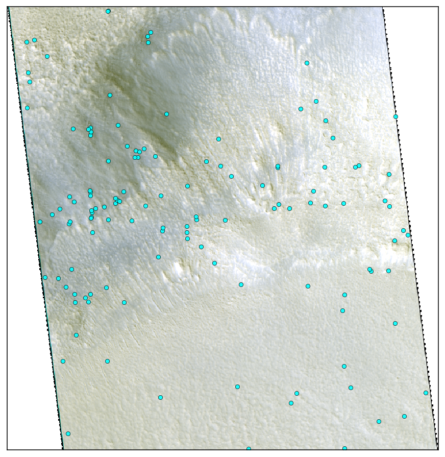
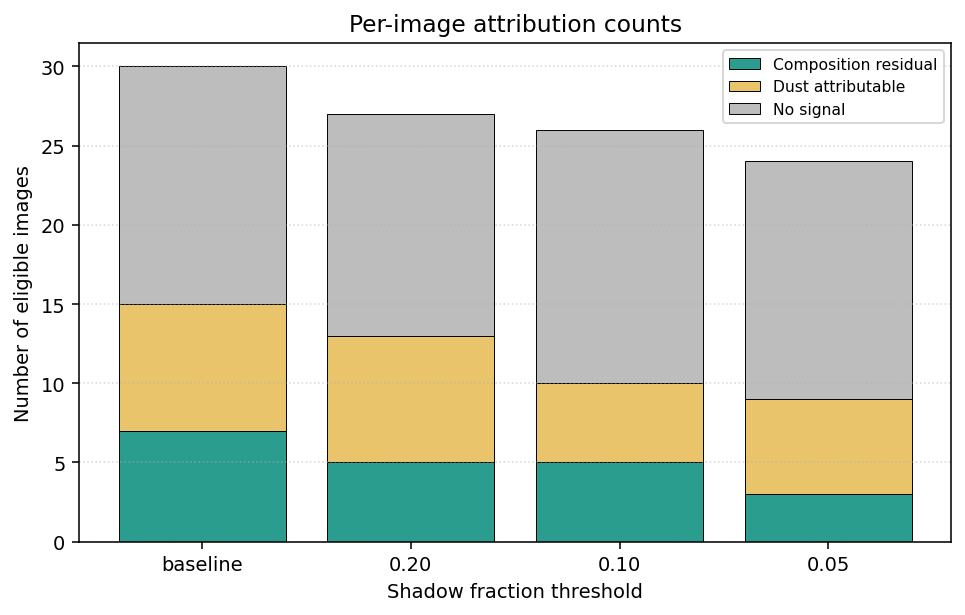

# Compositional analysis

## Motivation

Where the boulders in a given region came from is a basic open
question for Mars surface geology — were they eroded in place from
the local bedrock, ejected by nearby impacts, or transported in
from somewhere else — notably by late-Hesperian megatsunami events
([Rodriguez et al., 2016](https://doi.org/10.1038/srep25106);
[Costard et al., 2017](https://doi.org/10.1002/2016JE005230))
hypothesised to have delivered highland material into the northern
lowlands? The 36-image cohort sits at ~40 – 46°N on the eastern
Chryse / western Arabia margins, within the proposed deposit zones.
Composition is one of the few signals that can distinguish these
scenarios at orbital scale: locally-sourced
boulders should match the substrate they sit on, while transported
boulders should look like their distant parent unit. The main
obstacle is that Martian dust loading produces its own
boulder-rich-vs-poor color difference that mimics a compositional
signal. This study uses HiRISE three-band color at the per-tile
level to test whether a rich-vs-poor spectral signal exists at all,
and to separate the part attributable to differential dust loading
from the part that survives as a real compositional residual.

---

## 1. Question

The boulder-detection pipeline from the classification study produces a
map of meter-scale boulder polygons on each HiRISE image. The
compositional study asks the science-deliverable question on top of
those labels: **are the boulders spectrally distinct from their
immediate surroundings, and if so, is the difference compositional
or attributable to differential dust loading?**

---

## 2. Data

**Source data**:

- **HiRISE COLOR.JP2** — the three-band JP2 published by the PDS
  alongside each HiRISE panchromatic observation. The three bands
  are near-infrared (~900 nm), red (~700 nm), and blue-green
  (~500 nm), in I/F units (ratio of measured radiance to incident
  solar irradiance; dimensionless reflectance) at 0.25 m/pixel. The color swath is
  narrower than the panchromatic footprint (~2 – 6 km vs ~6 km), so
  the color data covers only the central 24 – 31 % of tiles within
  each image. HiRISE instrument in
  [McEwen et al., 2007](https://doi.org/10.1029/2005JE002605);
  color bands in
  [Delamere et al., 2010](https://doi.org/10.1016/j.icarus.2009.03.012).
- **Boulder polygons** — the same BoulderNet polygons used in the
  classification study, reused here as truth labels for the
  rich/poor partition.




*Figure 1. HiRISE 3-band false-color composite (IR=red channel,
RED=green, BG=blue) for an example held-out image
(`ESP_046959_2225`). Cyan dots are BoulderNet polygon centroids —
128 detected boulders fall inside this ~1 km strip of the color
swath.*

**Tile grid and labels.** Reused from the classification study;
"boulder-rich" is `fractional_area ≥ 1 %`. The same BoulderNet size
filter (`min_size_m ≈ 1.4 m`; see classification study §2) applies
here — sub-meter boulders are not in the truth labels.

**Per-tile color features.** For each tile that lies within both
the HiRISE coverage mask and the COLOR.JP2 swath, the per-band mean
I/F is read from the COLOR.JP2 pixels covered by that tile. Two
preprocessing steps apply before statistical analysis:

1. **Photometric correction.** Each image's per-band means are
   divided by the cosine of the per-image solar incidence angle
   (Lambertian correction), so a surface viewed under a low sun is
   not artificially darker than the same surface viewed under a
   high sun.
2. **Band ratios.** Beyond raw band means, three band-ratio
   features are calculated: `IR/RED`, `IR/BG`, and `dust_index = RED/BG`.
   Ratios are invariant under any wavelength-independent
   multiplicative shift in per-tile brightness — including per-pixel
   dust albedo variation. `RED/BG` is a simple Mars-surface dust
   proxy; `IR/RED` and `IR/BG` index ferric vs ferrous iron
   mineralogy, since dust hides the spectral asymmetry between
   ferric (oxidised) and ferrous (primary igneous) surfaces.

Final dataset: 9,860 tiles across 36 images with both color
features and per-tile boulder labels.

---

## 3. Methods

### 3.1 Cross-image statistical test

The headline test compares boulder-rich tiles against boulder-poor
tiles, pooled across the cohort, via two-sample Mann-Whitney U +
Cohen's d on rich-vs-poor populations (a nonparametric
significance test paired with a dimensionless effect-size
estimator — the U statistic says whether the rich-vs-poor
distributions differ at all, the d expresses the size of the shift
as a multiple of the pooled within-group standard deviation). Before pooling, each tile's
color features are z-scored against its image's own distribution,
so the test asks "are rich tiles more anomalous within their image
than poor tiles?" rather than "do absolute I/F values differ by
image?" — necessary because per-image solar incidence, atmospheric
opacity, and substrate color all produce per-image shifts in
absolute I/F.

### 3.2 Per-image dust control (the residualisation step)

A second step distinguishes a real composition signal from
differential dust loading. The per-image `RED/BG` dust proxy is fit
linearly against each color feature *per image*, residuals are
extracted (the per-tile feature values with the per-image
dust-correlated component removed), and the cross-image test is
re-run on residuals. If the rich-vs-poor difference persists, the
signal is compositional; if it collapses, the original effect was
dust-attributable. A real composition signal is expected to live
preferentially in the band-ratio features `IR/BG` and `IR/RED`,
because those ratios are constructed to be robust to multiplicative
dust shifts and respond to ferric vs ferrous mineralogy instead.

### 3.3 Shadow refinement

A possible confound is shadow contamination — boulders cast small
shadows under oblique sun, and shadow pixels are systematically
darker, which could bias the rich-vs-poor difference in single-band
I/F means. We drop any tile with `shadow_fraction > 10 %` and report
headline results on the shadow-filtered cohort.

### 3.4 Per-image attribution classifier

To answer "which images carry the signal?", the same Mann-Whitney +
Cohen's d test is run *per image* on band-ratio features (raw and
dust-residualised), and each image is binned into one of three
categories:

- **Composition residual** — both the raw rich-vs-poor effect and
  the dust-residualised effect are detectable on this image.
  Composition signal is detectable on this image alone.
- **Dust attributable** — the raw effect is detectable but the
  dust-residualised effect is not. The signal exists but is
  dust-loading.
- **No signal** — neither effect is detectable per-image. Either
  truly null or the per-image test is underpowered.

---

## 4. Results

### 4.1 Pooled rich-vs-poor headline

After per-image standardisation, the pooled test finds that
boulder-rich tiles differ from boulder-poor tiles in all six color
features at very high significance (n ≈ 8,355 tiles from 30
eligible images):

| Feature | Cohen's d | p-value |
|---|---:|---:|
| IR | -0.372 | 1.7e-73 |
| RED | -0.365 | 5.1e-69 |
| IR/RED | -0.331 | 1.7e-61 |
| BG | -0.346 | 1.1e-59 |
| IR/BG | -0.279 | 9.9e-43 |
| RED/BG (dust) | -0.252 | 9.3e-33 |

The vanishingly small p-values are a sample-size artefact rather
than evidence of a large effect — at this n even a |d| ≈ 0.1
shift comes out as p ≪ 1e-10 from a Mann-Whitney U. The Cohen's d
column carries the real magnitude information, and those values
are small in absolute terms (|d| ≈ 0.25 – 0.37).

All six effects are negative: boulder-rich tiles are systematically
lower than boulder-poor tiles in raw I/F (darker), in ratio features
(less ferric-altered), and in the dust proxy (less dust-loaded).
Per-image sign consistency runs at 77 – 83 % across the six
features, so the cohort-level effect reflects broad within-image
agreement, not a few-outlier effect.

### 4.2 Dust discriminator

Pooled dust-residualised effect sizes:

| Feature | Residualised d | p-value | Shrinkage vs raw |
|---|---:|---:|---:|
| IR/BG | -0.162 | 1.5e-17 | 42 % |
| IR/RED | -0.152 | 8.5e-18 | 54 % |
| IR | -0.122 | 6.2e-25 | 67 % |
| RED | -0.082 | 9.1e-18 | 77 % |
| BG | -0.068 | 3.9e-16 | 80 % |

All five non-dust features survive the dust control. The ordering
of shrinkage is the diagnostic: band-ratio features `IR/BG` and
`IR/RED` shrink the least (42 %, 54 %), while single-band features
shrink the most (67 – 80 %). This is the predicted pattern — band
ratios are constructed to be robust to multiplicative dust shifts
and respond to ferric vs ferrous mineralogy instead, so a real
composition residual will live preferentially there. The bottom-line
split is roughly **50 – 80 % dust attribution, 20 – 50 %
composition attribution**, with the composition share preferentially
in the ratio features. Adding the tile-level shadow filter shows that partial-dust effects in single-band features grow once
shadow-heavy tiles are removed, while band-ratio effects are stable
across the filter by construction.

Two of the composition-residual images (per §3.4) show a clean
direction reversal between the raw and dust-residualised tests —
their raw effect is *positive* (boulder-rich tiles look redder,
driven by dust loading), but the dust-residualised effect is
*negative* with substantial magnitude. The composition signal on
those images was hidden under a larger but opposite-direction dust
signal, showing that the composition
residual is real and independent of dust loading.

### 4.3 Shadow-filter robustness

The per-image attribution test (§3.4) outputs, at the headline
T=0.10 shadow filter, a **5 / 5 / 16** split between composition-
residual, dust-attributable, and no-signal images across the 26
eligible images — i.e. roughly a fifth of the eligible cohort
carries a per-image composition residual, another fifth is
dust-attributable, and the remaining ~60 % is null.

The 10 % shadow cut was an empirical choice. To check that the
headline split is not an artefact of that specific threshold, we
re-run the attribution under four shadow-filter cuts — baseline
(no filter), 0.20, 0.10, and 0.05 — and check whether the
breakdown is qualitatively stable across them.



*Figure 2. Per-image attribution counts across four shadow-filter
thresholds.*

As shown in Figure 2, composition residual stays in the 3 – 7 range,
dust attributable in 5 – 8, and no signal in 14 – 16 across all
four cuts. The qualitative breakdown is not sensitive to the exact
filter setting.

---

## 5. Discussion

The dust narrative
dominates the raw effect — boulder-rich areas are systematically
less dust-loaded than the boulder-poor surroundings, consistent
with younger emplacement age. The composition narrative explains
the residual — even
after dust loading is controlled for, a statistically robust
difference remains, preferentially in the ferric/ferrous-sensitive
ratio features and growing under shadow control. **Boulder material
is less ferric-altered than the regolith it sits in.**

The composition residual's direction is consistent with two
distinct geological scenarios that the color analysis alone cannot
distinguish.

- **Surface maturity (locally sourced).** Boulders are fresh,
  intact mineral surfaces; surrounding regolith is the
  mechanically pulverised and chemically weathered version of the
  same parent rock, with oxidation rims and hydrated alteration
  products that shift the spectral response toward "more ferric."
  Under this interpretation the composition residual is a
  regolith-maturity signal.
- **Transported provenance.** Boulders are a different parent rock
  than the surrounding lowland surface, brought in by long-range
  transport — the leading candidate for this cohort being
  late-Hesperian megatsunami transport from the outflow events
  ([Rodriguez et al., 2016](https://doi.org/10.1038/srep25106);
  [Costard et al., 2017](https://doi.org/10.1002/2016JE005230)).
  Under this scenario the boulders are from
  highland source regions and should be compositionally distinct
  from the local lowland substrate.

Both predict the spectral direction observed; the color analysis
alone cannot disambiguate. The decisive disambiguation would
require a direct comparison of the composition residual against
inferred upstream source-unit composition.

---

## 6. Limitations

- **Small effect magnitude.** Pooled standardised partial-dust
  |d| of 0.07 – 0.18 is small in absolute terms; headline-significant
  p-values reflect the pooled sample size, not large per-tile
  separability.
- **Crude dust proxy.** The `RED/BG` dust index is a placeholder;
  a literature-validated dust index
  ([Atwood-Stone & McEwen, 2013](https://doi.org/10.1029/2013GL058355)
  is the natural refinement) would shift the per-image dust
  attribution by some amount in either direction.
- **Per-tile aggregation can't isolate boulder material from its
  surroundings.** Each 320 m tile averages over boulders plus the
  regolith between them, so the rich-vs-poor color difference could
  reflect properties of the area around boulders (e.g. wind-shadow
  dust deposition, disturbed regolith from emplacement, or other
  surface modification) rather than the boulder material's own
  spectral signature.

---

## 7. Conclusions

1. **Boulder-rich tiles are spectrally distinct from boulder-poor
   tiles** of the same image, across the 36-image cohort. Pooled
   rich-vs-poor |d| 0.21 – 0.37 (p ≤ 1e-26) on all six color
   features.
2. **Dust explains ~50 – 80 % of the raw effect**, with single-band
   shrinkage 67 – 80 % and band-ratio shrinkage 42 – 54 % under
   per-image dust residualisation.
3. **A real composition residual survives both dust and shadow
   control**, preferentially in the ferric/ferrous-sensitive ratio
   features `IR/BG` and `IR/RED`, with direction "boulders less
   ferric-altered than surrounding regolith." This direction is
   consistent with both a surface-maturity and a transported-
   provenance interpretation.

The main future direction is as follows:

- **Upstream source-unit comparison.** The decisive next study is
  a direct comparison of the composition residual against
  inferred upstream highland source-unit color, using either CRISM
  mineralogical maps or HiRISE color of plausible upstream source
  units (e.g. the highland margins along the Mawrth Vallis /
  Margaritifer Sinus boundary). Match against upstream highland
  source supports the transported interpretation; match against
  local lowland regolith composition supports surface maturity.

---

## 8. Reproducibility

**Repository**: [github.com/brianvamaro/hirise2ctx](https://github.com/brianvamaro/hirise2ctx)

| Artefact | Path |
|---|---|
| Pooled + shadow-sweep runner | [`scripts/run_stage7d_pooled.py`](../scripts/run_stage7d_pooled.py) |
| Per-image attribution outputs | `dataset_v2/stage7d_attribution_shadow_*.parquet` (gitignored) |
| Figure 1 builder | [`scripts/probes/_compositional_slim_polygons_overlay.py`](../scripts/probes/_compositional_slim_polygons_overlay.py) |
| Figure 2 builder | [`scripts/probes/_compositional_slimmer_attribution_bars.py`](../scripts/probes/_compositional_slimmer_attribution_bars.py) |

Re-run the pooled test + attribution at the headline shadow filter via:

```powershell
 run --no-capture-output -n geospatial `
    python -u scripts/run_stage7d_pooled.py --shadow-threshold 0.10 `
    --out dataset_v2/stage7d_pooled_shadow_0.10.parquet `
    --attribution-out dataset_v2/stage7d_attribution_shadow_0.10.parquet
```

---

## 9. References

- Amaro, B., et al. (2026). Effect of Boulder-Size Distributions on
  Thermally Derived Rock Abundances on the Moon. *Journal of
  Geophysical Research: Planets*.
  [doi.org/10.1029/2024JE008769](https://doi.org/10.1029/2024JE008769).
- Atwood-Stone, C., & McEwen, A. S. (2013). Avalanche slope angles
  in low-gravity environments from active Martian sand dunes.
  *Geophysical Research Letters*, 40(12), 2929 – 2934.
  [doi.org/10.1029/2013GL058355](https://doi.org/10.1029/2013GL058355).
- Costard, F., et al. (2017). Modeling tsunami propagation and the
  emplacement of thumbprint terrain in an early Mars ocean.
  *Journal of Geophysical Research: Planets*, 122(3), 633 – 649.
  [doi.org/10.1002/2016JE005230](https://doi.org/10.1002/2016JE005230).
- Delamere, W. A., et al. (2010). Color imaging of Mars by the High
  Resolution Imaging Science Experiment (HiRISE). *Icarus*, 205(1),
  38 – 52.
  [doi.org/10.1016/j.icarus.2009.03.012](https://doi.org/10.1016/j.icarus.2009.03.012).
- McEwen, A. S., et al. (2007). Mars Reconnaissance Orbiter's High
  Resolution Imaging Science Experiment (HiRISE). *Journal of
  Geophysical Research: Planets*, 112, E05S02.
  [doi.org/10.1029/2005JE002605](https://doi.org/10.1029/2005JE002605).
- Rodriguez, J. A. P., et al. (2016). Tsunami waves extensively
  resurfaced the shorelines of an early Martian ocean. *Scientific
  Reports*, 6, 25106.
  [doi.org/10.1038/srep25106](https://doi.org/10.1038/srep25106).
