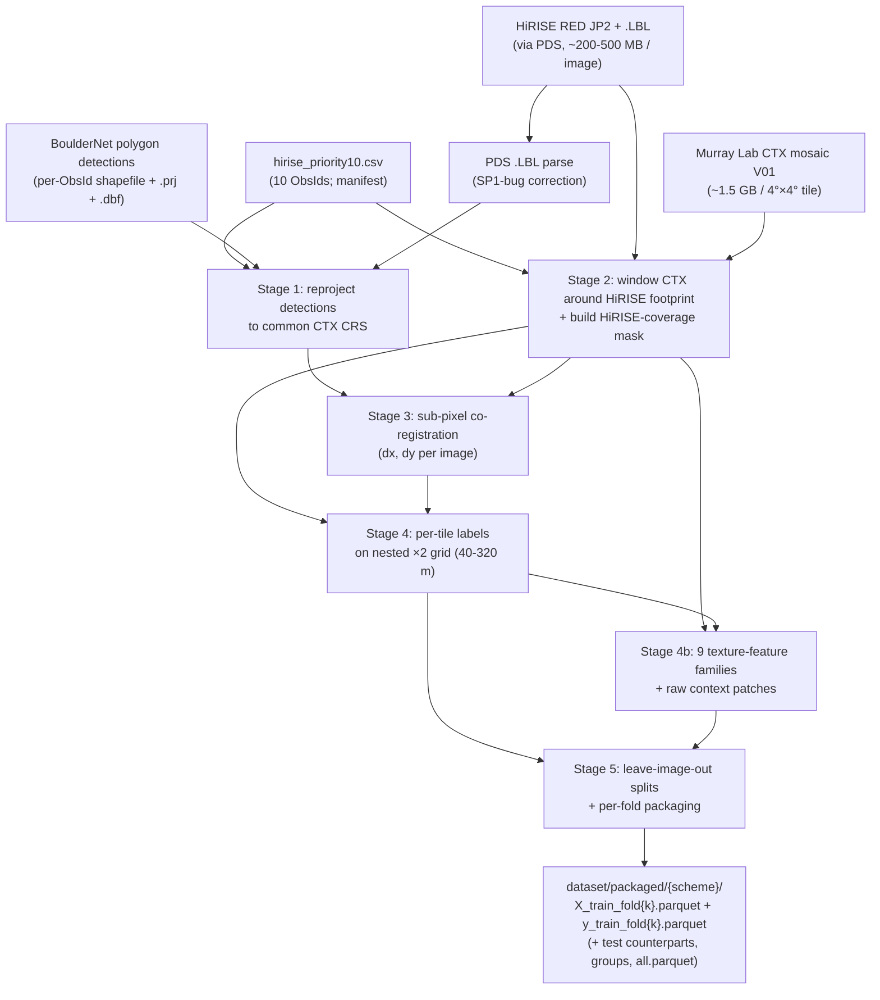
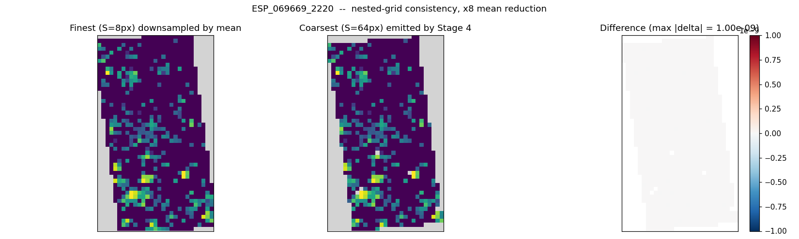
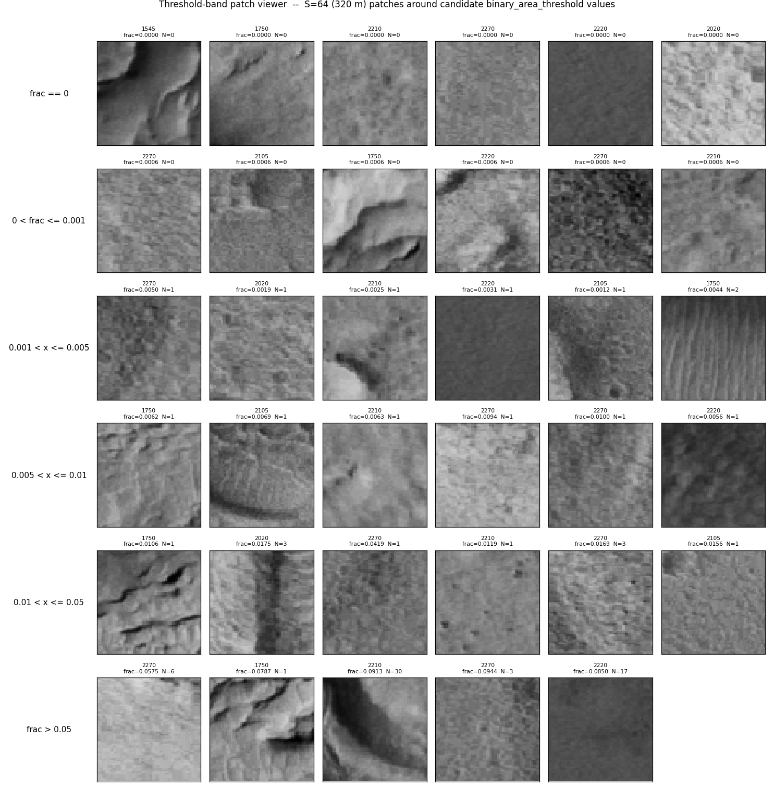
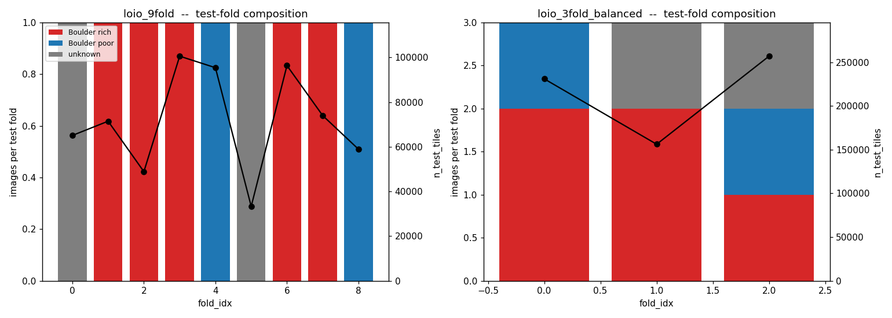

# Methods

> A self-contained narrative description of the HiRISE → CTX rock-abundance data
> pipeline as it stands at the end of CLAUDE.md Week 1-2 scope (commit `b9bc82a`,
> 2026-05-25). Written for a scientifically literate reader who isn't necessarily a
> specialist in either Mars surface science or machine learning. For runtime decisions
> see [`DECISIONS.md`](../DECISIONS.md); for per-column output schemas see
> [`dataset/DATA_DICTIONARY.md`](../dataset/DATA_DICTIONARY.md); for the build
> specification see [`CLAUDE.md`](../CLAUDE.md). The modeling stage (Week 3) is out of
> scope here and lives in [`PLAN_modeling.md`](../PLAN_modeling.md).

---

## 1. Overview

### 1.1 Goal

The scientific goal is to learn a mapping from coarse-scale (~5 m / pixel) Context
Camera (CTX) imagery of Mars to a per-tile fractional **rock abundance** label, using
fine-scale (~50 cm / pixel) High Resolution Imaging Science Experiment (HiRISE)
boulder detections as ground truth. The trained model can then be applied to the
near-global CTX mosaic, in regions where no HiRISE coverage exists, to predict
boulder abundance from CTX texture alone.

Boulder presence and abundance are scientifically relevant for several Mars surface
questions, including landing-site safety assessment, regolith maturity proxies,
ejecta-emplacement modelling, and as inputs to thermal-inertia interpretation. The
canonical global-scale data product for Mars rock abundance derives from
thermal-inertia inversion of nighttime TES (Thermal Emission Spectrometer)
spectra at ~3 km / pixel
([Nowicki & Christensen 2007](https://agupubs.onlinelibrary.wiley.com/doi/full/10.1029/2006JE002798));
a CTX-resolution counterpart would refine this by approximately three orders of
magnitude in pixel area.

The fine-scale ground truth is generated by **BoulderNet**
([Prieur et al. 2023](https://agupubs.onlinelibrary.wiley.com/doi/full/10.1029/2023JE008013)),
a Mask R-CNN-based instance-segmentation model trained on a multi-body dataset of
> 33,000 boulders across HiRISE Mars, Lunar Reconnaissance Orbiter Narrow Angle
Camera, and terrestrial high-resolution imagery. Applied to the priority10 HiRISE
RED panchromatic imagery, BoulderNet produces per-image shapefiles of meter-scale
polygon outlines tracing individual resolved boulders. The detector run is upstream
of this pipeline; we ingest its shapefile output as-given.

### 1.2 Scope of this document

This Methods document describes everything between **the BoulderNet shapefiles + the
project manifest** as inputs and **a model-ready, image-grouped train/test dataset**
as output. It does *not* cover (a) the BoulderNet detector itself, (b) the predictive
model that will be trained on the packaged output, or (c) the downstream applications
(global CTX-mosaic prediction, THEMIS validation, compositional analysis). Each of
these is a separable concern with its own documentation; references appear in §9.

### 1.3 Pipeline at a glance

The pipeline is **staged and cached**: every per-image artifact is keyed by HiRISE
Observation ID and saved to disk with a provenance JSON sidecar, so any stage can be
re-run for any image without invalidating the others. The expensive stages (2 and 3,
which involve downloads and FFT-based registration respectively) run once and produce
caches; the cheap stages (4, 4b, 5, which involve only per-tile arithmetic on the
cached arrays) can be re-run in seconds to minutes when a labelling or feature
parameter changes. This separation is a deliberate design choice — see §6.6 and §7.5
for the parameter-sweep implications.

**Format note.** Tabular outputs throughout the pipeline (per-tile labels in
§6, per-tile features in §7, packaged train/test sets in §8) are written as
**Apache Parquet** files. Parquet is an open columnar binary format developed
in the Apache Arrow / Hadoop ecosystem and widely used for analytical and
machine-learning tabular data. Compared to CSV, Parquet preserves column data
types exactly (so float / integer / boolean / string distinctions survive
disk round-trips), compresses by 5-10× through column-wise encoding, and reads
selected columns without parsing the rest of the file — useful at our row
counts (hundreds of thousands of rows per image, ~650,000 across the manifest).
Per-file companion JSON sidecars carry provenance (config hash, source paths,
per-stage parameters used). Readers familiar with R will recognise it as the
underlying format of the `arrow` package; in Python it is the default columnar
format for both `pandas.read_parquet` and `polars`.

---

## 2. Input dataset

### 2.1 The priority10 manifest

Ten HiRISE Observation IDs make up the current dataset. They were selected by the
project supervisor as a "priority" subset balancing two considerations: a tight
cluster of six **boulder-rich** images at ~40-46°N, 0-20°E (representing a single
boulder-bearing geological context) and four **diversity picks** spanning a wider
range of latitudes, boulder densities, and surface types. Per-image metadata is
carried in `hirise_priority10.csv` and includes ObsId, PDS ProductId, manifest
center coordinates (`CenterLat`, `CenterLon_180`, `CenterLon_360`), illumination
geometry where measured (incidence and emission angles), a qualitative manifest
label `BoulderLabel` ∈ {Boulder rich, Boulder poor, unknown}, and download URLs
for the JP2 imagery, the PDS detached label file, and a browse JPEG.

The qualitative `BoulderLabel` is a *per-image* judgement made by the manifest
author — it is not a per-tile label and is not used directly as the regression
target. It is used (a) as a stratification axis when constructing cross-validation
folds (§8) and (b) as a sanity check that the measured per-image abundance
distributions follow the expected ordering (boulder-rich images measurably denser
than boulder-poor ones, see §6.5).

The pipeline is manifest-driven: adding a row to the CSV and dropping a matching
detections folder under the configured `detections_root` is the only requirement to
grow the dataset. No code changes are needed; the per-image stages are independent
and parallelisable across rows. Future work explicitly anticipates a 50-200+ image
manifest, with implementation triggers (notably switching the cross-validation
loader from in-memory to a streaming-iterator path at ~50 images) documented inline.

### 2.2 BoulderNet detections

The boulder ground truth is a per-image shapefile of polygon outlines, with sidecar
`.prj` (projection), `.dbf` (attributes), and `.shx` (index) files in standard ESRI
shapefile convention. Each polygon represents one detected boulder. The attribute
table carries a model confidence `score` ∈ [0.10, 0.83] (mean 0.41), a category
identifier (`cat_id`, always 0), category name (`cat_name`, always "boulder"), two
boolean tile-overlap flags (`isin_slice`, `is_at_edge`) inherited from the
BoulderNet tiling strategy, and a polygon id.

Per-polygon boulder size is **not** stored as an explicit attribute; it must be
derived from the polygon geometry. We use either `geometry.area` directly (giving
boulder footprint area in m²) or the equivalent-circle diameter `2·√(area/π)`. For
the boulder-rich anchor image ESP_047976_2020, this gives a polygon-area
distribution with median 3.7 m² and mean 5.1 m² across 1,346 detected boulders.

The **design-level detection floor** for BoulderNet is set by the training-data
composition and the Mask R-CNN backbone's receptive-field geometry rather than
by HiRISE pixel size in isolation. As characterised in
[Amaro et al. 2026](https://agupubs.onlinelibrary.wiley.com/doi/10.1029/2024JE008769),
which applies the same model to lunar boulder-size distributions:

> "BoulderNet predictions are most accurate for boulders covering areas
> greater than 5 × 5 pixels, regardless of pixel scale. Thus, any detections
> of boulders smaller than this threshold area are filtered out in
> post-processing."

In source-image pixel space the floor is therefore 25 px², independent of
sensor or platform. Translating to area on the ground depends on the HiRISE
ground sample distance for each manifest image, which varies across our
manifest because HiRISE products are released at multiple binning levels.
For each of the nine polygon-bearing priority10 images, the `.LBL`'s
`MAP_SCALE` keyword gives the projected pixel size, and the 5 × 5-pixel
threshold area is computed per image (`scripts/probes/_boulder_size_audit.py`):

| ObsId | HiRISE px (m) | 5×5-px threshold (m²) | n boulders | n < threshold | % < threshold |
|---|---:|---:|---:|---:|---:|
| ESP_055714_2270 | 0.50 | 6.25 | 1,974 | 7 | 0.35 % |
| ESP_054857_2270 | 0.25 | 1.56 | 6,462 | 0 | 0.00 % |
| ESP_069669_2220 | 0.25 | 1.56 | 1,462 | 1 | 0.07 % |
| ESP_057469_2215 | 0.50 | 6.25 | 940 | 2 | 0.21 % |
| ESP_071093_2210 | 0.25 | 1.56 | 961 | 1 | 0.10 % |
| ESP_047976_2020 | 0.25 | 1.56 | 1,346 | 22 | 1.63 % |
| ESP_056165_2200 | 0.50 | 6.25 | 26 | 21 | **80.77 %** |
| ESP_075577_2105 | 0.25 | 1.56 | 624 | 9 | 1.44 % |
| ESP_039820_1750 | 0.25 | 1.56 | 497 | 3 | 0.60 % |

Two observations from this audit. First, the BoulderNet post-processing
filter described above appears to **not have been applied consistently** to
the priority10 shapefile copies — small numbers (0-2 %) of sub-threshold
polygons survived in eight of the nine audited images, and the majority of
polygons in ESP_056165_2200 are sub-threshold. The mechanism is not
investigated here; the relevant data-quality fact is that the input
shapefiles contain some detections that the model's authors would not
consider reliable at the operating pixel scale. Second, the ESP_056165_2200
case is particularly significant: this is the boulder-poor manifest image
with only 26 total polygons, of which 21 are sub-threshold; what survives
as a "detected boulder" in our downstream labels may largely be
detection-noise residuals there. This is flagged inline in the modeling
stage's per-image evaluation.

**Implication for downstream labels.** Per-tile `fractional_area` (§6.5)
counts every polygon present in the input shapefile after Stage 4 filtering.
Both potential polygon-level filters in this pipeline —
`labeling.detection_filters.min_size_m` (the size-based floor discussed
here) and `labeling.detection_filters.min_confidence` (a cutoff on
BoulderNet's `score` attribute) — are **applied at Stage 4 before polygon
rasterization**, because once the per-tile `boulder_area` and `boulder_count`
have been aggregated, the individual polygon contributions are no longer
recoverable from the cached parquet. The decision of whether to filter,
and at what per-image threshold, is therefore a Stage 4 configuration
decision rather than a modeling-stage decision.

**Filter policy (2026-05-26, `AskUserQuestion`).** `min_size_m` is set to
**1.4105 m**, the equivalent-circle diameter `2·√(1.5625/π)` for an area
threshold of 1.5625 m² = (5 × 0.25 m)². This matches the Amaro 2026 design
floor for 0.25 m/px HiRISE binning exactly. `min_confidence` is left at
`null` (no `score` cutoff). The chosen filter drops 36 polygons out of
13,352 across the sweep (0.27 %), all from the 0.25 m/px images:

| ObsId | binning | n polys (raw) | n polys (filtered) | Δ |
|---|---|---:|---:|---:|
| ESP_047976_2020 | 0.25 m/px | 1,346 | 1,324 | −22 |
| ESP_075577_2105 | 0.25 m/px | 624 | 615 | −9 |
| ESP_039820_1750 | 0.25 m/px | 497 | 494 | −3 |
| ESP_069669_2220 | 0.25 m/px | 1,462 | 1,461 | −1 |
| ESP_071093_2210 | 0.25 m/px | 961 | 960 | −1 |

The 0.50 m/px images (ESP_055714_2270, ESP_054857_2270 [0.25 m/px],
ESP_056165_2200, ESP_057469_2215) are **unaffected** by this filter —
their smallest polygon areas (4.36, 1.71, 3.75, 4.02 m² respectively in
the cached Stage 1 GeoPackages) all sit at or above 1.5625 m². The
sub-threshold polygons in those images per the per-image audit table
above would only be removed by either a stricter global filter (≥ 2.5 m
diameter = 6.25 m² area, the 0.50 m/px floor) or by extending
`_apply_detection_filters` to use a per-image threshold computed from each
`.LBL`'s `MAP_SCALE`. Notably, **ESP_056165_2200's 21 sub-6.25-m² polygons
all survive** the current global filter; this is recorded here so the
modeling-stage per-image diagnostic can account for it. Tightening the
filter is a one-line config edit + ~3-second-per-image re-run of
`scripts/run_stage4.py --all` away.

The 10 priority manifest images together contain **13,352 BoulderNet polygons**
after the SP1 correction described in §3. Per-image counts range from 0
(ESP_065711_1545, a deliberate diversity pick on visibly smooth plains where the
detector found nothing) to 6,462 (ESP_054857_2270, the densest image in the
manifest).

### 2.3 HiRISE source imagery

For each manifest image we retrieve the corresponding HiRISE Reconnaissance Orbiter
RED panchromatic JP2 product and its detached PDS label file (`.LBL`). The JP2 is
streamable as a tiled overview pyramid; we read it **decimated to approximately
5 m / pixel** (matching CTX resolution) rather than at full ~50 cm / pixel native
resolution. The decimated read produces a single GeoTIFF per image (~5-20 MB) used
for two purposes downstream: (a) computing the HiRISE coverage mask in Stage 2,
which delineates the swath of CTX pixels for which boulder ground truth is in fact
available, and (b) phase-correlation co-registration in Stage 3.

We **do not** materialise the full-resolution HiRISE imagery for any downstream
computation. This is a deliberate choice: full-resolution HiRISE data adds no
information to a downstream model operating on CTX inputs (the CTX is itself ~5 m /
pixel), and reading at full resolution would multiply per-image storage by ~100×.

The PDS `.LBL` is parsed for its geometry metadata: image-center latitude/longitude,
the local Mars radius used in the image's map projection (`A_AXIS_RADIUS`, which can
differ from the IAU equatorial radius by ~3,000 m and from neighbouring images by
~100 m), and the projection latitude `CENTER_LATITUDE`. The `.LBL` is the
authoritative source for these values; the JP2's embedded GeoTIFF metadata can
disagree with the `.LBL` for a subset of older HiRISE products (§3.2).

### 2.4 CTX target imagery

The CTX target imagery is the **Murray Lab Global CTX Mosaic V01**
([Dickson et al. 2024](https://agupubs.onlinelibrary.wiley.com/doi/10.1029/2024EA003555),
*Earth and Space Science*; first announced as
[Dickson et al. 2018 LPSC abstract](https://ui.adsabs.harvard.edu/abs/2018LPI....49.2480D/abstract)),
a blended near-global mosaic of CTX images at uniform ~5 m / pixel resolution. The mosaic is distributed as ZIP-wrapped GeoTIFFs, one
4° × 4° tile per file at ~1.5 GB per tile. We retrieve each tile that contains any
manifest-image footprint exactly once, cache it locally, and read per-image
sub-windows from the cached tile rather than streaming each window from the remote
endpoint (the latter is roughly two orders of magnitude slower over our network).

Eight unique CTX tiles cover the priority10 manifest. One tile (`E000_N40`) covers
three manifest images simultaneously. The pipeline detects this deduplication
automatically.

### 2.5 Per-image inventory

The current manifest reduces to nine images carried through every stage:
ESP_057469_2215 is dropped from the Stage 4 / 4b / 5 sweeps because its polygon
bounding box straddles the boundary between two adjacent CTX tiles, and only the
single-tile retrieval mode is implemented. See §4.4 for the diagnostic and the
deferred multi-tile-window fix.

| ObsId | `BoulderLabel` | Lat | Lon (180°) | n boulders | n finest tiles |
|---|---|---:|---:|---:|---:|
| ESP_055714_2270 | Boulder rich | 47.04 | 18.92 | 1,974 | 76,030 |
| ESP_054857_2270 | Boulder rich | 47.05 | 5.95 | 6,462 | 37,292 |
| ESP_069669_2220 | Boulder rich | 42.10 | 5.97 | 1,462 | 72,821 |
| ESP_071093_2210 | Boulder rich | 41.05 | 4.95 | 961 | 55,962 |
| ESP_047976_2020 | Boulder rich | 22.05 | 19.04 | 1,346 | 54,054 |
| ESP_056165_2200 | Boulder poor | 39.95 | 17.95 | 26 | 73,335 |
| ESP_075577_2105 | Boulder poor | 30.50 | -23.07 | 624 | 44,560 |
| ESP_039820_1750 | unknown | -4.50 | 152.04 | 497 | 49,279 |
| ESP_065711_1545 | unknown | -25.55 | -26.04 | 0 | 25,221 |

The `BoulderLabel = unknown` row with zero boulders (ESP_065711_1545) is a
**legitimate true-zero ground-truth signal**: HiRISE-imaged terrain on which the
detector ran and found no boulders. We retain it in all downstream stages because
its all-zero tiles represent a real boulder-absent class for the model to learn
from, distinct from tiles that are zero merely because HiRISE never imaged them
(those are dropped by the coverage-mask gating; see §6.2).

---

## 3. Coordinate-system handling

The pipeline's single most subtle correctness concern is **map projection
heterogeneity**. The BoulderNet detections, the HiRISE imagery, and the CTX mosaic
all sit in nominally related but practically distinct equirectangular projections,
and the most common failure mode is silent kilometres-of-displacement bias due to
one of the three CRSes being mis-specified. We resolve this with an explicit
reproject-everything-to-a-single-target-CRS step and a sanity-check residual that
flags mis-projection at the ~kilometre level rather than letting it pass through
silently.

### 3.1 Per-image local-radius equirectangular projections

The BoulderNet shapefile for each image is georeferenced in an equirectangular
projection whose **sphere radius is the local Mars radius at that image's center
latitude**, not the IAU equatorial radius. For the anchor image ESP_047976_2020,
the `.prj` declares a sphere radius of 3,393,833.26 m — neither the IAU 2000
equatorial radius (3,396,190 m) nor a constant value across the manifest. This
local-radius choice originates in the upstream HiRISE PDS RDR map projection
convention and propagates through to the BoulderNet output.

Consequently the per-image source CRS **differs from image to image**, and from the
target CTX mosaic CRS. We read each image's `.prj` and reproject per-image into a
common target CRS using a full pyproj transformation; the alternative of assuming a
single shared sphere and transforming all polygons by the same affine produces
multi-kilometre displacement errors of magnitude proportional to `|lon − central
meridian|` and dependent on `sec(lat)`.

The target CRS is the IAU 2000 Mars equirectangular projection on a sphere of
3,396,190 m with central meridian 0° — the canonical CRS that the published Murray
Lab CTX mosaic V01 paper specifies. (The actual GeoTIFF headers shipped with the
mosaic declare a slightly different CRS, `Mars_2015_Ocentric_Equirectangular`,
with inverse flattening 169.894 — an oblate spheroid rather than a sphere. Over the
~6 km extent of a single HiRISE footprint at 40° latitude, the discrepancy between
the two CRSes is sub-pixel at 5 m / pixel resolution, and we do not propagate it
through the per-image polygons. See §5.4 for the empirical check that this
sub-pixel residual does not manifest as a systematic latitudinal bias in Stage 3
shifts.)

### 3.2 The HiRISE PDS Standard_Parallel_1 bug

A subset of older HiRISE PDS RDR products were issued with an incorrect
`Standard_Parallel_1` value of 0° in their `.prj` and embedded JP2 metadata, even
though the image geometry was generated under the **correct** PDS-declared
projection latitude (the image's `CENTER_LATITUDE`, typically a multiple of 5° near
the image center). This is a known upstream issue (Trent Hare, USGS Astrogeology,
2016 onward; see references in `DECISIONS.md` 2026-05-21 entry); USGS publishes a
patcher tool, `fix_jp2_v2`, that edits the JPEG2000 GeoTIFF box in place. The
HiRISE team has been re-issuing corrected labels gradually, but four of our ten
manifest images predate the upstream re-issue.

The affected files have a recognisable fingerprint: datum line declared as
`D_unnamed` (rather than `D_MARS`) and `Standard_Parallel_1 = 0.0`. When pyproj
interprets such a `.prj` it scales longitudes by `1/cos(0) = 1` rather than
`1/cos(image_lat)`, producing a sceond-order longitudinal displacement of `~|lon −
central_meridian|·(1 − cos(image_lat))` — empirically 481 km at 22° latitude and
1,879 km at 47° latitude in our manifest.

Our pipeline detects the buggy fingerprint at Stage 1 read time and **overrides
the `Standard_Parallel_1` value in the source CRS** with the authoritative
`CENTER_LATITUDE` from the PDS `.LBL`. The same symmetric correction is applied at
JP2 read time in Stage 2 (the JP2's embedded GeoTIFF box has the same buggy
metadata as the matching `.prj`). The fix is non-destructive: no raw upstream file
is modified on disk; the override is applied in the pipeline's in-memory CRS
objects only. The corrected source CRS is recorded in the Stage 1 per-image
sidecar (`source_crs_wkt`), which serves as the authoritative reference for any
later read of the same image.

Before-fix and after-fix residuals against the manifest center coordinates show
the magnitude of the bug:

| ObsId | Status | SP1 before | SP1 corrected | Residual before | Residual after |
|---|---|---:|---:|---:|---:|
| ESP_055714_2270 | corrected | 0.0 | 45.0 | 1,879 km | 9.4 km |
| ESP_054857_2270 | corrected | 0.0 | 45.0 | 1,941 km | 5.3 km |
| ESP_069669_2220 | trusted_prj | — | — | 6.3 km | 6.3 km |
| ESP_071093_2210 | trusted_prj | — | — | 6.4 km | 6.4 km |
| ESP_047976_2020 | corrected | 0.0 | 20.0 | 481 km | 7.4 km |
| ESP_056165_2200 | corrected | 0.0 | 35.0 | 1,087 km | 12.5 km |

The post-fix residuals (5-12 km) are well within the legitimate offset between a
HiRISE footprint's geometric center and the manifest's image-corner coordinate,
which can reach ~10 km for a typical 6 × 18 km HiRISE swath.

**Figure 1.** Reprojected boulder polygons for the four SP1-buggy images, plotted
against the boundaries of the CTX tiles they are assigned to in the manifest.
Polygons land entirely outside their tiles (red boxes), confirming the
displacement is not a small alignment error but a systematic CRS misinterpretation.
After the SP1 correction (not shown here; see §4.3 Figure 3 for the post-fix
overlay on a representative image), polygons land within the correct tile and
overlap the HiRISE swath as expected.

### 3.3 Stage 1 output and sanity check

The Stage 1 output is one GeoPackage per image (`cache/reprojected_detections/{
ObsId}.gpkg`) plus a JSON sidecar recording the source CRS WKT, the target CRS
WKT, the SP1-correction status (`trusted_prj` or `sp1_corrected_from_pds_label`),
the PDS `CENTER_LATITUDE` used as replacement when the correction triggered, and
the SHA256 of the config snapshot that produced the cache.

A pipeline-level sanity check compares each image's reprojected polygon-footprint
centroid against the manifest's declared center coordinates, converted to the
target CRS. We require the great-circle distance between these two points to be
less than a configurable threshold (default 15 km), which catches the
hundreds-of-km class of CRS bug while admitting the legitimate ~5-10 km offset
between footprint-centroid and image-corner conventions. A test failure raises an
exception and halts the pipeline rather than silently propagating; the check
caught the SP1 bug on its first run.

---

## 4. CTX windowed retrieval and HiRISE coverage masking

### 4.1 Tile retrieval

For each unique CTX tile required by the manifest, we fetch the entire 1.5 GB ZIP
once from the Murray Lab catalogue endpoint and cache it under `cache/ctx_tiles/`.
The tile URL follows a signed-prefix zero-padded convention: longitude is encoded
as `E{abs:03d}` for positive and `E-{abs:03d}` for negative (never `W`); latitude
follows the same rule with 2 digits (`N20`, `N-08`). The retriever first tries a
bare manifest-derived form and falls back to the canonical signed form on a 404.

The downloaded ZIP is read in-place via GDAL's `/vsizip/` virtual filesystem; we
do not unzip to disk. Per-image sub-windows are extracted by computing the
polygon-footprint bounding box in the target CRS, buffering by a configurable
margin (default 1,000 m), and slicing the tile at integer pixel boundaries snapped
to the tile's native pixel grid. **Snapping to the tile's pixel origin is
critical**: it guarantees that all subsequent per-tile arithmetic in Stages 4 and
4b operates on integer-pixel blocks of the upstream mosaic, which in turn makes
the nested ×2 label grid (§6.1) exactly nested rather than rounded.

For images with no detected boulders (ESP_065711_1545) the polygon-footprint
bounding box is degenerate; we fall back to a nominal-footprint bounding box
computed from the manifest center coordinates and a configured nominal HiRISE
swath size (6 × 16 km).

### 4.2 Tile vs window pixel size

Within a single Murray Lab tile, the internal block size is set to the full
raster (47,420 × 47,420 pixels), which trips a low-level GDAL error if naively
copied into a much smaller output. We strip the internal block dimensions from the
profile before writing the per-image sub-window and set `tiled=True, blockxsize=256,
blockysize=256` explicitly. This is a one-line workaround documented in the code
but worth surfacing here because it would not be obvious from a casual read.

### 4.3 HiRISE coverage mask

A per-image **HiRISE coverage mask** is built alongside the CTX sub-window. We read
the HiRISE JP2 decimated to ~5 m / pixel, reproject it onto the CTX window's grid
using nearest-neighbour resampling (to keep the swath boundary crisp rather than
feathered), and binarise: 1 where decimated HiRISE has a valid (non-zero) pixel
after reprojection, 0 elsewhere. The mask has identical CRS, transform, and shape
as the CTX sub-window and is stored as a single-band uint8 GeoTIFF.

The mask is essential for downstream correctness, **not optional**: HiRISE swaths
are rotated rectangles, typically ~6 km × ~18 km, whose orientation depends on the
HiRISE pointing geometry. A polygon-bounding-box CTX window includes the
rotated-rectangle swath plus its surrounding corners-and-edges, which are roughly
~40 % of the window area on average and contain **no HiRISE imagery**. If we did
not mask these regions, every CTX tile in the unobserved corners would be labelled
"boulder absent" — a measurement artifact rather than a real ground-truth signal,
because BoulderNet was never run on those pixels. The distinction between
"boulder absent" (observed and empty) and "boulder unobserved" (no HiRISE
coverage) is the difference between zero-inflation as a real distributional
property of the target and zero-inflation as a labelling error; we propagate it
through the pipeline explicitly.

**Figure 2.** Stage 2 output for the canonical boulder-rich image
ESP_069669_2220. Left panel: cached CTX window covering the polygon-footprint
bounding box plus 1 km buffer. Right panel: HiRISE coverage mask (white) overlaid
on the same window — the rotated-rectangle HiRISE swath covers approximately 60 %
of the polygon-bbox CTX window. Boulder polygons (red) cluster in the top half,
which is a textured ejecta surface; the bottom half is smooth plains. Without the
mask, ~40 % of Stage 4 tiles would be spurious "no-boulder" labels from
HiRISE-unobserved area.

### 4.4 Edge case: polygon bbox straddles a tile boundary

One image in the manifest (ESP_057469_2215) has polygons spanning both sides of
the boundary between two adjacent Murray Lab CTX tiles (`W004_N40` and `E000_N40`).
Only the in-tile portion of the polygon-bbox CTX window is retrievable in
single-tile mode; the resulting cached window contains only ~0.1 % of the HiRISE
swath. We detect this via the `hirise_coverage_fraction` field in the Stage 2
sidecar and **drop ESP_057469_2215 from downstream sweeps**. Re-enabling this
image would require either (a) implementing a multi-tile mosaicking pass in Stage
2, (b) reprojecting the affected image's polygons under a central meridian shifted
to avoid the boundary, or (c) accepting the loss. Option (c) is the current
default; the others are deferred to future-work as the manifest grows.

---

## 5. HiRISE ↔ CTX co-registration

### 5.1 Motivation

The Murray Lab CTX mosaic V01 has a documented ~200 m registration uncertainty
relative to ground truth, while individual HiRISE images are typically georeferenced
to better than 50 m. Without correcting for this difference, the per-tile labels
generated from HiRISE-derived polygon positions would be **systematically offset
from the CTX texture features measured in the same tile** by an amount that varies
from image to image. The downstream model would then be trained on a label-feature
pairing in which (e.g.) the strong CTX shadow signal sits in tile (i, j) but the
boulder polygon producing it sits in tile (i−1, j) — a near-fatal misalignment for
a regression model whose accuracy depends on tile-local feature-target
correspondence.

We solve this by computing a per-image sub-pixel rigid translation `(dx, dy)`
between the decimated HiRISE imagery and the cached CTX window, and applying this
translation to the boulder polygons before tile-grid rasterization (§6.7).

### 5.2 Algorithm

For each image we (a) reproject the cached decimated HiRISE onto the CTX window's
grid, (b) identify the largest power-of-two-side-length square sub-window that
fits entirely inside both rasters' valid regions, (c) compute the phase
cross-correlation between the two rasters within that sub-window at sub-pixel
upsampling factor 20 (giving ~0.25 m granularity at 5 m / pixel), and (d) record
the solved translation in metres along with the peak normalised cross-correlation
coefficient as a quality metric. The algorithm is implemented via
`skimage.registration.phase_cross_correlation`; the sub-pixel upsampling step is
the standard implementation by Guizar-Sicairos, Thurman & Fienup (2008).

We do **not** solve a full affine warp. Doing so would risk distorting
HiRISE-derived ground-truth positions in ways the model would then have to learn
around, and the rigid-translation model fits the expected error mode (CTX mosaic
registration is uniform within a tile, not spatially varying at the scale of a
single HiRISE footprint).

### 5.3 Results

Across the nine retained manifest images, the solved shift magnitudes range from
118 m to 273 m with a median of 179 m — well within the ~200 m order-of-magnitude
target documented in the build specification. Peak cross-correlation coefficients
range from 0.28 (a single boulder-poor outlier discussed below) to 0.88, with a
median of 0.69.

| ObsId | `BoulderLabel` | \|shift\| | dx (m) | dy (m) | peak correlation |
|---|---|---:|---:|---:|---:|
| ESP_054857_2270 | Boulder rich | 118 m | −1.2 | −118.0 | 0.63 |
| ESP_047976_2020 | Boulder rich | 126 m | −8.2 | −125.2 | 0.71 |
| ESP_075577_2105 | Boulder poor | 160 m | +30.0 | −157.5 | 0.69 |
| ESP_056165_2200 | Boulder poor | 165 m | −63.0 | −152.0 | **0.28** |
| ESP_039820_1750 | unknown | 179 m | +102.0 | −147.0 | 0.68 |
| ESP_065711_1545 | unknown | 223 m | +39.0 | −220.0 | 0.70 |
| ESP_055714_2270 | Boulder rich | 241 m | +29.2 | −239.0 | 0.60 |
| ESP_071093_2210 | Boulder rich | 247 m | −15.5 | −246.5 | 0.77 |
| ESP_069669_2220 | Boulder rich | 273 m | +122.5 | −243.5 | 0.88 |

**Figure 3.** Phase-correlation peak coefficient (vertical) vs solved shift
magnitude (horizontal), one point per image, labelled with the ObsId tail.
ESP_056165_2200 sits visibly below the rest at peak 0.28; it is the only image in
the manifest that visibly tracks the boulder-poor manifest label (only 26 boulders
detected) and its CTX texture is correspondingly bland. The other eight images
cluster around peak ≈ 0.65-0.88.

### 5.4 Systematic asymmetry

Every solved `dy` is negative, ranging from −118 to −247 m; `dx` straddles zero
(−63 to +123 m). The HiRISE imagery sits systematically ~150-250 m **north** of
the matching CTX features. This is consistent with the documented Murray Lab CTX
mosaic ~200 m registration baseline rather than a CRS bug in the pipeline, and we
do not apply a global correction (the per-image shifts already absorb it).

The empirical test for whether the IAU 2000 sphere vs Murray Lab oblate CRS
discrepancy (§3.1) manifests as a Stage 3 bias would be a clear `|shift|` vs
`image_lat` correlation. The data instead shows shift magnitudes largely flat
across the 30°N-47°N latitude band of the manifest with no clean linear trend,
consistent with the discrepancy being sub-pixel as predicted.

### 5.5 The low-peak outlier

ESP_056165_2200 has a phase-correlation peak of 0.28 — well below the other
images. This image has only 26 BoulderNet polygons across its full footprint
(versus 497-6,462 for the others) and a visibly smooth, dust-covered CTX texture
with no high-frequency signal for the FFT to lock onto. The solved shift may
therefore be less reliable than for the other images.

We currently apply this image's shift unconditionally and flag it for review in
the modeling stage. An alternative would be to fall back to the nominal grid
anchor (zero shift) for low-peak outliers; this becomes a useful policy once a
sufficient sample of low-peak cases exists to set the threshold empirically.
Today, with one data point, we record the peak value in the Stage 3 sidecar and
defer the policy decision.

---

## 6. Per-tile label generation

### 6.1 Grid construction

Per-tile labels are computed on a nested ×2 ladder of square tiles, with sides
8 / 16 / 32 / 64 CTX pixels (~40 / 80 / 160 / 320 m at the Murray Lab pixel size).
The grid is **anchored to the CTX mosaic's native pixel origin**, not to any
per-image anchor. This means that:

- A tile at scale S=8 with index `(ti, tj)` lives at mosaic-pixel rows `[ti·8,
  ti·8 + 8)` and mosaic-pixel columns `[tj·8, tj·8 + 8)`. Tile indices are
  **absolute** across the global CTX mosaic, not local to one image.
- Two finest tiles `(2k, 2l)` and `(2k+1, 2l)` and `(2k, 2l+1)` and `(2k+1, 2l+1)`
  exactly tile the coarser tile `(k, l)` at scale S=16, with no rounding. The same
  property holds recursively up the ladder.

The mosaic-pixel-origin anchor combined with the ×2 ladder gives us **exact
nesting**: per-tile statistics (boulder area, boulder count, tile area) computed
once on the finest grid can be summed up the ladder via 2 × 2 reductions to
obtain the coarser-scale statistics exactly, with no resampling or interpolation.
The same property holds for eligibility: a coarse tile is eligible if and only if
all four of its sub-tiles are eligible. This is enforced as `all()` reduction
over the 2 × 2 sub-tile eligibility array.

### 6.2 Eligibility

A finest-grid tile is **eligible** if every HiRISE coverage-mask pixel inside it
is 1 (the coverage mask defined in §4.3). Tiles with partial coverage are dropped
rather than scaled, because partial coverage biases `fractional_area` low (the
denominator is the full tile area, but the numerator includes only the covered
portion). The strict `coverage == 1.0` rule was chosen over a relaxed
`coverage ≥ 0.95` rule after deliberation; the strict choice eliminates the
bias-toward-zero artifact entirely at the cost of dropping a small number
(~1-2 %) of swath-boundary tiles.

The eligibility filter is propagated up the ladder via the `all()`-over-2×2 rule:
a single ineligible finest sub-tile drops every coarser tile that contains it.
Empirically, the finest-to-S=16 tile-count ratio in the sweep is 4.07 (vs the
theoretical 4.00 if every coarse tile's four sub-tiles were eligible), meaning
about 1.8 % of would-be coarse tiles are dropped because at least one sub-tile
sits on the swath boundary.

### 6.3 Boulder area: 5× sub-pixel rasterization

The primary regression target is **`fractional_area`** ≡ `boulder_area /
tile_area`, the fraction of each tile's area covered by detected boulder
polygons. To compute `boulder_area` we rasterize all polygons at five times the
CTX pixel resolution (i.e. 1 m sub-pixels at 5 m / pixel CTX) using GDAL's
standard pixel-center inclusion rule, then sum sub-pixel hits per finest tile
and multiply by the sub-pixel area (1 m² per sub-pixel by construction).

**Why 5× and not higher?** The relevant length scales in play are the CTX pixel
size (~5 m), the HiRISE pixel size (~25-50 cm) at which BoulderNet operates, and
the polygon-vertex precision in the BoulderNet shapefile (which is bounded above
by the HiRISE pixel size — vertices in the upstream output are themselves
quantised to the HiRISE pixel grid). A 5× sub-pixel factor places the
rasterization grid at 1 m, comfortably between the CTX pixel and the HiRISE
pixel: each CTX pixel is partitioned into 25 sub-pixels, fine enough that
sub-CTX-pixel boulder coverage is resolved with ~1 m² granularity. Going to 10×
(~0.5 m sub-pixels) would match HiRISE resolution exactly but quadruples the
memory cost (a 5× sub-pixel array for a typical ~3500 × 2300-pixel CTX window
already needs ~200 MB of uint8 storage; 10× would need ~800 MB) without
revealing any additional polygon structure, because the polygons themselves are
not detected at finer than HiRISE-pixel precision. Going to 20× would refine
*below* the polygon-vertex precision floor and is unambiguously wasteful.

The per-polygon rasterization error has zero mean (a sub-pixel is counted iff
its centre is inside the polygon, an unbiased estimator of polygon-area
intersection) and scales with polygon perimeter rather than area. For a 2 m
boulder (≈3 m² area, ~6 m perimeter), the worst-case area error per polygon is
of order `perimeter × sub_pixel_size ≈ 6 m²`, comparable to the boulder itself —
but this is a worst case; the actual error is much smaller and unbiased, and
when many polygons are summed within a tile the aggregate sub-pixel
discretisation error scales as `√N · sub_pixel_area`, well below the per-tile
total for any tile with a measurable boulder count.

We deliberately do **not** use per-polygon shapely intersection. That approach
would scale as O(n_tiles × n_polygons) and be needlessly slow without offering
any precision benefit; sub-pixel rasterization gives a deterministic ~1 m²
unbiased error floor and runs in a single pass over the polygons.

### 6.4 Boulder count: centroid binning

A complementary label is **`boulder_count`** — the number of detected boulders
whose centroid lies inside each tile. This is unambiguous at tile borders by
construction: each boulder is counted exactly once, in the tile owning its
centroid. (The "any intersection" alternative would double-count boulders that
span a boundary, especially for boulders large relative to the finest tile size.)
Computation is a single floor-divide of the centroid's mosaic-pixel coordinates
by the tile size.

### 6.5 Label transforms emitted

Stage 4 emits **all four candidate label transforms** in every row, so a
downstream config change to thresholds re-derives labels in milliseconds from the
cached parquet without recomputing the base statistics:

- `fractional_area` ≡ `boulder_area / tile_area`. **Primary regression target.**
- `binary_by_area` ≡ `fractional_area ≥ binary_area_threshold` (default 0.005, a
  placeholder pending the visual decision aid in notebook 08).
- `binary_by_count` ≡ `boulder_count ≥ binary_count_threshold` (default 5, also
  a placeholder).
- `count_density` ≡ `boulder_count / tile_area` (per-m² density).

The placeholder binary thresholds were chosen as round numbers; a visual
inspection of the resulting positive class against the underlying CTX patches
(notebook 08 §10b) suggests the current `binary_area_threshold = 0.005` may sit
at or just above the visibility floor where individual boulders become
recognisable in the CTX imagery. Final threshold selection is deferred to the
modeling stage, where it can be informed both by the patch-viewer evidence and by
the model's sensitivity to threshold choice.

### 6.6 The Stage 3 shift applied to polygons

The Stage 3 per-image shift `(dx, dy)` is applied to the boulder polygons by
translating each polygon's geometry before rasterization. Crucially, the **grid
itself remains anchored to the CTX mosaic pixel origin** — we do not resample the
CTX raster to match the HiRISE coordinate system, and we do not shift the tile
grid per image. The result is that HiRISE-derived boulder positions align with
CTX texture features within the same tile, while preserving the cross-image
absolute-index property of the tile grid.

### 6.7 Output volumes and target distribution

Across the nine retained manifest images, Stage 4 emits **488,554 finest tiles**,
**119,944 tiles at S=16**, **28,825 tiles at S=32**, and **6,587 tiles at S=64**
(total 643,910 tiles across all scales). The distribution of `fractional_area`
at the finest scale is **heavily zero-inflated and right-skewed**:

- 97.88 % of finest tiles have `boulder_area == 0` (genuinely no boulders detected).
- Of the remaining 2.12 %: mean `fractional_area` = 2.2 × 10⁻⁴, median = 0, P90 = 0,
  P99 = 6.25 × 10⁻³, max = 0.269 (≈27 % of a single finest tile covered by
  boulders, at the densest part of a boulder-rich image).

**Figure 4.** Distribution of `fractional_area` across all 488,554 finest-grid
tiles in the priority10 sweep. Left panel: linear-axis histogram (log y) showing
the zero spike that contains 97.88 % of all tiles. Right panel: log-scale
histogram restricted to non-zero tiles, showing the heavy right tail. The
modeling stage will need to address this distribution explicitly via either
log-transform (`log1p`), a two-stage presence + magnitude model, or an explicit
zero-inflated regression (e.g. Tweedie or hurdle).

**Figure 5.** Per-tile `fractional_area` heatmap for the canonical boulder-rich
image at finest (S=8 px = 40 m) and coarsest (S=64 px = 320 m) scales
side-by-side, log-colour-scaled. Tiles outside the HiRISE swath are dropped (grey)
rather than rendered as zero. The boulder field is clearly concentrated in the
upper textured-ejecta region, consistent with the visual inspection of the CTX
window in Figure 2.

### 6.8 Nested-grid consistency check

CLAUDE.md acceptance criterion #2 requires that summing the finest grid up the
×2 ladder reproduces the directly-computed coarse-grid statistics. This is
guaranteed by construction (the integer-pixel-origin anchor makes the
reshape-and-sum exact), but we verify it both numerically and visually as a
regression test.

**Figure 6.** Three-panel visual consistency check on ESP_069669_2220. Left:
the finest-grid `fractional_area` heatmap downsampled by mean over 8×8 finest
blocks. Centre: the same field emitted directly by Stage 4 at S=64. Right:
their difference. The maximum absolute difference is 1.0 × 10⁻⁹, consistent
with floating-point round-off.

---

## 7. Per-tile texture features

Stage 4b extracts **nine families of texture features** from the cached CTX
window for each emitted Stage 4 tile, plus raw CTX context patches for
downstream use by a convolutional model. The feature set is intentionally
broader than the original four families specified in CLAUDE.md §4; five
additional families (LBP, lacunarity, sub-tile variance, Canny edges,
higher-order intensity moments) were added based on a literature pass and the
expected boulder-shadow geometry at 5 m / pixel.

A separate companion notebook (`notebooks/08_features_explained.ipynb`) carries
the per-family scientific rationale at depth, including external literature
citations. This Methods section gives a compact narrative summary of the
choices that matter for interpretation of downstream results.

### 7.1 Computation pattern

Per-image artifacts (Sobel gradient magnitude + direction, Local Binary Pattern
label map, Canny edge map, per-quantisation integer arrays for GLCM,
shadow / bright binary masks from per-image DN thresholds) are computed once
over the full cached CTX window. Per-tile features are then **reshape-and-reduce
operations** on rectangular blocks of the window — vectorised in NumPy with no
per-tile Python loop. The only families that require a per-tile loop are GLCM
(scikit-image's `graycomatrix` does not vectorise over tiles) and the gliding-
box lacunarity computation (per-tile integral image then box-sum sweep).

For an arithmetic sense of cost: GLCM dominates the per-image budget at ~75 %
of wall-clock time. The full nine-family sweep across all nine retained images
completes in ~3 minutes wall-clock total. Adding or modifying a feature family
re-runs Stage 4b only, in seconds-to-minutes per image, with no re-fetch of
imagery and no re-co-registration.

### 7.2 The nine families

**(a) Intensity statistics (10 columns, available at every scale).** Per-tile
mean, standard deviation, min, max, 10th/50th/90th percentiles, interquartile
range, plus higher-order centred moments (skewness, excess kurtosis). The
higher-order moments are motivated by boulder-shadow geometry: a tile containing
detected boulders typically has a **left-skewed, heavy-tailed** intensity
distribution because the boulder shadows produce DN values well below the
terrain mean while the boulder sunlit caps produce only a moderate brightening.
Single-σ statistics miss this asymmetry; the third and fourth standardised
moments capture it explicitly.

**(b) GLCM (gray-level co-occurrence matrix) texture (18 columns).** Pair-wise
intensity-bin statistics, computed via the standard
[Haralick, Shanmugam & Dinstein (1973)](https://www.haralick.org/journals/TexturalFeatures.pdf)
co-occurrence matrix construction, with six second-order properties (contrast,
dissimilarity, homogeneity, energy, correlation, angular second moment),
rotation-averaged over four offset angles (0°, 45°, 90°, 135°) to make the
features rotation-invariant in the small-rotation limit, and computed at one to
three pixel offsets depending on scale.

A subtlety: **the GLCM levels parameter is set scale-dependently** (8 levels at
the finest 8 × 8 = 64-sample tile, 16 at S=16 and S=32, 32 at S=64) following
[Clausi (2002)](https://www.tandfonline.com/doi/abs/10.5589/m02-004), who shows
that quantisation finer than √(n_samples) produces degenerate co-occurrence
matrices and statistically meaningless property values. The finest-scale 8 × 8
tile has only 64 pixel samples, which would barely fill a 16 × 16 co-occurrence
matrix even before angular and distance partitioning; 8 levels is the
defensible upper bound. The schema across scales is kept stable by NaN-padding
the missing distance offsets at the finest scale.

**(c) Sobel gradient statistics (5 columns).** Per-tile mean, std,
90th-percentile, and **99th-percentile** of the Sobel gradient magnitude after
a σ = 1 Gaussian smoothing (low-pass against sensor noise), plus the
magnitude-weighted circular variance of the gradient *direction* over the tile.
The 99th-percentile addition over the more common p90 is motivated by the
observation that boulder edges in textured tiles are rare strong-edge outliers
that saturate the p90 — the p99 distinguishes "tile with a few sharp boulder
edges" from "tile that's uniformly textured".

**(d) Shadow / bright-cap fractions (3 columns, per-image DN-mode-anchored
thresholds).** The most physically motivated feature in the stack. Mars
boulders at the CTX resolution are 3-D objects on a flat surface; under typical
HiRISE / CTX sun angles (30°-50° incidence), an individual boulder produces an
adjacent dark shadow patch and a bright sunlit cap — the photometric signature
of relief, the same intuition that underlies photoclinometry for HiRISE DTM
generation ([Kirk et al. 2008](https://agupubs.onlinelibrary.wiley.com/doi/full/10.1029/2007JE003000)).

We do not invert per-pixel relief; instead we collapse the photometric
signature into three per-tile scalar features. For each image we compute the
modal pixel value across the HiRISE-mask-covered region in a single bincount
over the uint8 histogram of the cached CTX window. **A note on units.** We use
"DN" (Digital Number) throughout this section as a convenient shorthand, but
the underlying uint8 [0, 255] values are not raw radiometric CTX detector
counts — the Murray Lab CTX mosaic V01 applies per-image radiometric
normalisation, brightness balancing across overlapping CTX scenes, and seam
blending before quantising to uint8
([Dickson et al. 2024](https://agupubs.onlinelibrary.wiley.com/doi/10.1029/2024EA003555),
"The Global Context Camera (CTX) Mosaic of Mars: A Product of
Information-Preserving Image Data Processing", *Earth and Space Science*).
The mosaic uint8 value is therefore better described as a normalised
brightness rather than a raw DN; we keep the "DN" shorthand for brevity, with
the understanding that all per-image thresholds are computed *relative to the
modal mosaic-pixel value of the same image* and therefore are insensitive to
absolute radiometric calibration. Three absolute DN cuts are then derived as
offsets from the mode: `shadow_threshold = mode − 20`, `shadow_strict = mode −
35`, `bright_threshold = mode + 30`. Per tile we emit the fraction of pixels
below `shadow_threshold` (`shadow_fraction`), below `shadow_strict`
(`shadow_fraction_strict`), and above `bright_threshold` (`bright_cap_fraction`).

The DN-mode anchoring matters for **cross-image comparability**: the modal DN
varies across our manifest from 77 (the darkest boulder-rich image) to 166 (the
brightest boulder-poor image), more than a factor of two. A single image-
percentile threshold (e.g. "below the 10th percentile DN") would produce wildly
different absolute thresholds across images, with the result that two tiles
containing the same physical shadow geometry would receive different
`shadow_fraction` values depending on the surrounding image's overall
brightness. Anchoring on the mode fixes the absolute offset, so the feature
value reflects shadow content independent of image-level brightness.

**Figure 7.** Per-image DN histograms across all HiRISE-covered pixels, with
modal value (black), shadow threshold (blue dashed, mode − 20 DN), strict
shadow threshold (purple dotted, mode − 35 DN), and bright threshold (orange
dashed, mode + 30 DN). The mode shifts from 77 (ESP_069669_2220, the darkest
boulder-rich case) to 166 (ESP_056165_2200, the brightest boulder-poor case);
the offset-based thresholds preserve the same physical interpretation across
this brightness range.

**(e) Local Binary Patterns (10 columns).** Per-pixel 8-neighbour comparison
codes mapped to the rotation-invariant uniform label set (scikit-image's
`method='uniform'`, P = 8 radius = 1, producing 10 distinct labels). Per-tile
features are the normalised histogram across the 10 labels. LBP encodes
*pattern statistics* — what kinds of local pixel arrangements occur — and is
invariant to monotonic illumination changes, complementing GLCM which encodes
*pair statistics*. Mars-imagery precedent for similar features in geomorphic
classification: [Palafox et al. (2017)](https://www.ncbi.nlm.nih.gov/pmc/articles/PMC5701651/).

**(f) Shadow-mask lacunarity (2 columns, S ≥ 32 only).** Lacunarity is a
gappiness or clustering measure for a binary mask; it answers the question "are
the dark pixels evenly scattered, or clumped?" Computed via the gliding-box
formulation of [Allain & Cloitre (1991)](https://journals.aps.org/pra/abstract/10.1103/PhysRevA.44.3552):
for each box size *b*, slide a *b* × *b* window over the tile, count the
shadow-mask hits inside each box, and compute `L(b) = ⟨M²⟩ / ⟨M⟩²` over all
window positions. We emit `L(2)` and `L(4)` on the shadow mask. Restricted to
S ≥ 32 because the statistic becomes unstable when the number of valid box
positions inside the tile drops below a few hundred.

This is the only feature in the stack that explicitly addresses the **spatial
distribution** of shadows within a tile, rather than their aggregate fraction.
A tile with 10 % shadow scattered uniformly has different geomorphology — and
different boulder size-frequency expectations — from a tile with 10 % shadow
concentrated under one large rock; lacunarity separates these cases.

**(g) Sub-tile variance (1 column, S ≥ 16 only).** The variance of the four
sub-tile mean intensities within each tile, where the sub-tile side is half the
tile side. Captures block-level heterogeneity that the single-tile standard
deviation washes out: a half-textured half-smooth tile and a uniformly noisy
tile can have the same `intensity_std` but very different `subtile_var`.
Essentially free given the nested ×2 ladder.

**(h) Canny edges (2 columns, S ≥ 16 only).** Per-tile edge density (Canny
pixels divided by tile area) and orientation entropy (Shannon entropy of the
edge-pixel gradient direction binned into 8 directions across [0, π)). Edge
density gives a cleaner counterpart to `grad_mag_mean` after non-max
suppression; orientation entropy captures the **structured vs isotropic**
texture axis (oriented edges = ridges, slopes, lineations; isotropic edges =
boulder field with mixed orientations).

**(i) Context patches.** Raw CTX uint8 chips centred on each tile, at two
patch sizes (32 × 32 pixels = 160 m, and 64 × 64 pixels = 320 m). Patches are
stored as a single bundled `.npy` stack per (image, patch size), with each
row in the features parquet referring to its patch by integer index. The
patches are intended for a downstream convolutional model, which will learn
its own representation rather than relying on the hand-engineered features
above. Total disk cost across the sweep is approximately 3.3 GB.

### 7.3 Resolution preservation

The CTX imagery is **never spatially downsampled** at any point in the feature
pipeline. Boulders at CTX resolution are already sub-pixel to a-few-pixel
objects; any spatial downsampling forfeits information that cannot be
recovered downstream. The single information-discarding step in Stage 4b is
the GLCM intensity quantisation (§7.2 b), which is a scale-dependent
trade-off explicitly motivated by sample-size statistics and bounded above by
8 levels at the smallest tile size — far below the 256 levels of the uint8
input.

### 7.4 Output volumes and signal strength

The full feature parquet has 60 columns per row (the nine families plus
operational columns for the row key, valid-pixel-fraction, and patch
references). Across all 643,910 emitted tiles, the strongest correlations
with the target `fractional_area` at the finest scale are weak in absolute
terms but consistent in direction:

| Top positive Spearman ρ with `fractional_area` | Value |
|---|---:|
| `shadow_fraction_strict` | +0.083 |
| `shadow_fraction` | +0.079 |
| `intensity_std` | +0.035 |
| `glcm_contrast_d1` | +0.033 |
| `glcm_dissimilarity_d1` | +0.033 |
| `intensity_iqr` | +0.031 |
| `grad_mag_mean` | +0.028 |
| `grad_mag_p90` | +0.027 |

| Top negative Spearman ρ | Value |
|---|---:|
| `bright_cap_fraction` | −0.040 |
| `glcm_homogeneity_d1` | −0.033 |
| `glcm_ASM_d1` | −0.024 |
| `glcm_energy_d1` | −0.024 |
| `glcm_correlation_d1` | −0.023 |

The correlations are all weak in absolute terms (|ρ| ≤ 0.083) because of the
heavy zero-inflation: 97.9 % of finest tiles have `fractional_area = 0`, so
the Spearman statistic is dominated by ties at zero. The qualitative pattern
is nevertheless interpretable: shadow features lead in the positive direction
(consistent with the shape-from-shading intuition), and GLCM homogeneity-type
features (energy / ASM / homogeneity / correlation, which all rise on uniform
textures) lead in the negative direction. The negative correlation of
`bright_cap_fraction` is unexpected and worth understanding — possible
explanations include flat specular surfaces being preferentially classified as
bright but boulder-poor, or a BoulderNet detection bias against high-DN
backgrounds. Resolving this is deferred to the modeling stage.

The modeling stage will need to evaluate at coarser tile scales (S=32, S=64)
and on conditional-on-non-zero subsets, where the zero-inflation dilution is
less severe.

### 7.5 Threshold-band patch viewer

The visual decision aid in `notebooks/08_features_explained.ipynb` §10b
samples six raw CTX patches at S=64 in each of six narrow bands of
`fractional_area` centred on candidate binary thresholds: `frac = 0`, the
small-positive band `(0, 0.001]`, the band immediately below the current
placeholder threshold `(0.001, 0.005]`, the band immediately above `(0.005,
0.01]`, then `(0.01, 0.05]`, then `> 0.05`. The visual progression across
bands is the basis on which the binary thresholds will be re-tuned for the
modeling stage; in particular, the `(0.001, 0.005]` band shows tiles that are
currently labelled negative under the placeholder threshold but may be
indistinguishable from the truly-zero tiles visually.

**Figure 8.** Six per-row narrow `fractional_area` bands around candidate
binary thresholds, six S=64 patches per row sampled across the nine retained
images. The visual progression from `frac = 0` (smooth dusty terrain) through
`(0.001, 0.005]` (borderline-textured) to `> 0.05` (clearly cratered or boulder-
covered) supports a visibility floor near `frac ≈ 0.001-0.005`. The current
placeholder `binary_area_threshold = 0.005` sits at the high end of this
range; the modeling stage will revisit it.

---

## 8. Cross-validation design

### 8.1 Why the splits are over images, not tiles

Tiles within a single HiRISE / CTX image share illumination geometry,
atmospheric state, surface composition, BoulderNet detector calibration, and
local CTX mosaic registration error. A random per-tile split therefore lets
the model see, at training time, tiles that are spatially within
~hundreds-of-metres of test-set tiles drawn from the same image — and that
proximity in turn means shared per-image background that the model can latch
onto as a label-leakage signal. The result is a test-set metric that
overestimates true generalisation by a margin that depends on how strongly
the model exploits per-image background features, but is empirically often
multiples of the genuine generalisation error.

We avoid this entirely by **partitioning train and test sets at the image
level**. No `obs_id` appears in both train and test for any fold under any
scheme. The constraint is enforced by construction in the split-building code,
verified by a unit test, and re-verified by a runtime assertion in the QA
notebook that scans the materialised per-fold parquets.

### 8.2 Two schemes

We emit two named cross-validation schemes alongside one another. The modeler
selects which to use at training time.

- **`loio_9fold`** (primary). True leave-one-image-out: one fold per image, one
  image per test set. Nine folds total. Gives **honest per-image variance** —
  the model's metric on each fold is its predicted abundance for one held-out
  image, and the spread across folds reports how much the model's accuracy
  depends on the specific image identity. On a small dataset this is the most
  informative validation reporting structure.

- **`loio_3fold_balanced`** (secondary). A size-balanced three-fold split via
  greedy assignment within `BoulderLabel` groups: at each step, place each
  image into the fold currently smallest in its own label group. With our
  manifest's 5 rich + 2 poor + 2 unknown distribution, this yields exactly
  three images per test fold (3 / 3 / 3 size balance), with label composition
  as balanced as the integer constraint allows: fold 0 = 2 rich + 1 poor;
  fold 1 = 2 rich + 1 unknown; fold 2 = 1 rich + 1 poor + 1 unknown. The
  per-fold tile counts vary widely (156k-257k) because per-image tile counts
  vary widely (33k-100k); image-count balance is not the same as tile-count
  balance.

### 8.3 Special handling

**ESP_065711_1545** (empty BoulderNet shapefile, 25,221 all-zero finest tiles)
is included in the splits with its manifest `BoulderLabel = unknown`. Its
tiles are real boulder-absent ground-truth examples — HiRISE-covered terrain
on which the detector ran and found nothing — and constitute a valuable
training signal for the model to learn the boulder-absent class. They are
also a clean per-image false-positive test target, which can be measured by
filtering test-set predictions to this image alone.

**ESP_057469_2215** is absent from all folds. As described in §4.4, its
polygon bounding box straddles the boundary between two adjacent Murray Lab
CTX tiles, so the single-tile CTX retrieval mode used in Stage 2 captures
only ~0.1 % of its HiRISE swath (most of the boulder-bearing terrain falls
in the neighbouring uncached tile). The image therefore produces no usable
Stage 4 labels and cannot enter the splits without first solving the
multi-tile windowing problem deferred to future work.

### 8.4 Output

Each scheme produces, alongside the split metadata, per-fold materialised
parquets ready for training:

- `X_train_fold{k}.parquet` and `X_test_fold{k}.parquet` — the feature side
  (55 columns plus the row key).
- `y_train_fold{k}.parquet` and `y_test_fold{k}.parquet` — the label side
  (12 columns including the four label transforms, the three base statistics,
  per-tile bounds for downstream plotting, and the row key).
- `groups_train_fold{k}.npy` and `groups_test_fold{k}.npy` — integer image
  identifiers for use with scikit-learn's `GroupKFold` and similar group-
  aware cross-validation utilities, in case the modeler wants to do intra-
  train CV that respects the image-group structure.
- `all.parquet` — a consolidated view with every tile tagged with its test
  fold index, for ad-hoc analyses that don't need the per-fold split.

A streaming-iterator path (`iter_train_batches`, `iter_test_batches`) is also
exposed in the code, yielding one DataFrame per image at a time without
materialising the full per-fold parquet. This is the recommended path once
the manifest grows past ~50 images and the materialised approach starts
costing tens of gigabytes per fold; at the current 9 images both paths are
correct and the in-memory one is simpler.

**Figure 9.** Left: nine-fold LOIO test composition — each test fold contains
exactly one image, and the per-fold tile count (black line) ranges from 33,324
(ESP_065711_1545, smallest) to 100,558 (ESP_055714_2270, largest). Right:
three-fold balanced test composition — three images per fold; label
composition is as balanced as the integer constraint allows. Per-fold tile
counts are unequal (156-257 k) because per-image tile counts are unequal.

---

## 9. Reproducibility and provenance

Every per-image artifact in the pipeline is keyed by HiRISE Observation ID and
written alongside a JSON sidecar containing:

- The SHA256 hash of the config snapshot under which the artifact was produced.
- The absolute paths of all upstream inputs (cached or downloaded).
- The relevant geometric metadata (CRS WKT, affine transform, raster shape).
- Any per-stage-specific provenance fields (e.g. SP1 correction status,
  Stage 3 shift, per-image DN-mode threshold, GLCM levels per scale).

The config-hash mechanism makes per-stage cache invalidation explicit and
inspectable: if a downstream stage's sidecar records a different config hash
than the upstream artifact it consumes, the discrepancy is detectable by a
simple file read. The intent is that any reader can confirm, from sidecars
alone, that the full chain from raw input to final dataset row was produced
under a single coherent configuration.

The full test suite at the current commit contains **125 unit and integration
tests**, with the slow integration cases auto-skipping when their cache
prerequisites are missing (allowing fast unit-only runs in environments where
the multi-gigabyte caches are not available). The slow cases include explicit
end-to-end assertions on the canonical boulder-rich anchor image
ESP_069669_2220: post-reprojection residual is within the configured
threshold, Stage 4 row counts match the labels parquet exactly when joined
against Stage 4b features, the nested-grid consistency identity holds to
floating-point precision, and no image appears in both train and test in any
Stage 5 fold.

Nine QA notebooks (covering detections ingest, the SP1-bug investigation,
HiRISE overlay, CTX windowing, co-registration, label generation, feature
extraction, the per-feature walkthrough, and split construction) re-execute
headlessly from the cached artifacts and re-render the figures embedded in
this document. The
QA notebooks deliberately do **not** carry any pipeline logic; they import
from the `src/` modules and only load, render, and assert. Anyone wishing to
reproduce a figure can re-execute its source notebook from a clean checkout
of the repository against the same caches.

### 9.1 What this Methods document does *not* describe

- **The BoulderNet detector itself.** We ingest its shapefile outputs as
  ground truth; the detector's architecture, training data, and per-image
  precision-recall characteristics are out of scope.
- **The predictive model.** The Week 3 modeling phase, including the choice of
  regressor (LightGBM-Tweedie baseline + optional CNN), evaluation metrics
  (per-fold Spearman ρ on conditional-on-non-zero subsets at multiple
  scales), and the question of which `binary_area_threshold` is used to
  define the positive class, are detailed in
  [`PLAN_modeling.md`](../PLAN_modeling.md). The current Methods document
  closes at the point where the modeler receives `X_train_fold{k}.parquet`
  and its companions.
- **External validation against THEMIS.** A separate work item, deferred to
  CLAUDE.md §10 future work, will test predicted CTX-resolution abundance
  against the existing THEMIS rock-abundance product over the regions where
  the two are co-located. This is not strictly a methods question (the
  methods are the same as for evaluation against held-out HiRISE) but it
  bears on whether the model's predictions agree with an independently
  measured quantity at coarser scale.
- **Compositional analyses.** Whether boulder-rich vs boulder-poor regions
  show systematic spectral differences (thermal or visible-NIR) is a
  follow-on scientific question the resulting per-tile predictions can
  enable, but is not a methods step here.

### 9.2 Open items for the modeling stage

A small number of pipeline parameters are still placeholders pending modeling-
stage evidence:

- `labeling.binary_area_threshold` (currently 0.005) and
  `labeling.binary_count_threshold` (currently 5). The visual evidence in
  notebook 08 suggests the area threshold may sit at or above the visibility
  floor; the count threshold is too strict relative to the area threshold
  (only 2 tiles fire `binary_by_count` alone vs 5,504 firing `binary_by_area`
  alone, at present settings). Final selection awaits modeling-stage
  sensitivity analysis.
- `labeling.detection_filters.min_confidence` (currently null, no filtering on
  the BoulderNet `score` attribute). Will be revisited once we have model
  performance as a function of score threshold.
- `splits.scale_filter` (currently null, all four tile sizes included in
  packaging). The modeling stage may restrict to a single scale or a subset.

Each of these is a one-line config edit followed by a Stage 4 or Stage 5
re-run that completes in seconds-to-minutes. The pipeline is deliberately
structured to make these sweeps cheap.

---

*Document last revised at pipeline commit `b9bc82a` (2026-05-25). Pipeline-state
changes that postdate this revision are recorded in
[`DECISIONS.md`](../DECISIONS.md) and reflected in the corresponding `PLAN_*.md`
and per-stage QA notebooks; if the headline figures or table values here
disagree with the current cache, the cache is authoritative.*
