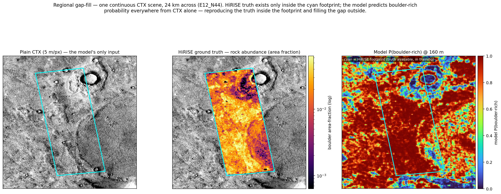
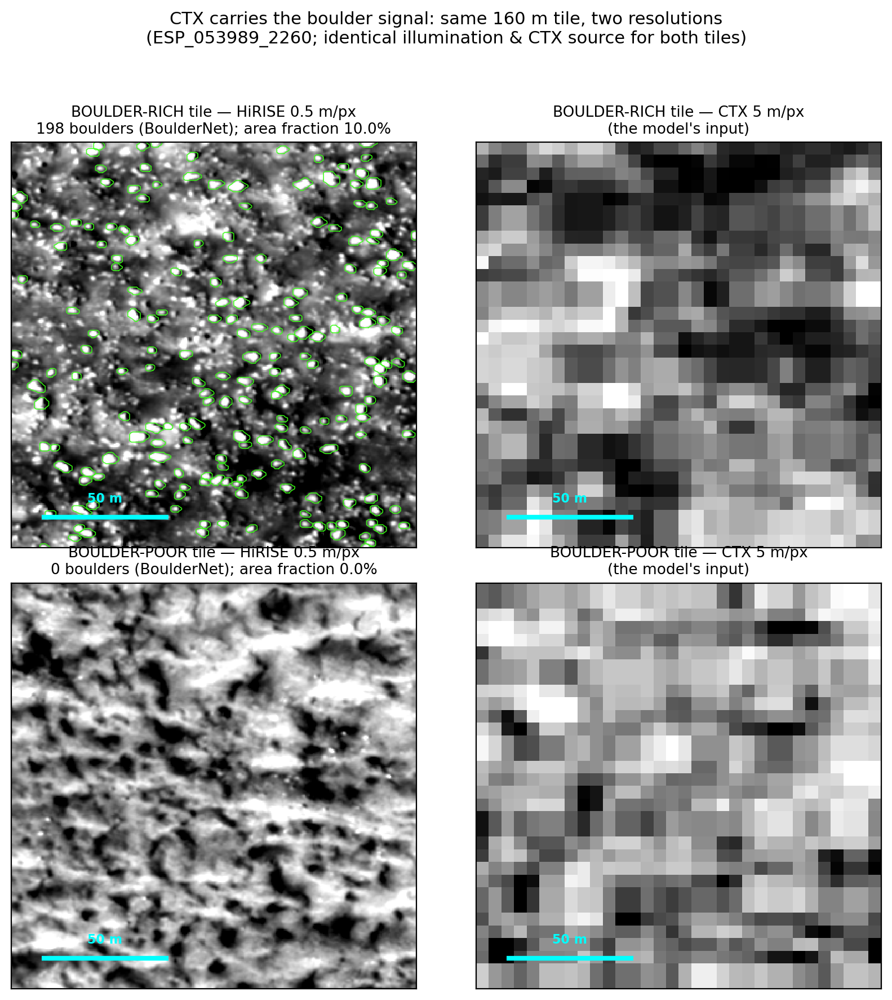
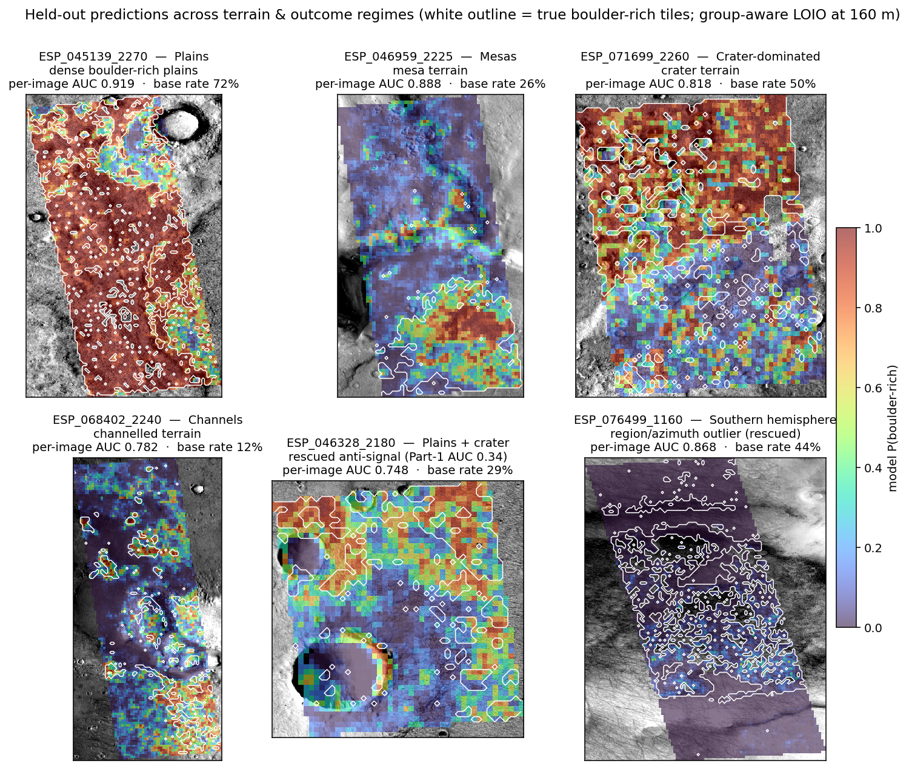
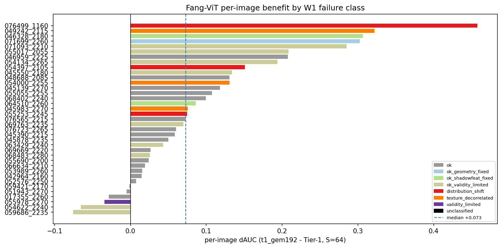
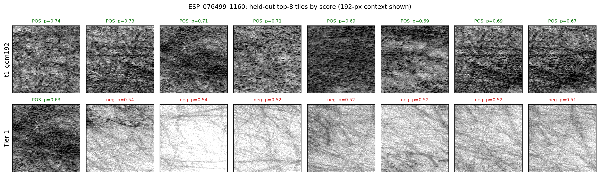
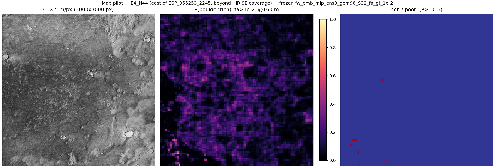
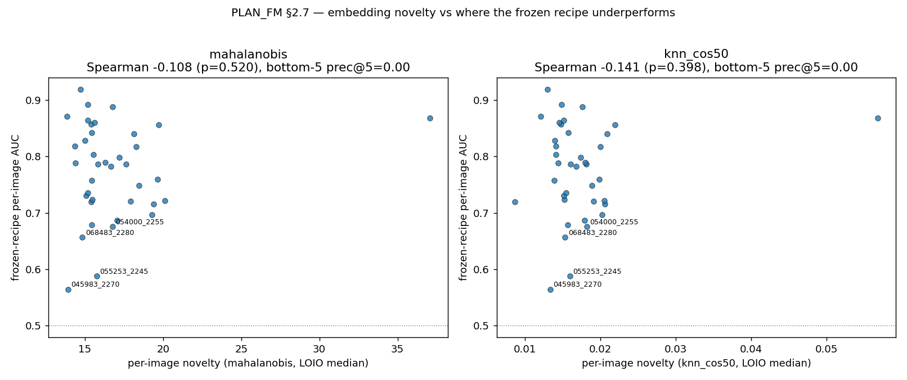
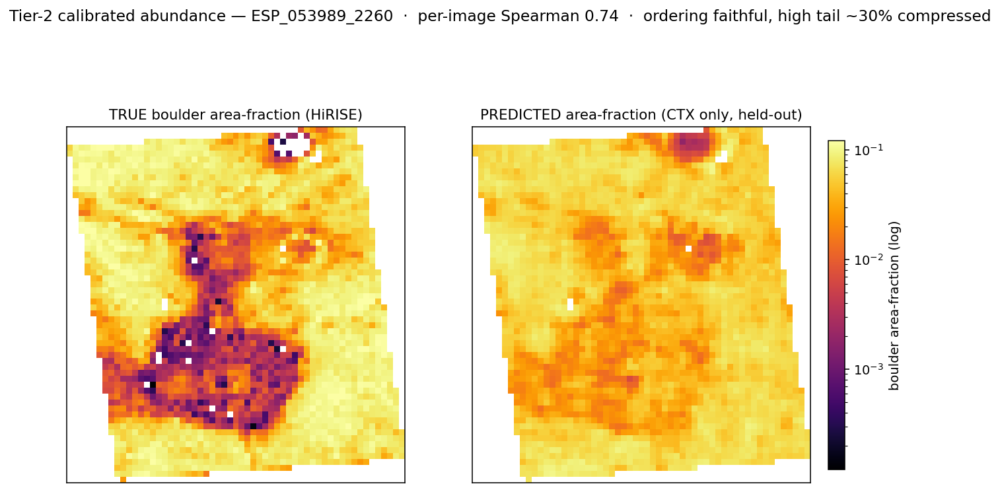
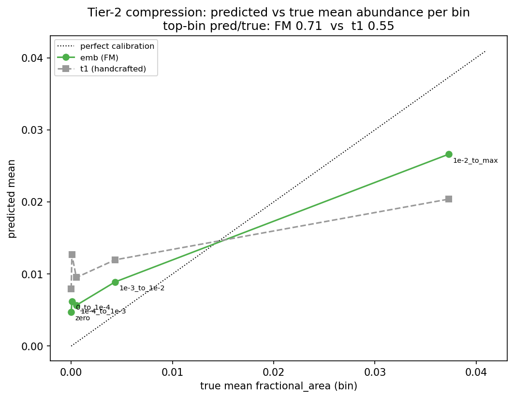

# Model Evidence — CTX boulder-abundance from foundation-model embeddings

Brian Amaro — EPS 245 Project

> **Companion to [classification_slimmer.md](classification_slimmer.md)** (Part 1,
> the handcrafted-feature Tier-1 detector this work supersedes). It assumes the
> reader knows the pipeline from Part 1 and does not re-explain it; its job is
> narrow and explicit — to show a skeptical, scientifically-literate reader that
> the model works well enough to carry to completion, and what the finished
> product delivers. Every headline number is **group-aware leave-image-out (LOIO)**
> cross-validation on the current 38-image set; no dev-set numbers appear here.
> Numbers marked `[held-out: pending]` await the pre-registered confirmation read
> on the expansion cohort (§7); until then the LOIO numbers carry the selection
> caveat stated up front.

## 0. Headline

A frozen, Mars-pretrained vision foundation model turns 5 m/px CTX texture into a
boulder-rich / boulder-poor call at 160 m, near-globally — **substantially better
than the handcrafted-feature detector of Part 1, at four times finer resolution**.
On 38 HiRISE-labelled images held out one at a time, it recovers boulder-rich tiles
with a pooled precision–recall AUC of 0.78 against a 0.37 base rate, and its
top-scoring 5 % of map tiles are ~96 % correct. The same frozen embedding also
yields a calibrated abundance estimate (§8) for free.

| recipe (held-out LOIO) | resolution | pooled PR-AUC | prec@5% | med per-image AUC |
|---|---|---|---|---|
| **FM recipe (this work)** | 160 m (S=32) | **0.7826** | **0.9638** | **0.7778** |
| Tier-1 handcrafted (Part 1) | 320 m (S=64) | 0.5651 | 0.771 | 0.681 |
| held-out confirmation | — | `[held-out: pending]` | `[pending]` | `[pending]` |

*Figure 1. The deliverable in one figure — **regional gap-fill**, a single
continuous 24 km CTX scene (23,409 tiles at 160 m). **Left:** the plain 5 m/px CTX,
the model's only input. **Middle:** the HiRISE ground truth — per-tile boulder
abundance (area fraction) — which exists *only* inside the cyan footprint (the one
HiRISE strip in the scene; the outline traces its true rotated footprint, excluding
the nodata corners of its bounding box). **Right:** the model's boulder-rich
probability over the *whole* scene from CTX alone. Compare middle and right inside
the footprint: the model reproduces the
abundance pattern — the dense plains and the low-abundance central feature — and
then **flows seamlessly across the footprint boundary** to fill the surrounding
gap, where no HiRISE exists. It is not saturated: it reads the crater interiors and
smooth patches as poor (dark blue) amid the boulder-rich plains. This is the
product: train on the scattered HiRISE footprints, predict the CTX between them.
(The footprint tiles were in the all-data model's training; the held-out evidence
that the recipe generalises is §3–§5.)*

## 1. The question, and the honest way to answer it

**What is claimed.** A per-tile **boulder-rich / boulder-poor** call — fractional
boulder area greater than 1 % (`fractional_area > 1e-2`) — that holds on terrain
the model has never seen. Rich/poor at this threshold is the operationally
meaningful cut: the level at which a tile carries a genuine concentration of
meter-scale boulders rather than a stray detection, and the same threshold Part 1
adopted.

**Why leave-image-out.** Tiles within one HiRISE image share illumination, season,
atmosphere, and CTX-mosaic source, so a random tile split would place
near-neighbours of every test tile in the training set and report an accuracy the
model could never reproduce on a new image. The honest protocol — the one a
deployment faces — holds out **whole images**: train on 37, predict the 38th,
rotate through all of them. Every number here is that protocol; dev-set numbers,
where the recipe was chosen, are not reported.

**Two qualifiers, stated up front** (both revisited in §7):

1. **Selection.** The recipe was *chosen* on these 38 images. A pre-registered
   confirmation on a disjoint expansion cohort removes this caveat; its numbers are
   the `[held-out: pending]` row above.
2. **Transductive pretraining.** The foundation model was self-supervised on the
   CTX mosaic itself, so it saw the test images' *pixels* (never their labels)
   during pretraining. Why that is acceptable for this deployment — and how to
   bound it — is §7.

## 2. The basis: can 5 m/px CTX see boulders at all?

Before any model, the premise must hold: a meter-scale boulder is a fraction of a
single 5 m CTX pixel, so no boulder is *resolved* in CTX. The claim is weaker and
testable — that a **concentration** of boulders changes the aggregate texture of a
CTX tile enough to be read. Figure 2 shows this directly.

*Figure 2. The same two 160 m tiles from one image (so illumination and CTX source
are identical), each at both resolutions. **Top:** a boulder-rich tile — HiRISE
(0.5 m/px) resolves ~200 individual boulders (BoulderNet detections outlined in
green; 10 % area fraction), and the co-located CTX (5 m/px) is visibly rougher and
higher-contrast. **Bottom:** a boulder-poor tile from the same image — smooth
regolith in HiRISE (zero detections), and bland, low-contrast CTX. The boulders
themselves are sub-pixel in CTX, but the **tile-scale texture they impose is not** —
that aggregate signature is exactly what the embedding reads.*

This is the scientific basis the whole project rests on, and it is consistent with
prior art: [Serrano et al. (2010)](https://ntrs.nasa.gov/citations/20100039411)
showed CTX GLCM texture correlates with HiRISE rock density on the Phoenix plains.
What the foundation model adds is a representation that reads that texture far more
robustly than the hand-built features could (§3–§5).

## 3. Reading the numbers (plain language)

Only the metrics the project uses appear here, each with its operational meaning.
(Presence AUC — "did the model find *any* boulder" — is deliberately not reported;
it is saturated by the base rate and uninformative at the rich/poor question.)

- **Pooled PR-AUC = 0.7826, against a base rate of 0.3733.** The no-skill line for
  PR-AUC is the positive base rate itself (37.3 % of tiles are boulder-rich here), so
  0.78 means the model is far above chance at separating rich from poor across the
  whole pooled cohort, not just on easy images.
- **Precision@5% = 0.9638.** Rank every tile by score and take the top 5 %: ~**96 %
  are truly boulder-rich**. This is the "where do I look first" guarantee — for
  landing-site screening or targeting follow-up HiRISE, the model's most-confident
  tiles are almost all real.
- **Median per-image AUC = 0.7778, with ±0.1–0.2 fold-ripple error bars.** AUC
  computed *within* each image, summarised by the median across the 38 — the honest
  view, because a user runs the map one region at a time. The error bars are real:
  an image with few positive tiles has a noisy AUC, so the **median across images**
  is the summary, not any single value (sd 0.0886 over 38 images ⇒ SE ≈ 0.0144).
- **⚠ These numbers moved slightly at the 2026-08-25 rebuild, and the comparison needs
  care.** The corrected label basis (R74 + R29) raised rich prevalence 0.3598 → 0.3733,
  and *chance PR-AUC is the prevalence*, so a flat PR-AUC at a higher base rate is a
  small **real** decline: skill above chance went (0.7832−0.3598)/(1−0.3598) = 0.6614
  → (0.7826−0.3733)/(1−0.3733) = **0.6530**. Precision@5% rising is likewise partly
  mechanical. The prevalence-insensitive read is median per-image AUC, **down 0.0087 —
  inside one standard error**. The defensible statement is that the frozen recipe
  **transfers to the corrected basis unchanged**, not that it improved or degraded.
- **The rich/poor threshold (`fractional_area > 1e-2`)** is the scientifically
  meaningful cut, fixed before any of these numbers were computed.

## 4. The model

The frozen recipe, for a reader who has not followed the build.

- **Inputs.** One 160 m (S=32) CTX tile plus its 3×3-tile neighbourhood (a 96 px
  box) — and nothing else. There are **no handcrafted texture features at map time**;
  every input is derivable from the CTX mosaic anywhere it exists, so the model is
  globally deployable.
- **The foundation model.** A ViT-B/16 vision transformer, self-supervised
  (MAE + DINO) on 3.9 million crops of the Murray Lab global CTX mosaic
  ([Fang et al., 2026](https://doi.org/10.1029/2025JH000827); weights
  [Zenodo 18180801](https://doi.org/10.5281/zenodo.18180801)) — the *same* imagery
  product we predict on. Used **frozen**: never fine-tuned, so the representation is
  fixed and the result deterministic given the embedding.
- **The embedding.** GeM (generalised-mean, p = 3) pooling of the patch tokens →
  one 768-dim vector per tile. GeM beat mean- and CLS-pooling head-to-head: it
  up-weights the few patches that actually contain boulders without collapsing to a
  single maximum.
- **The head.** A small three-seed MLP ensemble (768 → 256 → 64 → 1) → rich/poor
  probability. Three seeds because a single MLP's calibration is seed-sensitive;
  their mean is stable. No fusion, no second model, no handcrafted features.
- **Why it works.** The binding constraint was *representation*, not the learner:
  handcrafted CTX texture hit a feature-set ceiling neither a tuned tree nor a
  from-scratch CNN could clear (Part 1; Supplement S1). The foundation model
  supplies a representation that does — and the embeddings carry the signal *alone*
  (adding the 52 handcrafted features back gives nothing at this scale).

<!-- figure: schematic — CTX window → ViT → GeM → 768-d → MLP → rich/poor (to draw) -->

## 5. What the predictions look like

The visual proof across terrain and outcome regimes, every panel an image the
model never trained on.

*Figure 3. Held-out per-tile P(boulder-rich) (heatmap) with the true boulder-rich
tiles outlined in white, for six images spanning the cohort: dense boulder-rich
plains, mesas, crater-dominated and channelled terrain, the formerly-failing
anti-signal image, and a far-southern region/azimuth outlier. The model's heat
lands inside the white truth outlines across all terrain types — and on the two
hard cases (bottom row) it now succeeds where Part 1 failed. Per-image AUC and base
rate are annotated on each panel; base rate varies an order of magnitude (12 %–72 %)
yet the model tracks it.*

*Figure 4. Per-image AUC change of the FM recipe over the handcrafted baseline, one
bar per held-out image. The advantage is broad, not driven by a few images, and
largest exactly on the classes Part 1 failed — the distribution-shift images and
the azimuth outlier ESP_076499_1160 (the cohort's single biggest win).*

*Figure 5. Top-scoring tiles for the formerly-worst image as CTX chips with their
true labels — the model's highest-confidence picks are almost all true
boulder-rich, the visual form of prec@5% = 0.9638.*

The two formerly-failing cases are the persuasive ones. **ESP_046328_2180** was an
*anti-signal* image under Part 1 — its handcrafted predictions were systematically
inverted (per-image AUC 0.344, worse than a coin flip); the frozen embedding
recovers it to 0.748. **ESP_076499_1160**, an illumination-azimuth and southern-
latitude outlier that broke every handcrafted and CNN variant, becomes the cohort's
single biggest win (0.868). Both were diagnosed in Part 1 as covariate-shift
failures; the foundation model's pretraining makes their texture legible. A
detailed truth-vs-model overlay for two of these is in
[notebook 21](../notebooks/21_map_pilot.ipynb)
([figure](../reports/figures/21_deployable_truth_vs_model.png)).

## 6. What a map user gets

**The deliverable** is a near-global boulder rich/poor map at 160 m, produced by a
single model trained on all available images and run over any CTX mosaic window —
including terrain with no HiRISE coverage at all. The honest first deployment is
**regional gap-fill** (Figure 1;
[Serrano et al. 2010](https://ntrs.nasa.gov/citations/20100039411)'s framing):
train on the scattered HiRISE footprints in a region, predict the CTX between
them; global transfer is the stretch claim the §7 confirmation will test. Figure 6
shows the most extreme version of that — inference 15 km *beyond* a footprint, with
no HiRISE anchor at all in view.

*Figure 6. The off-coverage inference path in full: a 15 km CTX window
(8 281 tiles) east of a footprint → CTX texture, P(rich) heatmap, and the rich/poor
map. Overwhelmingly poor — the honest read for smooth plains — but the heatmap's
coherent elevated patches track rougher CTX, confirming the model responds to
terrain rather than saturating.*

**Where to trust it — answered honestly.** A map is only usable if candid about its
limits:

1. **On average, across new terrain:** the per-image confirmation (§7,
   `[held-out: pending]`) certifies the *recipe* generalises beyond the selection
   set. This is the primary trust statement and it is pre-registered.
2. **Per tile, "is this terrain unlike anything I trained on?":** we built and
   validated an embedding-space **novelty** score (Mahalanobis / k-NN distance to
   the training embedding cloud). It is a *valid out-of-distribution flag* — it
   correctly ranks the genuinely unusual ESP_076499_1160 as the single most-novel
   image — **but the pre-registered validation showed it does not predict per-tile
   accuracy** at this cohort size (per-image novelty vs. the recipe's own per-image
   AUC: Spearman −0.11 to −0.14, not significant at n = 38). The reason is a
   *good-news* property: the foundation model already absorbed the covariate-shift
   failure mode, so on these images novelty and skill are **decoupled** — the
   most-novel image is one of the model's best.

*Figure 7. Per-image novelty vs. the frozen recipe's own per-image AUC. The cloud
is flat; the lone high-novelty point at upper right (ESP_076499_1160) is the most
novel yet AUC 0.87 — the novelty/skill decoupling.*

So **the shipped map carries no per-tile accuracy overlay**; the novelty score is
retained only as an *extrapolation warning* (this terrain is unusual), not a
confidence number, and the validation will be re-run when the cohort expands and
the test regains power. The trustworthy quantities today are the prec@5%
"look-here-first" guarantee and the per-image confirmation — and the map is four
times finer (160 m vs. 320 m) than the Part-1 product.

## 7. Honest caveats

- **Transductive pretraining.** The foundation model saw the test images' *pixels*
  (never labels) during self-supervision. This is acceptable for the deployment
  estimand because the product runs on the same Murray mosaic, which is *in-corpus
  everywhere* — at map time the model is never shown a different distribution than
  it pretrained on. The residual concern (memorised test-specific texture) can be
  bounded by re-embedding through a model pretrained on a *disjoint* corpus (the
  MOMO probe, future work); every claim ships with this disclosure until then.
- **Confirmation status.** The headline numbers are LOIO on the 38 selected images;
  the `[held-out: pending]` row awaits the pre-registered confirm-then-absorb read
  on the 23-image expansion cohort (gates declared before any expansion number is
  computed). Until then the LOIO numbers are an honest but not selection-free
  estimate.
- **Label noise.** Labels come from BoulderNet on HiRISE; its detection limits
  (small / low-contrast boulders, an untested minimum-confidence filter) propagate
  into the truth field and cap measurable skill — partly the Tier-2 limit in §8.

## 8. Calibrated abundance (Tier-2): status, reach, and use

Tier-1 answers *is this tile boulder-rich?* Tier-2 answers *how much?* — a
continuous boulder area-fraction per tile, the input to a near-global
THEMIS-comparable abundance map. This section lays out where Tier-2 actually
stands, what it can and cannot do today, and how it would be used.

**Where it stands.** Tier-1 is frozen and productised (a single all-data
`DeployableHead`, run end-to-end in §6). Tier-2 has a clear winning candidate but
is **not yet frozen or productised**: a single-stage three-seed MLP *regressor* on
the identical frozen emb-only S=32 features (the hurdle / two-stage architecture
was tested and **dropped** — single-stage beat it, DECISIONS.md 2026-06-13). It
runs through the same LOIO harness and the same inference path; what remains is a
freeze decision, a deployable regressor head (the Tier-1 `DeployableHead`
analogue), and the calibration layer below — packaging and calibration, not new
research.

**What's achievable now.** The regressor reproduces the spatial *ordering* of
abundance from CTX alone — which tiles and regions are denser vs sparser — at
per-image Spearman ρ ≈ **0.43** (median; up to ~0.74 on well-resourced images),
**about twice the handcrafted baseline** (0.22). Figure 8 shows what that buys: a
held-out image's true abundance field and the CTX-only prediction, side by side.

*Figure 8. Held-out true (HiRISE) vs. predicted (CTX-only) boulder area-fraction
for one image, same log colour scale. The regressor recovers the spatial structure
— the low-abundance central feature and the high-abundance surrounding plains —
from 5 m/px texture it never trained on (per-image Spearman 0.74). The prediction
is visibly smoother because the magnitude is **compressed toward the middle at both
ends** (next figure): note the predicted panel lacks the deep-purple lows of the
truth — the model floors above true zero — and also softens the brightest peaks.
The **ordering is faithful**; the absolute range is squeezed.*

It also gives two things for free: rich/poor `meaningful_auc` = **0.78** (matching
the dedicated Tier-1 classifier — one model does both), and top-tile ranking
NDCG@5% = **0.50** vs. 0.35 for handcrafted.

**What's *not* achievable yet — the honest limit.** The absolute values are not yet
trustworthy at *either* end: the model compresses the abundance range toward its
middle (regression to the mean), the classic signature of a squared-error
regressor on a heavy-tailed, zero-inflated target.

*Figure 9. Mean predicted vs. mean true abundance per true-abundance bin. The green
(FM) curve is flatter than the perfect-calibration diagonal and crosses it near the
rich/poor threshold (~0.015): **below** the crossover it sits above the diagonal —
the model **over-predicts the lowest tiles**, flooring at ~0.005 and almost never
emitting true zero (1.8 % of predictions are near-zero vs. 18 % of tiles truly
zero) — and **above** the crossover it falls below, **under-predicting the top bin**
by ~30 % (ratio 0.71, vs. 0.55 for handcrafted; the FM compresses less but still
compresses).*

Two things are worth separating here. **Ranking** is not the problem and is not
capped by the zeros (removing the exact-zero tiles moves ρ by ~0.01); the curve is
monotone, so denser tiles are still ranked above sparser ones. The problem is
**magnitude calibration** — the two-sided squash above — which a calibration layer
fixes by *stretching* both ends (e.g. isotonic / quantile remapping fit on held-out
data), not by changing the ranking. The one-line summary: **use Tier-2 for relative
abundance and ranking today; absolute area-fractions await that calibration layer.**

**How it would be used** — three uses, in increasing demand on absolute calibration:

1. **Relative-abundance mapping for process science (now).** The questions this
   project exists for need *gradients and ordering*, which Tier-2 already delivers:
   does boulder abundance track a proposed transport/deposit geometry (the
   late-Hesperian megatsunami test in Part 1's motivation), or grade with terrain
   unit? A rank-reliable map answers these without calibrated absolutes.
2. **Graded hazard map for landing-site screening (now, as classes).** Following
   [Serrano et al. (2010)](https://ntrs.nasa.gov/citations/20100039411)'s
   hazard-class framing, the abundance map bins into ordered density classes
   (low / moderate / high) — robust to the compression because class boundaries are
   about ordering — and combines with prec@5% to flag the densest tiles first.
3. **THEMIS-comparable absolute abundance (needs calibration).** The Tier-2
   endpoint in [PLAN_ModelUsability.md](../PLAN_ModelUsability.md) is a near-global
   rock-abundance map comparable to THEMIS (~100 m/px thermal rock abundance). This
   needs (a) the calibration layer to de-compress both ends, and (b) THEMIS
   rank-correlation validation on overlap regions.

**What remains (the to-do).** (i) Freeze + productise the single-stage `mlp_reg`
into a deployable regressor head; (ii) a two-sided de-compression calibration layer
(isotonic / quantile remap, or a tail-weighted loss); (iii) THEMIS overlap
validation. None is a research risk — the representation already carries the signal
(ρ doubles over handcrafted); these are calibration and packaging steps that fold
into the same deployable path Tier-1 already uses.

---

## Supplement S1 — How we got here (the trajectory)

For readers who want the journey and the dead-ends ruled out; not needed to trust
the result.

| step | held-out skill | what it ruled out |
|---|---|---|
| slim 5-feature (shadow + roughness) | per-image AUC med ~0.57 | the minimal handcrafted floor |
| Tier-1 handcrafted (52 features) | pooled 0.5651 / med 0.681 | the handcrafted ceiling |
| CNN / conditional-leveler fusion (W2) | F1 0.5955 | learned CTX features ≈ handcrafted (the representation floor is real) |
| **FM recipe** | **0.7826 / 0.7778** | the floor was a *feature-set* floor, not a sensor floor |

Three negative results carried the project to the foundation model (detail in
DECISIONS.md):

- **The sensor-floor hypothesis was wrong.** For two years the assumption was that
  5 m/px simply cannot see meter-scale boulders — a *sensor* floor. Each input
  improvement that moved the number (denser v2 labels, a co-registration sign-error
  fix) argued instead for a *feature-set* floor; the foundation model confirmed it
  (same imagery, same labels, far better representation, +0.22 pooled PR-AUC).
- **Augmentation and fusion became obsolete.** The CNN line invested in photometric
  augmentation and conditional-leveler fusion to protect the distribution-shift
  images; the foundation model rescued exactly those images for free.
- **Trees are the wrong reader of dense embeddings.** A head bake-off on the
  identical embedding matrix found every non-tree head (MLP, k-NN, logistic) beat
  gradient boosting; the MLP ensemble won with clean paired significance.

## Supplement S2 — Recipe spec & reproduction

- **Frozen recipe:** three-seed MLP ensemble (768-256-64-1, dropout 0.2, BCE with
  pos-weight, AdamW) on the S=32 96-px 3×3-context GeM(p=3) 768-dim **emb-only**
  matrix; target `fa_gt_1e-2`. Banked LOIO cell
  `models/fang_probe/fw_emb_mlp_ens3_gem96_S32_fa_gt_1e-2`.
- **Checkpoint provenance:** Fang et al. 2026 ViT-B/16, MAE+DINO,
  [Zenodo 18180801](https://doi.org/10.5281/zenodo.18180801).
- **Inference path:** `src/fm_embeddings.py` (ViT + GeM + `embed_window`) →
  `src/modeling/mlp_head.py` (`DeployableHead`) → `src/mapping.py` (`predict_window`,
  GeoTIFF); deployable model banked at `models/deployable/`.
- **Figures:** the basis / gallery / product / Tier-2 figures are built by
  `scripts/probes/_evidence_{basis_figure,prediction_gallery,product_figure,tier2_map}.py`
  (exemplar selection in `_evidence_select_exemplars.py`); QA in
  [notebook 21](../notebooks/21_map_pilot.ipynb) and
  [notebook 22](../notebooks/22_freeze_and_tier2.ipynb).
