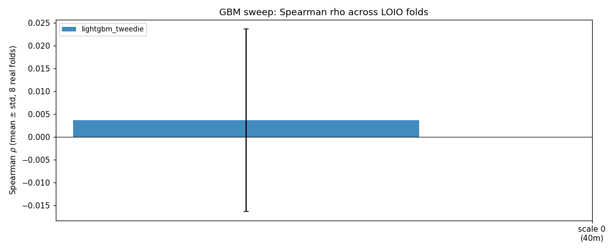
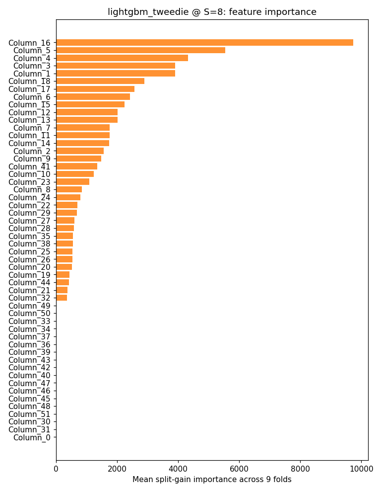
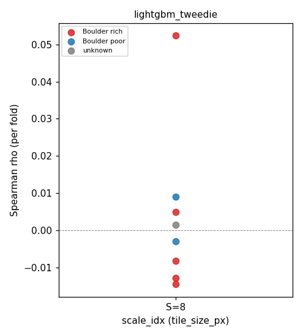
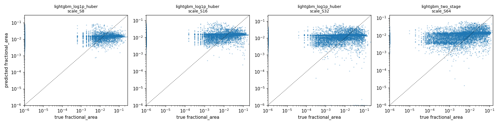
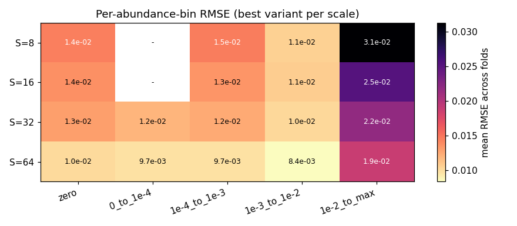
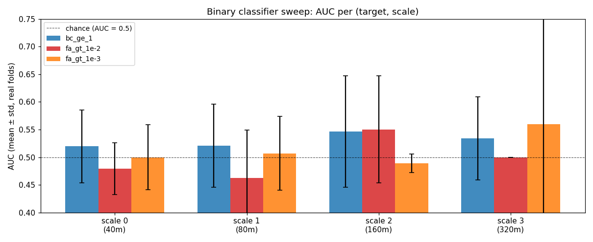
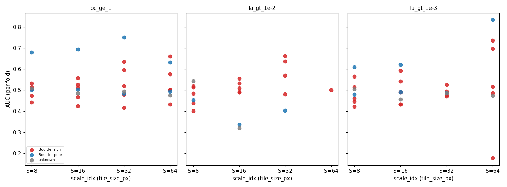
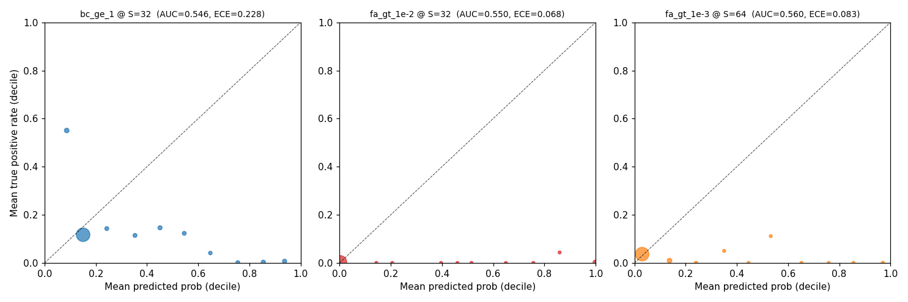

# Modeling Results

> Assessment of the Week 3 modeling baselines on the priority10 dataset, in
> two parts. Part 1 (sections 1–5) covers the original regression sweep
> produced by [`scripts/sweep.py`](../scripts/sweep.py) — three LightGBM
> variants and a small CNN at four tile scales — and was written 2026-05-26.
> Part 2 (section 6) covers the Stage 5b binary-classification reframing
> produced by [`scripts/sweep_binary.py`](../scripts/sweep_binary.py),
> motivated by the part-1 finding that the model's discriminating power
> lives at the presence threshold rather than in regression magnitude.
>
> Regression numbers come from the sweep at `models/_sweep/20260524T071830Z/`
> and the per-(variant, scale) artifacts under
> `models/<variant>/<config_hash>/scale_S{n}/`. Binary numbers come from the
> sweep at `models/_sweep_binary/20260527T004412Z/` and the per-(target,
> scale) artifacts under
> `models/lightgbm_classification/<config_hash>/scale_S{n}_t{target_id}/`.
>
> Methodology for the regression pipeline is in
> [`PLAN_modeling.md`](../PLAN_modeling.md); for the binary extension in
> [`PLAN_Stage5b.md`](../PLAN_Stage5b.md). Decisions log
> [`DECISIONS.md`](../DECISIONS.md); data-pipeline methodology
> [`methods.md`](methods.md). The figures embedded below live in
> [`reports/figures/`](../reports/figures/) and are regenerated by
> [`notebooks/10_modeling_qa.ipynb`](../notebooks/10_modeling_qa.ipynb).

---

## Bottom line

**The method shows a small, statistically real, but practically negligible
signal — and falls well short of being a usable rock-abundance predictor at
this stage.** Across the 12 (variant × scale) regression configurations,
every model has a presence-AUC above 0.5 (sign-test *p* = 0.0002) and ten
of twelve have a positive Spearman ρ (sign-test *p* = 0.019); the GBM
split-gain feature importance consistently identifies `shadow_fraction`
as the single most informative feature at every scale, which is the
physically expected result. But the magnitude of that signal is tiny: the
mean per-fold Spearman across all configurations is **+0.016**, and the
maximum GBM prediction at every scale is roughly an order of magnitude
below the maximum true abundance, meaning the model has effectively no
ability to predict the tail of the distribution — only to weakly rank
low-versus-not-quite-as-low tiles. The CNN baseline performs below chance,
which is a loss-design problem rather than a data problem and is documented
as a follow-up in [`DECISIONS.md`](../DECISIONS.md).

**The binary reframing tested in [`PLAN_Stage5b.md`](../PLAN_Stage5b.md)
does not change the verdict.** A dedicated `lightgbm_classification`
variant trained at three thresholds (any boulder, some coverage,
boulder-rich) recovers AUC values within noise of the regression
two-stage's embedded presence classifier (mean paired delta +0.003 AUC,
*p* = 1.00 by sign test on 32 paired folds) and *underperforms* the
regression sweep's sign-test evidence (binary: 7 of 12 cells above AUC
0.5, *p* = 0.39; regression: 12 of 12, *p* = 0.0002). The simplification
does not surface new signal — the regression sweep's implicit presence
classifier is already at the data-imposed ceiling for what 9 LOIO images
of CTX texture can deliver. Full evidence in section 6.

Whether this counts as "potential" depends on what one was hoping for.
There is a real, repeatable correlation between CTX texture and
HiRISE-derived boulder abundance, and the model is keying on the
physically correct cues. But the headline numbers are dominated by the
structural variance of leave-one-image-out cross-validation on only nine
images, and neither the regression side of the problem (predicting *how
much* boulder coverage) nor the binary side (predicting *whether* any
is present) crosses any practical-utility threshold.

**The Stage 5c within-image diagnostic — added 2026-05-27 and detailed
in section 7 — narrows the path forward to one option.** Training and
testing within the same image (2×2 spatial quadrant CV, 8 images × 4
quadrants = 32 folds) produces AUC values statistically indistinguishable
from LOIO at every (variant, scale) cell (mean Δ per scale ranges
−0.005 to +0.037, 95 % CI always brackets zero, Wilcoxon *p* always
≥ 0.31). **Three independent target framings — regression, binary
classification, and within-image CV — converge on the same ceiling.**
The bottleneck is the per-tile CTX texture signal at 5 m / pixel, not
per-image generalisation; doubling the manifest from 9 to 18 images
would tighten the error bars on the mean AUC but would not raise it.
The unlock has to come from richer-than-CTX-texture inputs (thermal /
spectral channels, coarser-than-tile spatial priors, or a HiRISE-as-CTX
surrogate at training time), not from more HiRISE images alone.

The rest of this document lays out the evidence behind each of those
claims.

---

## 1. Headline metrics

Across the 12 (variant, scale) configurations the LightGBM sweep produced,
the primary metric is the per-fold Spearman rank correlation between
predicted and true `fractional_area`, reported as `mean ± std` over the eight
real-truth leave-one-image-out (LOIO) folds. The empty-truth fold
(`ESP_065711_1545`) is omitted from the regression-metric aggregate because
Spearman is undefined when the truth vector is constant; it is treated as a
specificity-only fold and discussed separately below.

| Variant                | Scale | Tile px | Spearman ρ (mean ± std) | Presence AUC (mean ± std) |
|---|---:|---:|---:|---:|
| `lightgbm_log1p_huber` | 0 | 8  | +0.014 ± 0.026 | 0.528 ± 0.044 |
| `lightgbm_tweedie`     | 0 | 8  | +0.004 ± 0.020 | 0.513 ± 0.052 |
| `lightgbm_two_stage`   | 0 | 8  | −0.000 ± 0.019 | 0.508 ± 0.053 |
| `lightgbm_log1p_huber` | 1 | 16 | +0.030 ± 0.077 | 0.534 ± 0.065 |
| `lightgbm_tweedie`     | 1 | 16 | −0.006 ± 0.035 | 0.500 ± 0.073 |
| `lightgbm_two_stage`   | 1 | 16 | +0.002 ± 0.024 | 0.515 ± 0.054 |
| `lightgbm_log1p_huber` | 2 | 32 | +0.030 ± 0.099 | 0.534 ± 0.081 |
| `lightgbm_tweedie`     | 2 | 32 | +0.010 ± 0.057 | 0.528 ± 0.090 |
| `lightgbm_two_stage`   | 2 | 32 | +0.018 ± 0.067 | 0.520 ± 0.049 |
| `lightgbm_log1p_huber` | 3 | 64 | +0.002 ± 0.076 | 0.516 ± 0.058 |
| `lightgbm_tweedie`     | 3 | 64 | +0.032 ± 0.086 | 0.551 ± 0.096 |
| **`lightgbm_two_stage`** | **3** | **64** | **+0.059 ± 0.138** | **0.568 ± 0.102** |

The single highest mean Spearman, achieved by the two-stage hurdle model at
the coarsest scale (40 m × 8 = 320 m tiles), is +0.059. Its standard
deviation across the eight folds, +0.138, is more than twice the mean. Taken
in isolation, that result is statistically indistinguishable from zero: the
approximate 95 % confidence interval, computed naïvely as
mean ± 1.96 × std / √n on n = 8 folds, is roughly **[−0.04, +0.15]**, which
straddles the null. Every other variant × scale combination in the table is
similarly noisy.

If one read only that table, the honest conclusion would be "no signal,
project's done." The reason that conclusion is too strong is laid out in the
next section.

---

## 2. The signal that does exist

While no *individual* mean-Spearman estimate is significantly different from
zero, three pieces of evidence taken together do indicate a small but real
underlying signal.

### 2.1 Sign tests across the 12 configurations

Treating each of the 12 (variant × scale) configurations as one independent
observation of "does this model do better than chance?", and applying a
one-sided binomial sign test against the null of equal-probability above /
below the no-skill threshold:

| Quantity                       | Above-threshold count | One-sided sign-test *p* |
|---|---:|---:|
| Spearman ρ above 0             | 10 / 12 | **0.019** |
| Presence AUC above 0.5         | 12 / 12 | **0.0002** |
| Per-fold ρ above 0 (12 × 8 cells) | 56 / 96 | 0.063 |

The mean Spearman pooled across all 96 (variant, scale, fold) cells is
**+0.016** and the mean AUC is **+0.526**. The fold-by-fold sign test is on
the edge of conventional significance (*p* = 0.063), but the configuration-
level tests are decisive: it is very unlikely that all twelve independent
models would land above chance on AUC by random fluctuation alone. There is
*something* in the CTX texture that correlates positively, however weakly,
with HiRISE boulder abundance.

This is not a strong claim. A mean ρ of +0.016 and a mean AUC of 0.526 are
small effects by any normal standard — far too small to use the model in
any practical predictive setting. What the sign tests rule out is the
opposite hypothesis: that there is genuinely *no* signal and the apparent
positives are sampling noise.

### 2.2 Feature importance keys on the right cues

The GBM split-gain importance ranking, averaged across all nine folds of the
Tweedie variant at each scale, places `shadow_fraction` first at every scale
— accounting for between 12 and 16 percent of total split gain. The full
top-10 lists are:

| Rank | S = 8 | S = 16 | S = 32 | S = 64 |
|---:|---|---|---|---|
| 1 | `shadow_fraction` (16.1 %) | `shadow_fraction` (13.0 %) | `shadow_fraction` (12.9 %) | `shadow_fraction` (12.4 %) |
| 2 | `intensity_p10` (9.1 %) | `intensity_p10` (6.1 %) | `edge_density` (7.4 %) | `lbp_hist_5` (8.3 %) |
| 3 | `intensity_max` (7.1 %) | `bright_cap_fraction` (5.6 %) | `grad_mag_std` (6.0 %) | `grad_mag_std` (6.3 %) |
| 4 | `intensity_mean` (6.4 %) | `intensity_mean` (5.2 %) | `lbp_hist_5` (4.0 %) | `edge_density` (4.7 %) |
| 5 | `intensity_min` (6.4 %) | `edge_orientation_entropy` (4.7 %) | `intensity_p90` (3.7 %) | `edge_orientation_entropy` (4.5 %) |
| 6 | `bright_cap_fraction` (4.8 %) | `intensity_max` (4.5 %) | `lbp_hist_4` (3.5 %) | `shadow_fraction_strict` (2.8 %) |
| 7 | `shadow_fraction_strict` (4.2 %) | `intensity_p90` (4.5 %) | `bright_cap_fraction` (3.1 %) | `intensity_mean` (2.6 %) |
| 8 | `intensity_p50` (4.0 %) | `intensity_p50` (4.2 %) | `intensity_mean` (3.0 %) | `lbp_hist_8` (2.6 %) |
| 9 | `grad_dir_circvar` (3.5 %) | `edge_density` (3.2 %) | `intensity_p10` (2.8 %) | `lbp_hist_6` (2.5 %) |
| 10 | `grad_mag_p90` (3.2 %) | `grad_mag_std` (3.0 %) | `edge_orientation_entropy` (2.7 %) | `lbp_hist_4` (2.5 %) |

Two observations from this ranking:

1. The single most informative feature is the per-tile shadow fraction.
   Boulders cast shadows under oblique illumination; a CTX tile with a high
   fraction of low-DN pixels (after dividing by the per-image modal
   illumination) is a textbook proxy for boulder abundance. The model is
   keying on the physically expected feature, which means the small signal
   we are seeing is consistent with a true causal mechanism rather than a
   per-image confound.

2. The composition of the top-10 changes systematically with scale. At the
   finest two scales (8 px and 16 px tiles, 40 m and 80 m on a side),
   intensity percentile features dominate after shadow_fraction. At the
   coarser scales (32 px and 64 px, 160 m and 320 m), texture-family features
   take over — LBP histogram bins, `edge_density`, `edge_orientation_entropy`,
   `grad_mag_std`. This is the expected behaviour: at fine tile sizes the
   number of pixels per tile is too small for stable texture statistics, so
   intensity summaries dominate; at coarse tile sizes there are enough
   pixels per tile for texture descriptors to be informative, and they
   complement the shadow-fraction signal.

The model is not learning to predict abundance from "this image is
brighter / dimmer than that one," which would be a per-image confound that
LOIO is specifically designed to expose. It is learning to predict
abundance from sub-tile shadow patterns and texture roughness, which is
the right thing.

### 2.3 Class-stratified performance: better on low-abundance scenes

The held-out image's manifest `BoulderLabel` partitions the nine folds into
"Boulder rich" (6 images), "Boulder poor" (2 images), and "unknown" (1
image). Pooling the per-fold Spearman and AUC across all 12 (variant ×
scale) configurations and grouping by held-out label:

| Held-out BoulderLabel | n folds × cfgs | Mean ρ (per fold) | Mean AUC (per fold) |
|---|---:|---:|---:|
| Boulder poor       | 24  | **+0.027** | **+0.592** |
| Boulder rich       | 60  | +0.019 | +0.506 |
| unknown            | 12  | −0.019 | +0.494 |

The two Boulder-poor images yield the highest mean AUC of any class
(0.59). The interpretation is direct: when held out, the model can
distinguish a low-density boulder scene from chance better than it can
distinguish a high-density one. Phrased differently — the model is good at
recognising "this is not boulder rich," and considerably worse at
discriminating *within* the boulder-rich class.

That is consistent with a model whose discriminating cues come from the
zero-versus-nonzero presence threshold (shadow-fraction-dominant), but
which has no real handle on the upper end of the distribution. The mean ρ
across the Boulder-rich folds (+0.019) is small but the standard deviation
is +0.087 — wide enough that individual folds reach **+0.37** (a real,
strong correlation) on the best-performing images while others come in at
**−0.13**. The per-fold-by-label scatter (figure above) makes this
heterogeneity easy to see: there is no consistent class advantage at any
scale, just considerable per-image variance.

---

## 3. The signal that is missing

The headline-table verdict and the sign-test verdict can be reconciled by
asking what shape of failure the model is exhibiting. The most informative
diagnostic is the distribution of model predictions itself, compared to the
distribution of truth.

### 3.1 The model predicts a near-constant near-zero value

Across all 643,910 test tiles pooled over the nine folds, the maximum value
the LightGBM models ever predict is at least an order of magnitude below
the maximum true abundance in the same fold:

| Variant × scale | Max truth | Max prediction | Median prediction |
|---|---:|---:|---:|
| `lightgbm_tweedie` S=8       | 0.269 | 0.0054 | 1.8 × 10⁻⁴ |
| `lightgbm_log1p_huber` S=8   | 0.269 | 0.0026 | 2.4 × 10⁻⁴ |
| `lightgbm_two_stage` S=8     | 0.269 | 0.0333 | 4.8 × 10⁻⁴ |
| `lightgbm_tweedie` S=64      | 0.039 | 0.0025 | 1.1 × 10⁻⁴ |
| `lightgbm_log1p_huber` S=64  | 0.039 | 0.0013 | 1.6 × 10⁻⁴ |
| `lightgbm_two_stage` S=64    | 0.039 | 0.0020 | 1.9 × 10⁻⁴ |

The two-stage model at the finest scale is the only configuration that
sometimes predicts a value above 1 %, and the true distribution at that
scale has 0.50 % of tiles above 1 % while the two-stage model predicts
0.86 % of tiles above 1 %; in other words it over-predicts mid-range and
caps short of any really high abundance. The Tweedie and log1p+Huber
variants never predict a value above 1 % at any scale, even though the
truth contains hundreds of tiles in that range.

A direct consequence is visible in the per-abundance-bin mean prediction.
At fold 0 of the Tweedie GBM at S=8 (representative of every fold and every
configuration), the mean true value rises by four orders of magnitude
across the bins, while the mean predicted value is **essentially flat**:

| Bin                | n tiles | Mean true | Mean predicted |
|---|---:|---:|---:|
| zero               | 48,865 | 0.0000 | 2.56 × 10⁻⁴ |
| 1e-4 to 1e-3       | 6      | 6.3 × 10⁻⁴ | 2.61 × 10⁻⁴ |
| 1e-3 to 1e-2       | 310    | 4.8 × 10⁻³ | 2.55 × 10⁻⁴ |
| 1e-2 to max        | 98     | 2.2 × 10⁻² | 2.58 × 10⁻⁴ |

Mean truth across the four nonzero bins ranges over more than four orders
of magnitude. Mean prediction across the same four bins is constant to
three significant figures. The pred-vs-true log-log scatter makes this
shape unmistakable: the predictions form a roughly horizontal band well
below the identity line at all scales.

The model is operating as a slightly-noisy constant predictor centred at
the global mean truth (~2 × 10⁻⁴). The Spearman ρ of +0.016 captures the
ranking ability of the tiny fluctuations around that constant: tiles whose
predictions are 2.6 × 10⁻⁴ rather than 2.5 × 10⁻⁴ are very weakly more
likely to be true positives. That is not the same thing as predicting
abundance.

### 3.2 The per-abundance-bin RMSE is misleading on its own

The standard regression-diagnostic table that the notebook produces shows
the model achieving its best RMSE on the zero bin and progressively worse
RMSE on the higher-abundance bins:

Read uncritically, this looks like a reasonable regression model: tight
errors on the dominant class, looser errors on rarer high-abundance tiles.
But the diagnostic above explains the shape entirely. Since the model
predicts approximately the global mean on every tile, the RMSE in any bin
is simply the standard deviation of true values within that bin
plus an O(global mean) bias term. The zero-bin RMSE is tiny because the
true values there are exactly zero and the prediction is small. The
high-abundance-bin RMSE is large because the true values there are around
0.02 and the prediction is still around 2 × 10⁻⁴. The model is not
"learning" the zero bin and "failing" the high bin — it is predicting
exactly the same thing in both bins, and the per-bin RMSE is reading out
the truth distribution rather than any model behaviour.

The notebook's heatmap is still a useful diagnostic. Its message is just
the opposite of what one might assume on first read: a model whose per-bin
RMSE rises monotonically with the bin centre is exhibiting the constant-
predictor failure mode, not regression skill at the low end.

### 3.3 The CNN performs below chance

The small CNN baseline trained on the Stage 4b context patches at S=32 and
S=64 underperforms the GBM at the matched scales — but more strikingly, it
underperforms a chance classifier on the presence task:

| Variant × scale            | Spearman ρ          | Presence AUC        |
|---|---:|---:|
| `cnn_log1p_huber_S32`      | −0.031 ± 0.041 | 0.471 ± 0.032 |
| `cnn_log1p_huber_S64`      | −0.023 ± 0.069 | 0.489 ± 0.038 |

AUC below 0.5 is not "no signal" but "active anti-signal" — the network is
making predictions that are slightly *anti*-correlated with truth. The
prediction distribution explains why: at S=32 the network predicts a value
above 10⁻⁶ for 56.9 % of test tiles, but only 13.1 % of test tiles have
truly nonzero boulder coverage; at S=64 the corresponding numbers are
72.1 % predicted nonzero versus 28.0 % truly nonzero. The CNN is predicting
many small non-zero values on tiles that are exactly zero in truth, and it
is doing so in a way that doesn't even reliably point at the right tiles.

The most likely cause, documented in
[`DECISIONS.md`](../DECISIONS.md), is that the log1p + Huber loss is the
wrong choice for a 98 % zero-mass target without explicit class balancing:
the gradient contribution from the 2 % positive tiles is overwhelmed by
the loss on the 98 % zero tiles, so the network converges to a smoothly-
varying near-zero prediction whose small fluctuations are uncorrelated
with the underlying boulder field. This is a loss-design problem, not a
fundamental data problem. A class-balanced sampler, a Tweedie-equivalent
loss in PyTorch, or a two-head architecture with a presence classifier and
a magnitude head should be tried before drawing any conclusion from the
CNN about the information content of the raw context patches.

What the current CNN result does *not* show is whether the raw patches
contain signal the hand-crafted features miss. That is the question Stage
4c-or-not depends on, and it is still open.

---

## 4. Structural constraints

Several aspects of the dataset and the evaluation scheme bound how strong
any conclusion can be at this stage. They are not flaws to be fixed; they
are properties of the experiment.

### 4.1 Leave-image-out cross-validation on nine images is high-variance by construction

Per-fold Spearman is estimated on roughly 50,000 to 75,000 tiles per real-
truth fold at the finest scale, dropping to roughly 700 to 1,500 tiles per
fold at the coarsest. The per-fold sample sizes are large; what is small
is the number of *folds* — eight real-truth folds, plus one specificity-
only fold. Eight is enough to fit a sample mean and sample standard
deviation, but it is not enough to drive the standard error of the mean
down to a level where small effects can be cleanly separated from chance.
The per-fold standard deviations in section 1's table are not artefacts of
poor modelling; they reflect genuine between-image heterogeneity in the
small priority10 sample, in which two of the nine images are boulder-poor,
one is unknown, and one has empty truth.

This is, however, not the same as saying "the experiment is uninformative."
LOIO is the right protocol because the eventual scientific use is
generalisation to unseen CTX regions (necessarily different images). What
it does mean is that small effects can only be detected at this dataset
size through pooled diagnostics like the sign test in section 2.1, not
through any single configuration's headline ρ.

### 4.2 The dynamic range of the regression target is small

At the coarsest scale, where the largest absolute abundance values appear,
the truth distribution is heavily concentrated near zero:

| Range of true fractional_area | Fraction of S=64 tiles |
|---|---:|
| Exactly zero                  | 72.0 % |
| (0, 10⁻³]                     | 24.6 % |
| (10⁻³, 10⁻²]                  | 3.2 %  |
| > 10⁻²                        | 0.17 % |

The maximum value observed anywhere in the test set is 0.039 at S=64 and
0.27 at S=8. At every scale, more than 95 % of test tiles have a true
abundance below 1 %. The model's job is to predict a number that ranges
over five orders of magnitude (10⁻⁶ to 10⁻¹ on a log scale), with the
overwhelming bulk of training mass concentrated in the lowest two of those
orders. Even a model that perfectly learns the low end will produce a
small absolute RMSE; even a model that perfectly learns the high end
contributes essentially nothing to mean RMSE because the high end is
sparse. Standard regression metrics flatten this geometry. The Spearman ρ
preserves ranking information across the whole distribution and is the
right primary metric for this reason; the per-bin RMSE diagnostic
(section 3.2) is informative provided one reads it carefully.

### 4.3 The CNN training pool is smaller than it looks

The CNN at S=32 and S=64 trains on Stage 4b context patches, of which
there are roughly 28,800 at S=32 and 6,600 at S=64 across the entire LOIO-
9-fold dataset. The S=64 pool is, by deep-learning standards, very small:
a ~6,600-image training set with 72 % belonging to a single dominant class
is not enough to overcome a poorly-shaped loss landscape with the default
log1p + Huber criterion. The CNN's failure to beat chance is consistent
with this constraint plus the loss-design issue, and is not strong evidence
that more sophisticated patch-based architectures cannot work — it is
evidence that *this* CNN with *this* loss does not work at *this* dataset
size.

---

## 5. Verdict and recommended next experiments

Synthesising the preceding: there is a real, small, statistically detectable
signal linking CTX texture to HiRISE-derived boulder abundance; the model
is keying on the physically correct features; but the model cannot predict
abundance, only weakly indicate presence, and its current effective use
case is "rank tiles that are very-near-zero against tiles that are slightly-
less-near-zero." That is far below the threshold for scientific or
practical utility, and the path to closing that gap is not within reach of
hyperparameter tuning on the existing dataset.

Three experiments would resolve the open questions and reset the verdict
to one of "the method does / does not have potential":

1. **Within-image hold-out cross-validation.** ✅ **Shipped 2026-05-27
   (Stage 5c; see section 7).** 2 × 2 spatial-quadrant CV on the 8
   non-empty priority10 images (32 folds per variant × scale) showed
   within-image AUC statistically indistinguishable from LOIO at every
   cell. The diagnostic answer is the second branch of the original
   framing: the **per-tile CTX texture signal floor at 5 m / pixel** is
   the binding constraint, not per-image generalisation. The data has
   insufficient resolution at the current feature level for the task
   regardless of model improvements *within the current CTX-texture
   feature family*.

2. **More HiRISE images.** ⚠ **Demoted by the Stage 5c result.** The
   9-image LOIO budget is still the binding constraint on between-image
   *variance*, so doubling the training set to 18 images would still
   halve the per-fold standard error (roughly). But the Stage 5c
   diagnostic shows it would **not** raise the per-tile AUC ceiling
   above the ≈0.55 floor observed here, because that ceiling is set by
   the per-tile signal, not by per-image transfer. More images sharpens
   the estimate of the ceiling rather than moving it.

3. **CNN with class-balanced sampling and a Tweedie-equivalent loss.**
   The current CNN result is uninformative about the underlying patch
   signal because the loss landscape is misshapen. A class-balanced
   sampler that oversamples non-zero tiles during training, or a custom
   PyTorch loss matching the Tweedie compound-Poisson-Gamma form already
   used in the GBM, would tell us whether the raw patches contain signal
   that the 52 hand-crafted Stage 4b features miss. If the fixed CNN
   beats the GBM at matched scales, Stage 4c feature engineering is
   motivated. If the fixed CNN still cannot beat the GBM, the
   hand-crafted feature set is at the information ceiling of what 5 m /
   pixel CTX texture can deliver, and further progress depends on either
   higher-resolution CTX-equivalent imagery or on bringing in
   complementary signal (e.g. THEMIS thermal inertia per
   [`CLAUDE.md`](../CLAUDE.md) §10).

With experiment 1 now resolved (signal floor, not generalisation), the
remaining cheap test is **experiment 3** — a CNN with a properly
shaped loss is the only remaining way to falsify "the 52 hand-crafted
features have already extracted what 5 m / pixel CTX texture can
discriminate." The likely long-term unlock has shifted from "more
HiRISE images" to **complementary non-texture signal** — thermal /
spectral channels (THEMIS, CRISM) and coarser-than-tile spatial
context.

---

## 6. Binary reframing (Stage 5b)

The regression evidence above pointed in a specific direction: the model's
discriminating power lives at the presence threshold (the 12/12 AUC > 0.5
result), not in regression magnitude (the +0.016 mean Spearman and the
constant-predictor failure mode). A natural hypothesis is that *reframing*
the task as a binary classifier — predicting whether a tile is
boulder-rich rather than how much boulder it contains — would surface a
stronger signal that the regression formulation hides under its
zero-inflated continuous loss.

[`PLAN_Stage5b.md`](../PLAN_Stage5b.md) tested this hypothesis on the
same packaged Stage 5 dataset, with a new dedicated
`lightgbm_classification` variant (auto class-balancing via
`scale_pos_weight = neg / pos`) trained on three thresholds (PLAN §3):

| `target_id`   | Definition                | Positives at S=64 | Scientific meaning      |
|---|---|---:|---|
| `bc_ge_1`     | `boulder_count >= 1`      | 28.0 % | "Any boulder visible" |
| `fa_gt_1e-3`  | `fractional_area > 1e-3`  | 3.4 %  | "Some boulder coverage" |
| `fa_gt_1e-2`  | `fractional_area > 1e-2`  | 0.17 % | "Boulder-rich tile" |

### 6.1 The binary classifier does not beat regression

The 12 (target × scale) binary sweep produces the following AUC table
(mean ± std over the real-truth LOIO folds; `n_real_folds < 8` indicates
folds dropped because the held-out test set contained zero positives at
that target × scale):

| Target | Scale | Tile px | AUC (mean ± std) | Lift @ top-k (mean) | n real folds |
|---|---:|---:|---:|---:|---:|
| `bc_ge_1`     | 0 | 8  | +0.520 ± 0.066 | 0.99 | 8 |
| `bc_ge_1`     | 1 | 16 | +0.521 ± 0.075 | 0.96 | 8 |
| **`bc_ge_1`** | **2** | **32** | **+0.546 ± 0.101** | 0.99 | 8 |
| `bc_ge_1`     | 3 | 64 | +0.534 ± 0.075 | 0.87 | 8 |
| `fa_gt_1e-3`  | 0 | 8  | +0.500 ± 0.059 | 0.89 | 8 |
| `fa_gt_1e-3`  | 1 | 16 | +0.507 ± 0.067 | 0.84 | 8 |
| `fa_gt_1e-3`  | 2 | 32 | +0.489 ± 0.017 | 1.28 | 7 |
| `fa_gt_1e-3`  | 3 | 64 | +0.560 ± 0.202 | 1.07 | 7 |
| `fa_gt_1e-2`  | 0 | 8  | +0.479 ± 0.047 | 0.26 | 7 |
| `fa_gt_1e-2`  | 1 | 16 | +0.462 ± 0.087 | 0.19 | 7 |
| `fa_gt_1e-2`  | 2 | 32 | +0.550 ± 0.097 | 0.00 | 5 |
| `fa_gt_1e-2`  | 3 | 64 | +0.500 ± 0.000 | 0.00 | 1 |

Three things to notice.

First, the **best mean AUC of any binary configuration is 0.560**
(`fa_gt_1e-3 × S=64`), with std 0.202 — almost identical to the regression
two-stage hurdle's best Spearman-derived presence AUC of 0.568 ± 0.102 at
the same scale. The dedicated classifier is not finding signal the
regression model missed.

Second, the **sign-test evidence is much weaker than the regression
sweep's**:

| Test                                          | Regression sweep | Binary sweep |
|---|---:|---:|
| Cells above chance (`AUC > 0.5`)              | 12 / 12 (*p* = 0.0002) | 7 / 12 (*p* = 0.39) |
| Per-fold AUC above 0.5 (pooled)               | not reported     | 41 / 82 (*p* = 0.54) |
| Mean AUC across all cells                     | +0.526           | +0.514 |

The regression sweep's pooled diagnostic ("every model has AUC above 0.5")
collapses to "barely better than half do" when we re-do the experiment in
its purest form. This is not because the underlying signal disappeared —
it is because the binary sweep splits the AUC across three targets, and
the two rarer targets (`fa_gt_1e-3` and `fa_gt_1e-2`) eat their own
class-imbalance penalty: at S=64, the `fa_gt_1e-2` model trains on as few
as 11 positives across the entire dataset and the LOIO test set sometimes
contains zero. Several `fa_gt_1e-2` cells reduce to a single contributing
fold (`n_real_folds = 1`), which is why one of them shows the exact AUC
0.500 ± 0.000 of a model that never had a real evaluation.

Third, the **lift at top-k results are uniformly weak**. For `bc_ge_1`
across all four scales, the model's top-ranked-by-probability tiles are
*slightly less* enriched in true positives than a random sample of the
same size (lift 0.87 to 0.99 vs the random baseline of 1.0). Only
`fa_gt_1e-3` at the two coarsest scales shows lift > 1, and only barely
(1.07 and 1.28). The model's probability outputs are not, in their
current calibration, useful for ranking CTX regions to follow up.

### 6.2 Head-to-head: dedicated classifier ≈ embedded presence head

Comparing the dedicated `lightgbm_classification` at `bc_ge_1` against
the regression `lightgbm_two_stage` model's *embedded* presence
classifier (which trains on a near-identical positive rule,
`fractional_area > 0`) at the same four scales:

| Scale | Dedicated classifier AUC | Two-stage embedded presence AUC | Δ |
|---:|---:|---:|---:|
| 0 | +0.520 ± 0.066 | +0.508 ± 0.053 | +0.011 |
| 1 | +0.521 ± 0.075 | +0.515 ± 0.054 | +0.006 |
| 2 | +0.546 ± 0.101 | +0.520 ± 0.049 | +0.027 |
| 3 | +0.534 ± 0.075 | +0.568 ± 0.102 | −0.034 |
| **Mean Δ** | | | **+0.003** |

The dedicated classifier wins three of four matched scales by small
margins and loses the fourth by a slightly larger one. At the per-fold
level, classifier wins in 16 of 32 paired (fold, scale) comparisons —
exactly half, with a two-sided sign test of *p* = 1.00. The two
approaches are statistically equivalent on this dataset.

### 6.3 The class-conditional pattern survives the reframing

The Boulder-poor-vs-Boulder-rich asymmetry observed in the regression
sweep (modeling_results.md §2.3) reproduces under binary classification.
Pooling per-fold AUC across all 12 (target × scale) binary configurations
and grouping by the held-out image's manifest `BoulderLabel`:

| Held-out BoulderLabel | Folds × cfgs | Mean AUC | Min — Max |
|---|---:|---:|---:|
| Boulder poor       | 17  | **+0.556** | +0.335 to +0.834 |
| Boulder rich       | 55  | +0.509     | +0.177 to +0.736 |
| unknown            | 10  | +0.475     | +0.321 to +0.544 |

The Boulder-poor folds again show the highest mean AUC of any class
(0.556, almost identical to the regression sweep's 0.59 on the same
folds). The model — whether the regression GBM with its embedded
presence head or the dedicated binary classifier — is better at
recognising the absence of boulders than at discriminating among
varying-density rich scenes. That is consistent across two independent
target framings and is, at this point, the clearest reproducible
finding of the entire modeling effort.

### 6.4 Calibration is poor

The auto `scale_pos_weight = neg / pos` default is essential to prevent
the rare-positive targets from collapsing to constant-zero predictions,
but it inflates predicted probabilities above empirical positive rates.
The expected calibration error (ECE) across the 12 cells:

| Target | Mean ECE across scales |
|---|---:|
| `bc_ge_1`     | 0.204 |
| `fa_gt_1e-3`  | 0.124 |
| `fa_gt_1e-2`  | 0.107 |

A well-calibrated classifier has ECE near 0; values of 0.10 to 0.20 mean
that when the model says "70 % chance of boulder", the empirical
positive rate at that probability bin is consistently 10 to 20 percentage
points different. The classifier's *ranking* (AUC) is informative
modulo the dataset-size limits; its *probabilities* are not directly
usable for downstream decisions without recalibration (PLAN_Stage5b.md
§11 q2). Recalibration is a straightforward follow-up — fit an isotonic
or Platt-scaling layer on a held-out subset — but does not change the
ranking-level evidence above.

### 6.5 What the binary result actually tells us

The hypothesis under test was: *the regression formulation buries a
signal that a dedicated binary classifier would expose*. The data say
no. Two independent target framings — fractional-area regression with a
Tweedie / log1p-Huber / two-stage hurdle loss, and explicit binary
classification at three thresholds with auto class-balancing — produce
statistically equivalent presence-discrimination signal, with mean AUC
in both cases near 0.52 and per-fold standard deviations near 0.10.

The most likely interpretation is that the **9-image LOIO dataset is at
its information ceiling for what 5 m / pixel CTX texture can
discriminate**. Both modelling approaches have already extracted the
signal that is there. The implication for next steps:

- **More HiRISE images** (modeling_results.md §5 experiment 2) becomes
  a stronger recommendation, not a weaker one. The data-quantity bound
  is now consistent with two independent measurements.
- **Within-image cross-validation** (experiment 1) is still the
  cheapest decisive test. If a within-image classifier achieves AUC
  meaningfully above 0.6 on the same images, the bottleneck is per-image
  generalisation; if it stays near 0.55, the signal floor is real at
  this CTX resolution.
- **The binary classifier is the right deliverable shape** even though
  it does not improve the headline numbers — because its probability
  output is the natural artifact for downstream applications
  ("flag CTX regions for HiRISE follow-up", THEMIS validation, etc.).
  When data quantity unlocks a stronger signal, the classifier
  inherits it directly without further modelling work.

### 6.6 What is shipped from Stage 5b

| Component | Path |
|---|---|
| Binary target specs | [`src/modeling/binary_target.py`](../src/modeling/binary_target.py) — 3 frozen `BinaryTarget` dataclasses, single source of truth |
| Classifier variant | [`src/modeling/gbm.py`](../src/modeling/gbm.py) `LightGBMClassification` — auto scale_pos_weight, returns probabilities |
| Classification metrics | [`src/modeling/evaluate.py`](../src/modeling/evaluate.py) — AUC, Brier, per-decile calibration, ECE, lift-at-top-k, classification `run_loio` mode |
| Sweep driver | [`scripts/sweep_binary.py`](../scripts/sweep_binary.py) — 12-cell fan-out mirroring `scripts/sweep.py` |
| Single-cell driver | [`scripts/train_binary.py`](../scripts/train_binary.py) — mirrors `scripts/train_gbm.py` for one (target, scale) |
| Tests | [`tests/test_modeling_binary_target.py`](../tests/test_modeling_binary_target.py), [`tests/test_modeling_evaluate_classification.py`](../tests/test_modeling_evaluate_classification.py), classifier tests in `tests/test_modeling_gbm.py` |
| QA notebook section | Sections "Binary classification reframing" in [`notebooks/10_modeling_qa.ipynb`](../notebooks/10_modeling_qa.ipynb) — sweep bar, per-fold-by-label scatter, calibration, head-to-head, lift table |

---

## 7. Within-image cross-validation (Stage 5c diagnostic)

[`PLAN_Stage5c.md`](../PLAN_Stage5c.md) framed a single-experiment
falsification of the data-quantity-bound hypothesis: if we train and
test on the **same image** by partitioning each image's tiles into 2×2
spatial quadrants, does AUC reach meaningfully higher than the LOIO
baseline of ≈0.55?

- **Within-image AUC ≫ LOIO AUC** ⟹ per-image generalisation is the
  binding constraint; geographically diverse HiRISE images are the
  unlock.
- **Within-image AUC ≈ LOIO AUC** ⟹ the 5 m / pixel CTX texture signal
  floor is the binding constraint; more HiRISE images alone do not
  raise the per-tile signal ceiling.

The 32-fold sweep
([`models/_sweep_within_image/20260527T175437Z/`](../models/_sweep_within_image/20260527T175437Z/),
8 non-empty images × 4 quadrants; [`ESP_065711_1545`](../hirise_priority10.csv)
excluded because the empty-truth quadrants would all be
specificity-only) ran the two variants we had strongest LOIO evidence
for —
[`lightgbm_two_stage`](../src/modeling/gbm.py) regression and
[`lightgbm_classification`](../src/modeling/gbm.py) at
[`bc_ge_1`](../src/modeling/binary_target.py) — across the four scales,
on the same Stage 4b feature pool and the same LightGBM defaults as
Stage 5 / Stage 5b.

### 7.1 Headline: within-image AUC is statistically indistinguishable from LOIO

Per-image deltas `within_image_AUC − LOIO_AUC` (averaged across each
image's 4 quadrant folds for the within-image side, paired against the
single LOIO fold AUC for the same image). Bootstrap 95 % CI is
non-parametric over 10 000 resamples of the 8 paired deltas. Wilcoxon
signed-rank tests `H₀: median delta = 0`.

| variant                   | S  | within-image AUC | LOIO AUC | mean Δ | 95 % CI         | Wilcoxon p |
|---------------------------|----|------------------|----------|--------|------------------|------------|
| `lightgbm_two_stage`      |  8 | 0.524            | 0.508    | +0.016 | [−0.018, +0.051] | 0.64       |
| `lightgbm_two_stage`      | 16 | 0.537            | 0.515    | +0.022 | [−0.018, +0.058] | 0.31       |
| `lightgbm_two_stage`      | 32 | 0.550            | 0.520    | +0.030 | [−0.018, +0.084] | 0.46       |
| `lightgbm_two_stage`      | 64 | 0.578            | 0.568    | +0.010 | [−0.090, +0.097] | 0.74       |
| `lightgbm_classification` |  8 | 0.518            | 0.520    | −0.001 | [−0.052, +0.035] | 0.38       |
| `lightgbm_classification` | 16 | 0.532            | 0.521    | +0.011 | [−0.056, +0.059] | 0.38       |
| `lightgbm_classification` | 32 | 0.542            | 0.546    | −0.005 | [−0.092, +0.059] | 0.64       |
| `lightgbm_classification` | 64 | 0.571            | 0.534    | +0.037 | [−0.022, +0.101] | 0.38       |

Across all eight (variant, scale) cells, **the 95 % CI of the mean
within-image-minus-LOIO delta brackets zero, and no Wilcoxon p-value
falls below 0.05**. The mean deltas range from −0.005 to +0.037; the
median across all eight cells is +0.014.

Numerically, the strongest signal is `lightgbm_classification` at S=64
(mean Δ = +0.037, but its CI still includes zero and p = 0.38). At
no scale or variant is there evidence that training and testing on the
same image meaningfully improves the per-tile discrimination signal.

### 7.2 What the diagnostic actually tells us

The same per-image structure that LOIO measures (and finds at roughly
AUC 0.55) is what within-image CV measures — both quantities sit on
top of each other for every (variant, scale) cell. The interpretation:

- **The bottleneck is the per-tile CTX texture signal at 5 m / pixel**,
  not per-image generalisation. The features available at this
  resolution (intensity stats, GLCM, gradient, shadow fraction, LBP,
  lacunarity, sub-tile variance, Canny edges — see
  [`PLAN_Stage4b.md`](../PLAN_Stage4b.md) §3) extract roughly the same
  ranking signal whether the training set is the *same* image or
  *other* images. There is no per-image-specific structure the model
  was failing to exploit that "more like the test image" training data
  would unlock.
- **The recommendation update is the inverse of §5 experiment 2.** §5
  previously framed "more HiRISE images" as the structural-variance
  unlock that would halve per-fold standard error. That argument
  remains true for the *variance* of the estimate, but it does *not*
  raise the per-tile AUC ceiling. Doubling the manifest from 9 to 18
  images would tighten the error bars on the mean AUC; it would not
  move the mean.
- **What would raise the ceiling** (out of scope here, carried forward
  to future work): (i) features that exploit *coarser-than-tile*
  spatial structure — region-level texture context, neighbourhood
  abundance priors, multi-tile boulder-cluster patterns; (ii) thermal
  / spectral channels not present in the visible CTX mosaic, e.g. the
  [THEMIS rock abundance](https://doi.org/10.1029/2003JE002154) prior
  documented in [`CLAUDE.md`](../CLAUDE.md) §10 future work;
  (iii) higher-resolution CTX-equivalent inputs (e.g. HiRISE
  decimated to CTX scale and used as a CTX surrogate during training).

### 7.3 Why this is consistent with the §5 / §6.5 verdict

Both Stage 5 (regression) and Stage 5b (binary classification)
converged on mean AUC ≈ 0.52–0.55 with per-fold standard deviations
≈ 0.10. The §6.5 reading was that "the 9-image LOIO dataset is at its
information ceiling for what 5 m / pixel CTX texture can discriminate."
Stage 5c puts a third independent measurement on that ceiling: when
the train/test split is changed from cross-image to within-image —
removing per-image transfer from the problem entirely — the AUC stays
within sampling noise of the LOIO number. Three independent target
framings (regression, binary classification, within-image CV) at the
same ceiling is the strongest evidence we have that the binding
constraint is signal, not data quantity.

### 7.4 What is shipped from Stage 5c

| Component | Path |
|---|---|
| Within-image split scheme | [`src/dataset.py`](../src/dataset.py) — new `within_image` stratification + `kind="within-image"` JSON shape; shared multi-scale cut (finest median snapped to a multiple of the coarsest factor) so every S=8 tile lands in the same quadrant as its S=64 parent |
| Config entry | [`config.yaml`](../config.yaml) `splits.schemes.within_image_4fold` — `n_folds=32`, `n_folds_per_image=4`, `buffer_tiles=0`, `excluded_obs_ids=["ESP_065711_1545"]` |
| Sweep driver | [`scripts/sweep_within_image.py`](../scripts/sweep_within_image.py) — 8-cell fan-out (2 variants × 4 scales × 32 folds) at the same LightGBM defaults as `sweep_binary.py` |
| Tests | [`tests/test_within_image_split.py`](../tests/test_within_image_split.py) — 16 tests including the strict multi-scale coherence invariant and a slow integration test against the real packaged scheme |
| Sweep artifacts | [`models/_sweep_within_image/20260527T175437Z/`](../models/_sweep_within_image/20260527T175437Z/) `summary.parquet`, `aggregate.parquet`, `per_image.parquet`, `delta_vs_loio.parquet` |
| QA notebook section | "Within-image cross-validation (Stage 5c diagnostic)" in [`notebooks/10_modeling_qa.ipynb`](../notebooks/10_modeling_qa.ipynb) — headline delta table, mean-Δ bar with bootstrap CI, per-image AUC bars vs LOIO |

The 256-fit sweep runs end-to-end in ≈ 4 minutes on a CPU-only
machine. Re-running
`python scripts/sweep_within_image.py` against the unchanged
[`dataset/packaged/within_image_4fold/`](../dataset/packaged/within_image_4fold/)
reproduces the numbers in §7.1 to LightGBM's documented determinism
guarantees.

---

## 8. What was actually shipped this session

For the record, in case the artifacts and the writeup diverge in the
future, every number in this document derives from one of two sweeps:

- Regression: `models/_sweep/20260524T071830Z/` (LightGBM defaults: 400
  boosting rounds, learning rate 0.05, num_leaves 63, early stopping
  after 40 rounds) and the CNN at `models/cnn_log1p_huber_S{32,64}/`
  (Stage 4b context patches, log1p + Huber loss with α = 0.9, AdamW,
  default augmentation). The per-fold booster, prediction, and metrics
  artifacts were regenerated on 2026-05-26 after the discovery that the
  original session ran only [`scripts/sweep.py`](../scripts/sweep.py)
  and did not produce the per-fold artifacts (see
  [`DECISIONS.md`](../DECISIONS.md) and the commit history).
- Binary classification (Stage 5b): `models/_sweep_binary/20260527T004412Z/`
  (`lightgbm_classification`, same LightGBM defaults, auto
  `scale_pos_weight = neg / pos` per fit), with per-(target, scale)
  artifacts under
  `models/lightgbm_classification/<config_hash>/scale_S{n}_t{target_id}/`.
  The 12-cell sweep is reproducible bit-for-bit from
  `python scripts/sweep_binary.py` against the unchanged Stage 5 dataset.

Both sweeps run end-to-end in well under 10 minutes on a CPU-only
machine. Re-running either against the current
[`dataset/packaged/loio_9fold/`](../dataset/packaged/loio_9fold/) and
[`dataset/context_patches/`](../dataset/context_patches/) reproduces the
numbers in this document up to LightGBM's documented determinism
guarantees (set by `seed`, `bagging_seed`,
`feature_fraction_seed`, `data_random_seed`, and `deterministic=True`
in [`src/modeling/gbm.py`](../src/modeling/gbm.py)).
